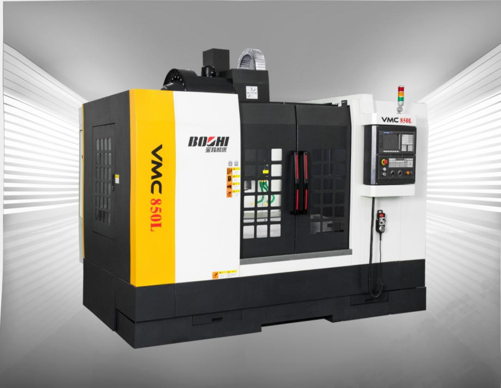

## 热卖爆款名优产品质量稳定

机床整体结构采用树脂砂型铸造，箱形结构，厚壁多筋，并经多道应力消除工序，使得机床具有良好的刚性；

·整机针对高速、高刚性专门设计，主轴最高转速达800Or/min，X/Y采用滚珠线轨，Z轴超宽硬轨，XY轴快速移动达24m/min，Z轴快速移动15m/min；采用配重平衡系统，机床高速动态稳定性好；

主轴锥孔及工作台面的淬火等方面拥有专有技术，保证了其硬度和精度稳定性；

加工中心关键零件和出厂精度均由美国布朗·夏普BROWN&SHARPE 三坐标测量和英国雷尼绍RENISHAW双频激光干涉仪严格检测，对其进行全面检验，确保机床几何精度和工作精度。

经典 热销CLASSIC HOTSELLING 销售热线—020-81995926—（数控机床）

## 宝鸡机床  VMC850L  COMMAND THE FUTURE  

