在本产品使用说明书中，我们将尽力叙述各种与该产品使用相关的事项。限于篇幅限制及产品具体使用等原因，不可能对产品中所有不必做和/或不能做的操作进行详细的叙述。因此，本产品中没有特别指明的事项均视为“不可能”或“不允许”进行的操作。

本产品使用说明书的版权，归广州数控设备有限公司所有，任何单位与个人进行出版或复印均属于非法行为，广州数控设备有限公司将保留追究其法律责任的权利。

## 前言

尊敬的客户：

对您惠顾选用广州数控设备有限公司RB15L搬运机器人（简称机器人）产品，本公司深感荣幸与感谢！

为了保证产品安全、正常与有效地运行，请您务必在安装、使用产品前仔细阅读本产品使用说明书。

## 安全警告

操作不当将引起意外事故，必须要具有相应资格的人员才

能使用、操作本产品。

## 安全注意事项

使用前（安装、运转、保养、检修等)，请务必熟读并全部掌握本使用说明书和其他随行附属资料（文件)。在熟知全部设备知识、安全知识及注意事项后再开始使用。

本使用说明书中的安全事项分为“危险”、“注意”、“强制”、“禁止”四类，将分别叙述。

危险误操作时有危险，可能发生死亡或重伤事故

注意误操作时有危险，可能发生中等程度伤害或轻伤事故

强制必须严格遵守的事项

禁止禁止的事项

另外，即使是“注意”所记载的内容，也会因情况不同而产生严重后果，因此任何一条注意事项都极为重要，请务必严格遵守。

虽然不符合“注意”或“危险”的内容，但为了确保安全和有效的操作，用户也必须遵守的事项，将会在相关处加以叙述。

## 强制

■《RB15L搬运机器人使用说明书（机械分册)》是以机器人的本体结构内容为中心的技术资料。为确保本系统的正常应用和妥善保养及维修，其中包括安全注意事项、使用注意事项、详细的规格说明、保养及检修的项目等内容。请务必在认真阅读并充分理解和掌握的基础上使用

■另外，关于安全的有关内容记载在《工业机器人使用说明书（电气分册）》的“第一章安全设备”中，阅读本使用说明书前，请务必熟读安全内容，以确保正确使用

## 注意

■说明书中的图解，有的为了说明细节取下盖子或安全罩进行绘制，运转此类部件时，务必按照规定将盖子或安全罩还原后，再按使用说明书要求运转

使用说明书中的图及照片，为代表性示例，可能与所购买产品不同

■使用说明书有时由于产品改进、规格变更及说明书自身更便于使用等原因而进行适当的修改

■由于破损、丢失等原因需定购说明书时，请与本公司销售部联系

客户擅自进行产品改造，不在本公司保修范围之内，本公司概不负责

## 危险

■操作机器人前，按下控制柜上的急停键，并确认伺服电源被切断，同时控制柜上的伺服电源灯熄灭

紧急情况下，若不能及时制动机器人，则可能引发人身伤害或设备损坏事故。

■急停后再接通伺服电源时，要解决造成急停的故障后再接通伺服电源

由于误操作造成的机器人动作，可能引发人身伤害事故。

## ■在机器人动作范围内示教时，请遵守以下事项：

保持从正面观察机器人；

遵守操作步骤；

考虑机器人突然向自己所处方位运动时的应变方案；

➢确保设置躲避场所，以防万一。

由于误操作造成的机器人动作，可能引发人身伤害事故。

## ■进行以下作业时，请确认机器人的动作范围内没有人，并且操作者处于安全位置操作：

➢控制柜接通电源时；➢用示教盒操作机器人时；➢试运行时；

再现运行时。

不慎进入机器人动作范围内或与机器人发生接触，都有可能引发人身伤

害事故。另外，发生异常时，请立即按下急停键。

急停键位于控制柜前门及示教盒的右上侧。

## 注意

进行机器人示教作业前要检查以下事项，有异常则应及时修理或采取其他必要措施

机器人动作有无异常；

➢外部电线遮盖物及外包装有无破损。

## ■示教盒用完后须放回原处

如不慎将示教盒放在机器人、夹具或地上，当机器人运动时，示教盒可能与机器人或夹具发生碰撞，从而引发人身伤害或设备损坏事故。

## 安全责任

## 制造者的安全责任

制造者应对所提供的产品及随行供应的附件在设计和结构上已消除和/或控制的危险负责。

制造者应对所提供的产品及随行供应的附件的安全负责。

制造者应对提供给使用者的使用信息和建议负责。

## 使用者的安全责任

使用者应通过产品安全操作的学习和培训，并熟悉和掌握安全操作的内容。

使用者应对自己增加、变换或修改原产品、附件后的安全及造成的危险负责。

使用者应对未按使用说明书的规定操作、调整、维护、安装和贮运产品造成的危险负责。

本使用说明书由最终用户收藏！

诚挚的感谢您一一在使用广州数控设备有限公司的产品时，对本公司的友好支持！

VIII 

## 目录

第一章开箱检查  
  
1.1确认装箱内容  
  
1.2确认型号…  
  
第二章 搬运…3  
2.1搬运方法……3  
2.1.1使用吊车…·3  
2.1.2使用叉车…  
  
第三章安装……  
  
3.1安全栏的设置…  
  
.8  
3.2机器人安装方法·.8  
3.2.1安装举例…..8  
3.3 安装方式 ……….·10  
3.3.1机器人底座的固定…10  
3.3.2防坠落处理………10  
3.4安装现场和环境………11  
第四章基本规格.· 13  
4.1基本规格参数一览表…·13  
4.2机器人各轴名称及方向.·14  
4.3机器人外形尺寸及安装尺寸  
  
…15  
第五章保养、检修……·17  
5.1检修间隔及检修项目·17  
5.2作业步骤及注意事项·20  
5.2.1电池更换步骤……·20  
5.3油脂补充和更换的注意事项…·22  
5.3.1J1轴减速机油脂补充和更换步骤·23  
5.3.2J2轴减速机油脂补充和更换步骤…25  
5.3.3J3轴减速机油脂补充和更换步骤…27  
5.3.4J4轴减速机油脂补充步骤……..…29  
5.3.5J5、J6轴减速机油脂补充步骤……30  
5.3.6J6轴齿轮油脂补充步骤………31  
5.3.7J4轴交叉轴承油脂补充步骤………32  
5.3.8保养、检修注意事项………·33

## 第一章开箱检查

确认机器人和控制柜为同一型号。在设置多台机器人时，请特别加以注意如果型号不匹配，机器人可能不能精确运行，并可能引起人员受伤或设备损坏等危险。

### 1.1 确认装箱内容

到货之后，请确认装箱内容。

标准规格机器人有以下三部分（如有选项请确认其他内容)：

➢机器人；➢控制柜；➢示教盒。

### 1.2 确认型号

确认机器人与控制柜的型号是否一致。

## 第二章搬运

注意

起吊操作、吊车和叉车的操作请委托有操作资格的人员进行否则有可能发生人身伤害、设备损坏等事故。

搬运时应避免过度的震动和冲撞

否则对精密设备的性能会有影响。

### 2.1 搬运方法

## 重要

起吊重量约为300kg，请选用具有足够强度的钢丝绳。

不使用吊车和叉车而采用其它搬运方法时，请注意机器人的手臂、电机不能受外力作用。

#### 2.1.1 使用吊车

机器人的开箱和移动、搬运，原则上请使用吊车。

使用钢丝绳，利用吊环螺钉起吊搬运，这时，请务必按“图1搬运姿态”的姿态（出厂姿态）进行起吊搬运。

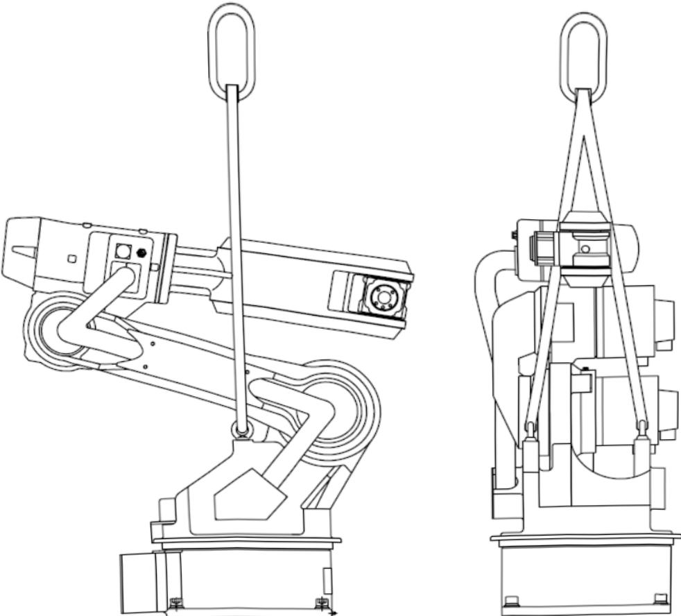

图1搬运姿态

#### 2.1.2 使用叉车

使用叉车搬运时，请按“图2使用叉车搬运的方法”所示，将机器人安装在具有足够负载能力的底板上（叉车运送底板由用户自行设计制作)，用螺栓固定，叉车叉子插入底板，连同机器人一起搬运。

搬运过程中注意不要发生倾倒或歪斜，缓速运送。

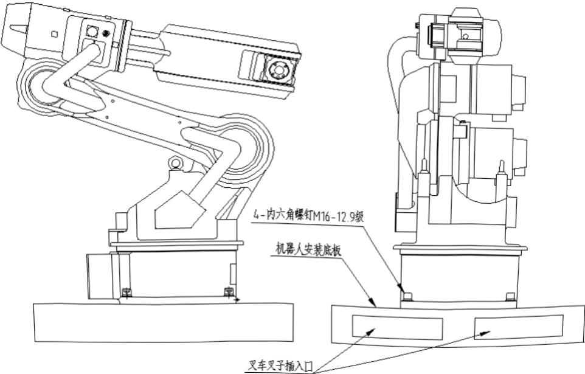

图2使用叉车搬运方法

## 第三章安装

## 危险

## 设置安全栏

否则有可能发生人身伤害、设备损坏等事故。

■机器人要放置在即使机器人手臂伸到最长，其手腕部的工具和工件的尖端点也不会碰到安全栏的位置

否则有可能发生人身伤害、设备损坏等事故。

机器人不固定不能进行通电和运转

否则有可能发生倾倒、人身伤害、设备损坏等事故。

■选择倒挂、壁挂安装方式时，要固定在有足够强度的天花板、墙壁上，还应设置防止坠落的安全装置

否则有可能发生人身伤害、设备损坏等事故。

■不要安装或运转有损坏、缺少零件的机器人

误动作有可能引起人身伤害、设备损坏等事故。

### 3.1 安全栏的设置

按中华人民共和国国家标准GB11291.1-2011/ISO10218-1：2006《工业环境用机器人安全要求第1部分：机器人》第5章的有关“安全防护装置”的规定，为避免机器人运转中造成设备损坏、操作者及周围人员人身伤害，请务必设置安全栏。

### 3.2 机器人安装方法

机器人的安装对其功能的发挥十分重要，特别值得注意的是基座的固定和地基能够承受机器人加减速时的动载荷以及机器人和夹具的静态重量。

另外，机器人的安装面不平整时，有可能发生机器人变形，性能受影响。机器人安装面的平面度，请确保在0.5mm以下。基座的固定，按照“3.2.1安装举例”中的方法进行。

#### 3.2.1 安装举例

首先把机器人安装底板固定在地面上，安装底板必须具有足够的强度和刚度，我们推荐安装底板的厚度为25mm以上，选用M16以上的地脚螺栓把安装底板固定在地面上。

机器人的底座应通过其上四个安装孔用M16内六角螺钉（推荐长度为

50mm）牢固地固定在机器人安装底板上，为使内六角螺钉和地脚螺栓在设备运

行中不发生松动，请按“图3机器人安装举例”的方法充分固定。

若机器人实际应用过程中工作位置需要加高，请在机器人底座和机器人安装底板之间增加支座垫高。先将支座与安装底板相连，再将机器人安装在支座上，支座的强度和刚度参照底座标准，连接螺钉与机器人底座安装螺钉要求相同。

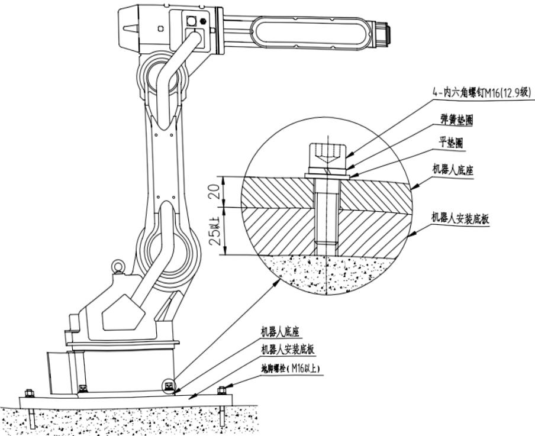

图3机器人安装举例

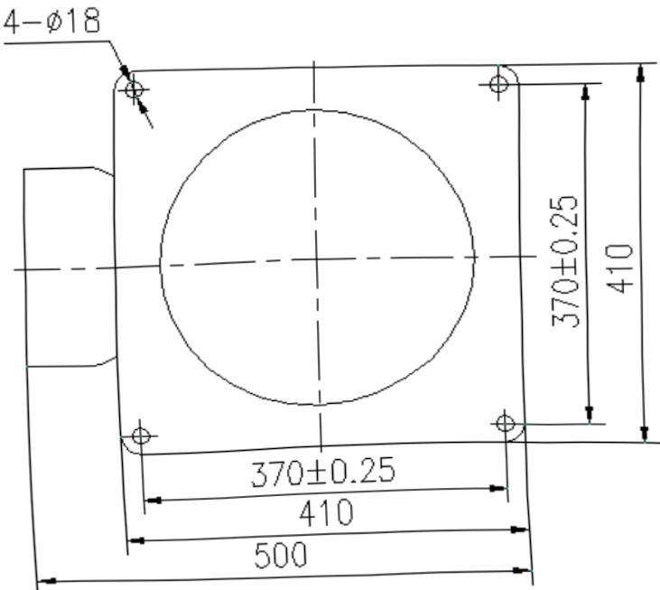

图4机器人底座安装尺寸

### 3.3 安装方式

机器人可以采用地面安装（标准安装）、壁挂安装和倒挂安装三种方式。壁挂安装、倒挂安装与地面安装有以下两点不同：

➢机器人底座固定；

➢防坠落处理。

#### 3.3.1 机器人底座的固定

壁挂和倒挂形式安装时，机器人底座必须使用4个M16内六角螺钉(GB/T70.1)性能等级12.9(GB/T3098.1-2010)，用206N．m力矩扭紧固定。

#### 3.3.2 防坠落处理

壁挂和倒挂形式安装时，为预防万一，在机器人底座上要安装防坠落保险装置。其方法请参照“图5防坠落方法”。

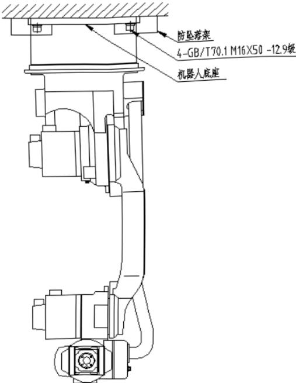

图5防坠落方法

<html><body><table border="1"><tr><td>重要</td></tr><tr><td>选择壁挂和倒挂形式安装时，请在订货时预先声明。现场设置壁挂和倒挂的</td></tr><tr><td>施工，请务必向我公司咨询并在我公司的指导下完成（联系方法见本说明书封</td></tr><tr><td>底）。</td></tr></table></body></html>

### 3.4 安装现场和环境

机器人安装现场必须满足以下环境条件：

运转时，环境的温度应在0℃~45℃范围内；

湿度较小、较干燥的场所（湿度20%～80%RH，无凝露);

灰尘、粉尘、油烟、水等较少的场所；

不存在易燃、腐蚀性液体及气体的场所；

远离大的电气噪声源（TIG焊接装置等）的场所；

安装面的平面度在0.5mm以下。

## 第四章基本规格

### 4.1 基本规格参数一览表

表1基本规格参数

<html><body><table border="1"><tbody><tr><td colspan="2">项目</td><td>参数</td></tr><tr><td colspan="2">型号</td><td>RB15L</td></tr><tr><td colspan="2">自由度</td><td>6</td></tr><tr><td colspan="2">驱动方式</td><td>交流伺服驱动</td></tr><tr><td colspan="2">有效负载</td><td>15kg</td></tr><tr><td colspan="2">重复定位精度</td><td>±0.05mm</td></tr><tr><td rowspan="6">运动范围</td><td>J1轴</td><td>±170°</td></tr><tr><td>J2轴</td><td>+145°~-100°</td></tr><tr><td>J3轴</td><td>+75°~-165°</td></tr><tr><td>J4轴</td><td>±180°</td></tr><tr><td>J5轴</td><td>±133°</td></tr><tr><td>J6轴</td><td>±360°</td></tr><tr><td rowspan="6">额定速度</td><td>J1轴</td><td>2. 87rad/s，165/s</td></tr><tr><td>J2轴</td><td>2. 87rad/s,165/s</td></tr><tr><td>J3轴</td><td>2. 96rad/s，170%s</td></tr><tr><td>J4轴</td><td>4. 71rad/s,270%/s</td></tr><tr><td>J5轴</td><td>3. 10rad/s,178%s</td></tr><tr><td>J6轴</td><td>6.19rad/s，355/s</td></tr><tr><td rowspan="3">允许扭矩</td><td>J4轴</td><td>40N·m</td></tr><tr><td>J5轴</td><td>50N.m</td></tr><tr><td>J6轴</td><td>22N.m</td></tr><tr><td rowspan="3">周围环境</td><td>温度</td><td>0℃~45℃</td></tr><tr><td>湿度</td><td>20%~80% (无凝露)</td></tr><tr><td>其他</td><td>1、避免与易燃易爆及腐蚀性气体、液体 接触； 2、勿溅水、油、粉尘； 3、远离电气噪声源（等离子)。</td></tr><tr><td colspan="2">安装方式</td><td>地面安装</td></tr><tr><td colspan="2">本体质量</td><td>295kg</td></tr><tr><td colspan="2">电柜质量</td><td>210kg</td></tr></table></body></html>

### 4.2 机器人各轴名称及方向

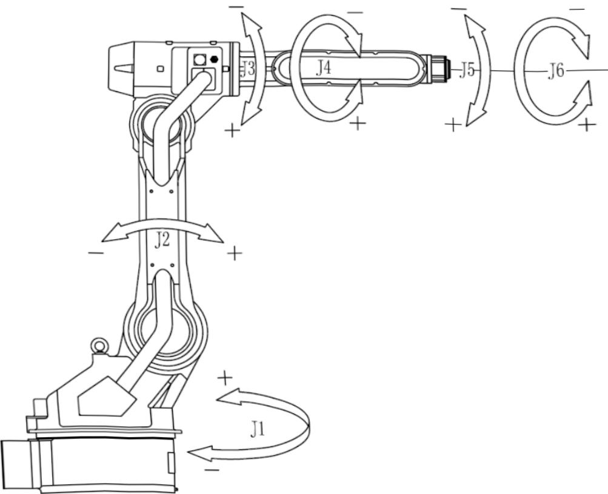

图6机器人各轴名称及方向

### 4.3 机器人外形尺寸及安装尺寸

图7机器人外形尺寸

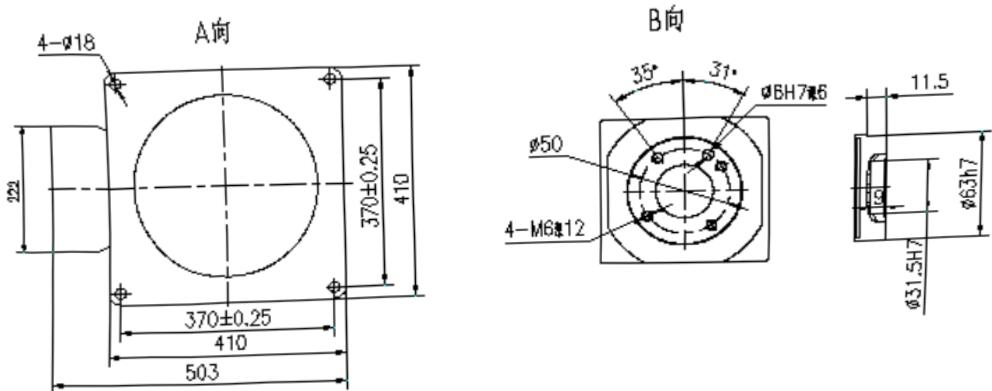

图9机器人手腕法兰盘尺寸

图8机器人的安装尺寸

图10机器人的最大运动范围

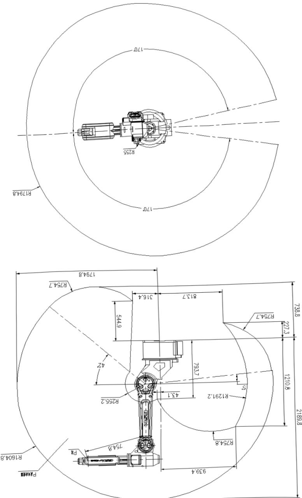

外形尺寸和最大动作范围4.4

## 第五章保养、检修

危险

□保养、检修作业及配线作业，必须在切断电源，并贴上如“禁止通电”标志后进行，否则有可能发生触电、人身伤害等事故

注意

保养、检修作业由指定的专业人员完成否则有可能发生触电、人身伤害等事故。

拆卸、清理请与我公司联系

### 5.1 检修间隔及检修项目

正确的检修作业，不仅能使机器人经久耐用，对防止故障及确保安全也是必不可少的。

检修可分为如“表2检修项目一览表”中所示的各个阶段及各阶段必要的检修项目。

在“表2检修项目一览表”的右栏，将检修人员分为“专业人员”、“有资格者”、“制造公司（即广州数控设备有限公司'）人员”三类。指定专业人员进行各项检修作业。

## 重要

检修间隔时间的设定，请按伺服电源接通时间计算

表2中的检修间隔，以搬运作业为基准，其他用途或使用条件特殊时，有必要单独分析再作结论

特别应注意，若高频率使用搬运作业的应用，须缩短检修间隔，请与本公司洽谈

表2检修项目一览表

<html><body><table border="1"><tr><td colspan="3" rowspan="2">检修部位</td><td colspan="6">检修间隔</td><td rowspan="2">方法</td><td colspan="3"></td></tr><tr><td>检修处理内容</td><td>检修人员</td><td>日 常</td><td>间隔 1000h</td><td>间隔 5000h</td><td>间隔 10000h</td><td>间隔 20000h</td><td>间隔 30000h</td><td></td></tr><tr><td>专业 人员</td><td>有资 格者</td><td>制造 公司</td><td>①</td><td>原点标记</td><td>O</td><td></td><td></td><td></td><td></td><td></td><td>目测</td><td>与原点姿态的标记是 否一致，有无污损。</td></tr><tr><td>O</td><td>②</td><td>外部导线</td><td>O</td><td></td><td></td><td></td><td></td><td></td><td></td><td></td><td></td><td></td></tr><tr><td></td><td></td><td>目测</td><td>检查有无污迹、损伤。</td><td>O</td><td>O</td><td>O</td><td></td><td>整体外观</td><td>O</td><td></td><td></td><td></td></tr><tr><td></td><td>目测</td><td>清扫尘埃、铁屑，检 查各部分有无龟裂、 损伤。</td><td>O</td><td>O</td><td>O</td><td>④</td><td>J1、J2、 J3轴电机</td><td>O</td><td></td><td></td><td></td><td></td></tr><tr><td>目测</td><td>有无漏油3。</td><td>O</td><td>O</td><td>O</td><td>5</td><td>底座螺栓</td><td></td><td>O</td><td></td><td></td><td></td><td></td></tr><tr><td>扳手</td><td>检查有无缺失、松 动； 补缺、拧紧。</td><td>O</td><td>O</td><td>O</td><td>?</td><td>盖类螺栓</td><td></td><td>O</td><td></td><td></td><td></td><td></td></tr><tr><td>O</td><td>O</td><td>⑦</td><td>底座插座</td><td></td><td>O</td><td></td><td></td><td></td><td></td><td>手触</td><td>检查有无松动，插紧</td><td>O</td></tr><tr><td>O</td><td>O</td><td>8</td><td>J5、J6轴 同步皮带</td><td></td><td></td><td>O</td><td></td><td></td><td></td><td>手触</td><td>检查皮带张紧力及 磨损程度。</td><td></td></tr><tr><td>O</td><td>O</td><td>9</td><td>机内导线 （J1、J2、 J3、J4、 J5、J6 轴导线)</td><td></td><td></td><td></td><td>O</td><td></td><td></td><td>目测 万用表</td><td>检测底座的主插座 与中间插座的导通 试验（确认时用手摇 动导线)，检查保护 弹簧的磨损。</td><td></td></tr><tr><td rowspan="2"></td><td rowspan="2">O</td><td>O</td><td></td><td></td><td></td><td></td><td>O</td><td></td><td></td><td>更换1。</td><td></td><td>O</td></tr><tr><td>①</td><td>机内导线 （J5、J6 轴导线)</td><td>O</td><td></td><td></td><td></td><td>O</td><td></td><td></td><td>目测 万用表</td><td>端子间的导通试验， 检查保护弹簧的磨 损。</td></tr><tr><td rowspan="2">O</td><td></td><td></td><td></td><td></td><td>O</td><td></td><td></td><td>更换1。</td><td></td><td></td><td></td><td></td></tr><tr><td></td><td></td><td></td><td></td><td></td><td></td><td></td><td></td><td></td><td></td><td></td><td></td></tr></tbody></table></body></html>

<html><body><table border="1"><tbody><tr><td colspan="2" rowspan="2">检修部位</td><td colspan="6">检修间隔</td><td rowspan="2">方法</td><td rowspan="2">检修处理内容</td><td colspan="3">检修人员</td></tr><tr><td>日 常</td><td>间隔 1000h</td><td>间隔 5000h</td><td>间隔 10000h</td><td>间隔 20000h</td><td>间隔 30000h</td><td>专业 人员</td><td>有资 格者</td><td>制造 公司</td><td></td></tr><tr><td>①</td><td>机内电池 组</td><td></td><td></td><td></td><td>O</td><td></td><td></td><td></td><td>RC-B01显示电池报 警或使用10000h时 换电池。</td><td></td><td>O</td><td>O</td><td></td></tr><tr><td>2</td><td>J1轴 减速机</td><td></td><td></td><td></td><td></td><td>O</td><td></td><td></td><td>油枪</td><td>检查有无异常（异常 时更换)。 补油²2(间隔5000h) 参照“5.3.1J1轴减 速机油脂补充和更 换步骤”。 换油²（间隔 10000h）参照“5.3.1 J1轴减速机油脂补 充和更换步骤”。</td><td></td><td>O</td><td>C</td></tr><tr><td>?</td><td>J2、J3 轴减速机</td><td></td><td></td><td></td><td></td><td></td><td></td><td>油枪</td><td>检查有无异常（异常 时更换)。 补油2(间隔5000h) 参照“5.3.2J2轴减 速机油脂补充和更 换步骤”和“5.3.3J3 轴减速机油脂补充 和更换步骤”。 换油²（间隔 10000h）参照“5.3.2 J2轴减速机油脂补 充和更换步骤”和 “5.3.3J3轴减速机 油脂补充和更换步 骤”。</td><td></td><td>O</td><td>O</td><td></td></tr><tr><td>④</td><td>J4、J5、 J6轴 减速机</td><td></td><td></td><td>O</td><td></td><td></td><td></td><td>油枪</td><td>检查有无异常（异常 时更换)。 补油2(间隔5000h) 参照“5.3.4J4轴减 速机油脂补充步骤” 和“5.3.5J5、J6轴 减速机油脂补充步 骤”。</td><td></td><td>O</td><td></td><td></td></tr><tr><td>O</td><td></td><td></td><td></td><td>油枪</td><td>检查有无异常（异常 时更换。）补油（间 隔5000h)参照“5.3.6 J6轴齿轮油脂补充 步骤”。</td><td></td><td>O</td><td></td><td>?</td><td>J6轴齿轮</td><td></td><td></td><td></td></tr></tbody></table></body></html>

<html><body><table border="1"><tr><td rowspan="2" colspan="2">检修部位</td><td colspan="6">检修间隔</td><td rowspan="2">方法</td><td rowspan="2">检修处理内容</td><td colspan="3">检修人员</td></tr><tr><td>日 常</td><td>间隔 1000h</td><td>间隔 5000h</td><td>间隔 10000h</td><td>间隔 20000h</td><td>间隔 30000h</td><td>专业 人员</td><td>有资 格者</td><td>制造 公司</td></tr><tr><td>16</td><td>J4轴十字 交叉滚子 轴承</td><td></td><td></td><td></td><td></td><td></td><td></td><td>油枪</td><td>检查有无异常（异常 时更换)。补油²（间 隔5000h）参照“5.3.7 J4 轴十字交叉轴承 油脂补充步骤”。</td><td></td><td></td><td>O</td><td></td></tr><tr><td>7</td><td>大修</td><td></td><td></td><td></td><td></td><td></td><td>O</td><td></td><td></td><td></td><td></td><td></td><td></td></tr></table></body></html>

*1机内导线（J1、J2、J3、J4、J5、J6部分）使用 20000h时需更换。

*2各部位使用的油脂请参照“表3油脂一览表”。

*3发生漏油时，油脂可能侵入电机。由于油脂渗漏引起电机故障时，请立即与本公司联系。

表3油脂一览表

<html><body><table border="1"><tr><td>作业序号</td><td>使用油脂</td><td>检修部位</td></tr><tr><td>②，③</td><td>00号锂基极压润滑脂</td><td>J1，J2，J3轴减速机</td></tr><tr><td>④，⑤</td><td>0号锂基极压润滑脂</td><td>J4，J5，J6轴减速机 J6轴齿轮</td></tr><tr><td>00号锂基极压润滑脂</td><td>J4轴十字交叉轴承</td><td>9</td></tr></table></body></html>

作业序号与“表2检修项目一览表”中的检修部位序号一致。

### 5.2 作业步骤及注意事项

#### 5.2.1 电池更换步骤

<html><body><table border="1"><tr><td>重要</td></tr><tr><td>当RC-B显示电池电量不足报警时，必须立即更换电池，以防止数据丢失</td></tr></table></body></html>

在“图11电池盒位置”中显示电池组的安装位置。

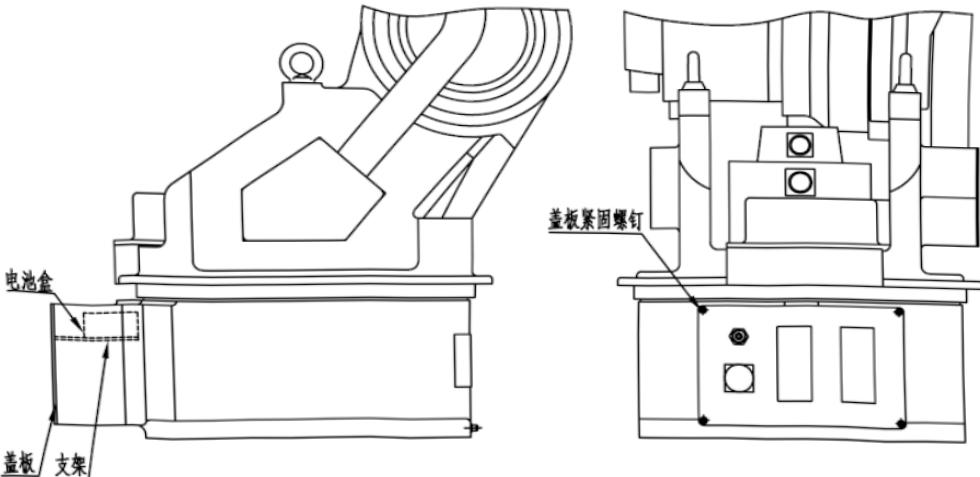

图11电池盒位置

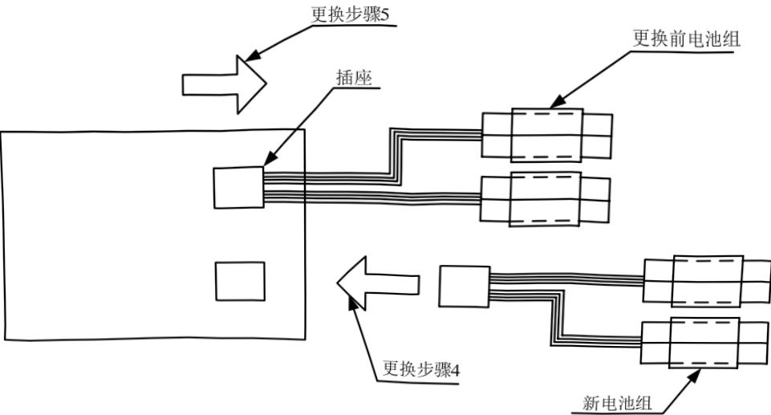

图12电池组连接

当系统显示需要更换电池时，请按照以下步骤操作：

1、关控制器主电源；

2、拆下盖板，拉出电池组，以便更换；

3、把电池组从支架上取下；

4、把新电池组插在支架空闲的插座上；

5、拔下旧电池组；

6、把新电池组装到支架上；

7、重新装好盖板。

重要

为防止数据丢失，必须先连接新电池组，再拆旧电池组

重要

安装盖板时，注意不要挤压电缆

### 5.3 油脂补充和更换的注意事项

进行油脂补充和更换时要注意以下事项，错误的操作会引起电机和减速器故障。

重要

注油时如果没有取下排油口的堵塞/螺钉，油脂会进入电机或减速器的油封会脱落，从而引起电机故障。务必要取下排油口的堵塞

不要在排油口安装连接件、油管等，会引起油封脱落，造成电机故障

使用专用油泵注油。设定油泵压力在0.3MPa以下，注油速度在8g/s以下

务必在注油前把注油侧的管内填充油脂，防止减速器内进入空气

#### 5.3.1 J1轴减速机油脂补充和更换步骤

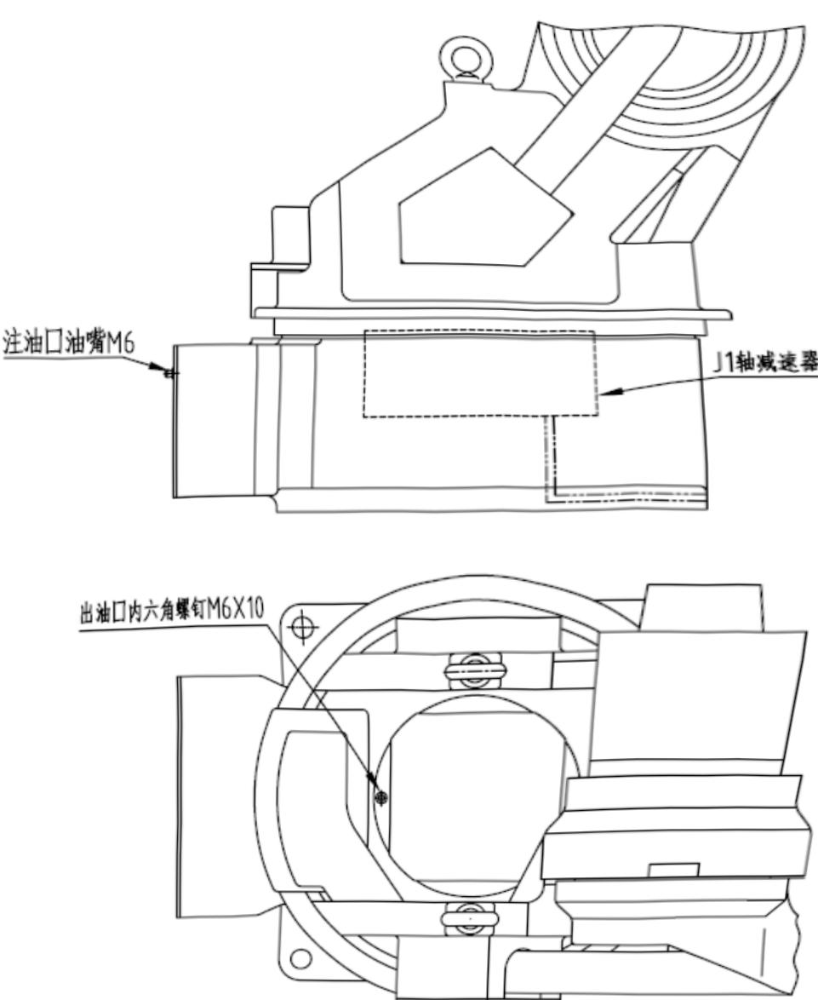

图13J1轴减速机局部结构

倒挂时，注油口和排油口相反

##### 5.3.1.1 油脂补充步骤(参考图13)

请按以下步骤补充油脂：

1、取下排油口的堵塞；

重要

如果不取下堵塞，注油时油脂会进入电机，引起故障，请务必取下堵塞

不要在排油口安装连接件、管子等，会引起油封脱落，造成电机故障

2、用油枪从注油口注油；

油脂种类：00 号锂基极压润滑脂

注入量：100cc 

(第一次需要注入：195cc)

油泵压力：0.3MPa以下

注油速度：8g/s以下

3、安装排油口堵塞前，运动J1轴几分钟，使多余的油脂从排油口排出；

4、用布擦净从排油口排出的多余的油脂，在排油口安装堵塞。堵塞的螺纹处要缠生胶带并用扳手拧紧。

##### 5.3.1.2 油脂更换步骤（参考图14)

请按以下步骤更换油脂：

1、取下排油口的堵塞；

重要

如果不取下堵塞，注油时油脂会进入电机，引起故障，请务必取下堵塞不要在排油口安装连接件、管子等，会引起油封脱落，造成电机故障

## 2、 用油枪从注油口注油；

油脂种类：00 号锂基极压润滑脂

注入量：432cc 

油泵压力：0.3MPa以下

注油速度：8g/s以下

3、从排油口完全排出旧油，开始排出新油时，说明油脂更换结束。（旧油与新油可通过颜色判别)；

4、安装排油口堵塞前，运动J1轴几分钟，使多余的油脂从排油口排出；

5、用布擦净从排油口排出的多余的油脂，在排油口安装堵塞。堵塞的螺纹处要缠生胶带并用扳手拧紧。

#### 5.3.2 J2轴减速机油脂补充和更换步骤

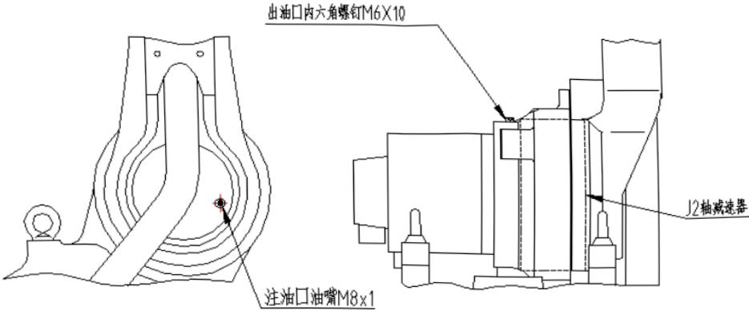

图14J2轴减速机局部结构

<html><body><table border="1"><tr><td>重要</td></tr><tr><td>倒挂安装时，注油口和排油口相反</td></tr></table></body></html>

##### 5.3.2.1 油脂补充步骤（参考图14）

请按以下步骤补充油脂：

1、使J2臂处于垂直于地面的位置；

2、取下排油口的堵塞；

重要

如果不取下堵塞，注油时油脂会进入电机，引起故障，请务必取下堵塞

不要在排油口安装连接件、管子等，会引起油封脱落，造成电机故障

3、用油枪从注油口注油；

油脂种类：00号锂基极压润滑脂

注入量：110cc (第一次需要注入：200cc)

油泵压力：0.3MPa以下

注油速度：8g/s以下

4、安装排油口堵塞前，运动J2轴几分钟，使多余的油脂从排油口排出；

5、用布擦净从排油口排出的多余的油脂，在排油口安装堵塞。堵塞的螺纹处要缠生胶带并用扳手拧紧。

##### 5.3.2.2、 油脂更换步骤（参考图14)

请按以下步骤更换油脂：

1、使J2臂处于垂直于地面的位置；

2、取下排油口的堵塞；

## 重要

如果不取下堵塞，注油时油脂会进入电机，引起故障，请务必取下堵塞

不要在排油口安装连接件、管子等，会引起油封脱落，造成电机故障

## 3、 用油枪从注油口注油；

油脂种类：00 号锂基极压润滑脂

注入量：495cc 

油泵压力：0.3MPa以下

注油速度：8g/s以下

4、从排油口完全排出旧油，开始排出新油时，说明油脂更换结束（旧油与新油可通过颜色判别);

5、安装排油口堵塞前，运动J2轴几分钟，使多余的油脂从排油口排出；

6、用布擦净从排油口排出的多余的油脂，在排油口安装堵塞。堵塞的螺纹处要缠生胶带并用扳手拧紧。

#### 5.3.3 J3轴减速机油脂补充和更换步骤

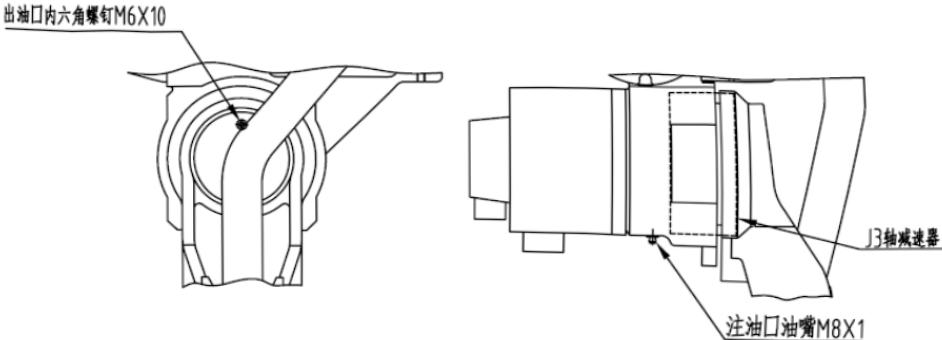

图15J3轴减速机局部结构

<html><body><table border="1"><tr><td>重要</td></tr><tr><td>倒挂安装时，注油口和排油口相反</td></tr></table></body></html>

##### 5.3.3.1 油脂补充步骤（参考图15)

请按以下步骤补充油脂：

1、使机器人小臂处于与地面水平的位置；

2、取下排油口的堵塞；

重要

如果不取下堵塞，注油时油脂会进入电机，引起故障，请务必取下堵塞不要在排油口安装连接件、管子等，会引起油封脱落，造成电机故障

3、用油枪从注油口注油；

油脂种类：00号锂基极压润滑脂注入量：70cc (第一次需要注入：140cc)油泵压力：0.3MPa以下注油速度：8g/s以下

4、安装排油口堵塞前，运动J3轴几分钟，使多余的油脂从排油口排出；

5、用布擦净从排油口排出的多余的油脂，在排油口安装堵塞。堵塞的螺纹处要缠生胶带并用扳手拧紧。

##### 5.3.3.2 油脂更换步骤（参考图15)

请按以下步骤更换油脂：

1、使机器人小臂处于与地面水平的位置；

2、取下排油口的堵塞；

## 重要

如果不取下堵塞，注油时油脂会进入电机，引起故障，请务必取下堵塞

不要在排油口安装连接件、管子等，会引起油封脱落，造成电机故障

3、用油枪从注油口注油；

油脂种类：00号锂基极压润滑脂注入量：224cc 油泵压力：0.3MPa以下

注油速度：8g/s以下

4、从排油口完全排出旧油，开始排出新油时，说明油脂更换结束（旧油与新油可通过颜色判别)；

5、安装排油口堵塞前，运动J3轴几分钟，使多余的油脂从排油口排出；

6、用布擦净从排油口排出的多余的油脂，在排油口安装堵塞。堵塞的螺纹处要缠生胶带并用扳手拧紧。

#### 5.3.4 J4轴减速机油脂补充步骤

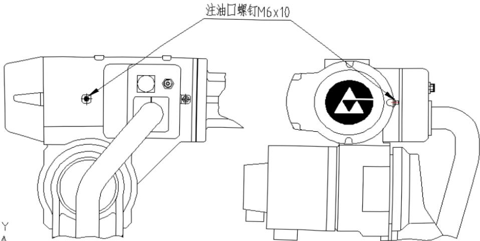

图16J4轴减速机局部结构

请按以下步骤补充油脂：

1、取下注油口的螺丝堵；

2、在注油口安装M6 油嘴；

3、用油枪从注油口注油（参考图16)；

油脂种类：0号锂基极压润滑脂

注入量：10cc 

(第一次需要注入 20cc)

油泵压力：0.3MPa以下

注油速度：8g/s以下

4、取下油嘴，安装螺丝堵，螺丝堵的螺纹处要缠生胶带并用扳手拧紧。

#### 5.3.5 J5、J6轴减速机油脂补充步骤

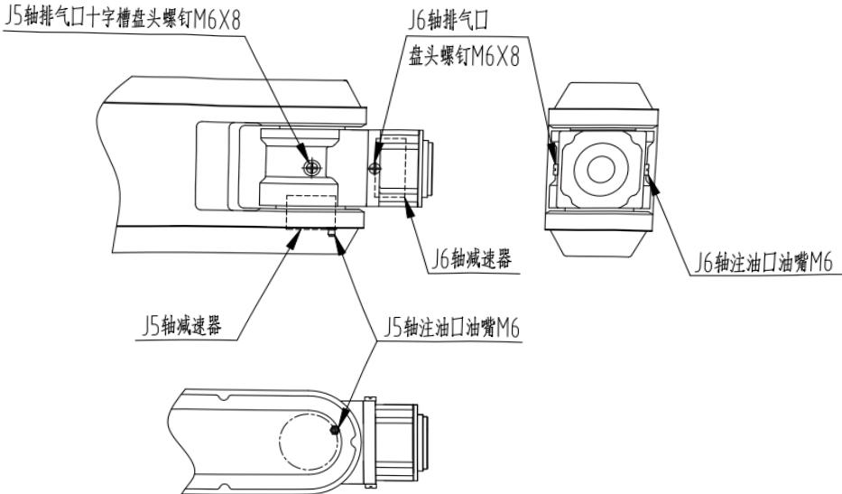

图17J5、J6轴减速机局部结构

请按以下步骤补充油脂：

1、取下J5轴排气口的螺丝堵（内六角凹端紧定螺钉$M6\times6$ );

<html><body><table border="1"><tr><td>重要</td></tr><tr><td>为J5轴补充油脂时需取下小臂侧盖，并将J5轴皮带轮卸下</td></tr></table></body></html>

2、取下注油口的螺丝堵，在注油口上安装M6油嘴；

3、用油枪从注油口分别为J5、J6轴注入润滑脂（参考图17);

油脂种类：0号锂基极压润滑脂注入量：J5轴：10cc(第一次需要注入 20cc)J6轴：10cc(第一次需要注入 20cc)油泵压力：0.3MPa以下

注油速度：8g/s以下

4、取下注油口的油嘴，在注油口安装上螺丝堵，螺丝堵的螺纹处要缠生胶带并用扳手拧紧；

5、将J5、J6轴排气口的螺丝堵分别安装在J5、J6轴的空气排气口处，螺丝堵的螺纹处要缠生胶带并用扳手拧紧。

#### 5.3.6 J6轴齿轮油脂补充步骤

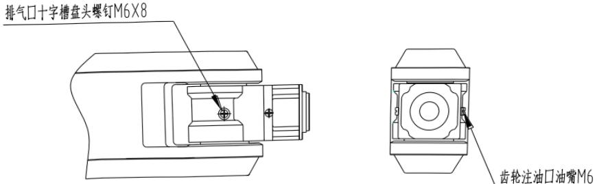

图18J6轴齿轮箱体局部结构

请按以下步骤补充油脂：

1、取下排气口的螺丝堵；

2、用油枪从齿轮箱的注油口注油（参考图18);

油脂种类：0号锂基极压润滑脂注入量：10cc(第一次需要注入20cc)油泵压力：0.3MPa以下注油速度：8g/s以下

3、将排气口的螺丝堵安装在空气排气口处，螺丝堵的螺纹处要缠生胶带并用扳手拧紧。

#### 5.3.7 J4轴交叉轴承油脂补充步骤

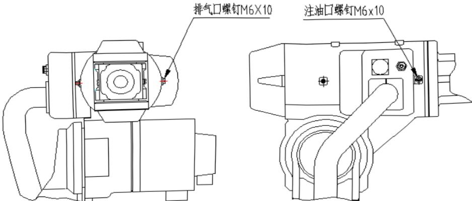

图19 J4轴十字交叉轴承处的结构

请按以下步骤补充油脂：

1、取下排气口的螺丝堵；

2、取下注油口的螺丝堵，在注油口安装M6油嘴；

3、用油枪从注油口注油（参考图19);

油脂种类：00 号锂基极压润滑脂注入量：4cc(第一次需要注入 8cc)油泵压力：0.3MPa以下

注油速度：8g/s以下

## 重要

## 空气排气口不能排油，注意不要注入过量油脂

4、取下注油口的油嘴，在注油口安装上螺丝堵，螺丝堵的螺纹处要缠生胶带并用扳手拧紧；

5、将排气口的螺丝堵安装在空气排气口处，螺丝堵的螺纹处要缠生胶带并用扳手拧紧。

#### 5.3.8 保养、检修注意事项

由于J5、J6 轴电机及编码器安装在手腕轴前端，为确保在焊接作业时的安全，小臂两边侧盖的结合面已用密封胶密封，开盖后再安装时，请务必重新涂密封胶密封。

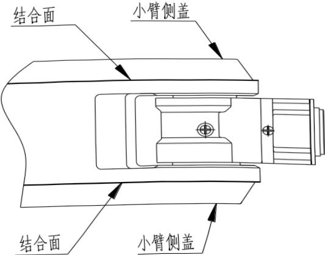

图20小臂侧盖密封部位

