在RH06A3-2060焊接机器人使用说明书（电气分册）中，我们将尽力叙述各种与

该机器人产品电气使用操作相关的事项。限于篇幅限制及产品具体使用等原因，不可能对产

品中所有不必做和/或不能做的操作进行详细的叙述。因此，本产品中没有特别指明的事项均

视为“不可能”或“不允许”进行的操作。

本使用说明书的版权，归广州数控设备有限公司所有，任何单位与个人进行出版或复印均属于非法行为，广州数控设备有限公司将保留追究其法律责任的权利。

## 前言

尊敬的客户：

对您惠顾选用广州数控设备有限公司研发制造的RH06A3-2060焊接机器人（简称机器人）产品，本公司深感荣幸并深表感谢！

本使用说明书为RH06A3-2060焊接机器人使用说明书（电气分册）部分。

RH06A3-2060焊接机器人使用说明书除焊接功能外，其余适用于RB06-2060搬运机器人。

为了保证产品安全、正常、有效地运行，请您务必在安装、使用产品前仔细阅读本产品说明书。

由于生产方式和就业形势向多样化发展、现场熟练工减少、临时工增加等原因，在使用机器和装置的安全问题上，我们除了要依靠“对人员进行安全教育”外，必须高度重视“机械安全”。

当今制造业比以往更重视人的生命，我们需要以“人出错，机器出故障”为前提考虑，将安全放在最高位置作为基本原则。

## 安全警告

操作不当将引起意外事故，必须要具有相应资格的人员才能使用、操作本产品。

# 安全注意事项

## 危险

## 操作机器人前，按下控制柜上的急停键，并确认伺服电源被切断，同时控制柜上的伺服电源灯熄灭 

紧急情况下，能及时制动机器人，否则可能引发人身伤害或设备损坏事故。

## 急停后再接通伺服电源时，要解决造成急停的故障后再接通伺服电源

由于误操作造成的机器人动作，可能引发人身伤害事故。

## 在机器人动作范围内示教时，请遵守以下事项

在进行示教作业之前，应确认机器人或者外围设备没有处在危险的状态并没有异常；

应事先确认安全装置（如控制柜急停按钮、示教盒急停按钮等）的位置和状态等；

保持从正面观察机器人；

遵守操作步骤；

考虑机器人突然向自己所处方位运动时的应变方案；

确保设置躲避场所，以防万一。

由于误操作造成的机器人动作，可能引发人身伤害事故。

## 进行以下作业时，请确认机器人的动作范围内没有人，并且操作者处于安全位

## 置操作：

控制柜接通电源时

用示教盒操作机器人时

试运行时

再现运行时

不慎进入机器人动作范围内或与机器人发生接触，都有可能引发人身伤害事故。另外，发生异常时，请立即按下急停键，急停键位于控制柜前门及示教盒的右上侧。

## 注意

## 进行机器人示教作业前要检查以下事项，有异常则应及时修理或采取其他必要措施 

机器人动作有无异常；外部电线遮盖物及外包装有无破损。

## 示教盒用完后须放回原处

如不慎将示教盒放在机器人、夹具或地上，当机器人运动时，示教盒可能与机器人或夹具发生碰撞，从而引发人身伤害或设备损坏事故。

## 关于解救被机器所困人员的方法的指南

若有人员不慎被机器人所困，所困人员应远离机器人的动作范围，保持镇定，以免与机器人发生碰撞受伤，外部人员应立即按下控制柜门上或示教盒右上角的急停按钮，停止机器人动作，如果还不能停止机器，请立刻断开电源，打开安全栅栏，解救被困人员。

## 安全责任

## 制造者的安全责任

——制造者应对所提供的机器人产品及随行供应的附件在设计和结构上已消除和/或控制的危险负责。

—制造者应对所提供的机器人产品及随行供应的附件的安全负责。

——制造者应对提供给使用者的使用信息和建议负责。

使用者的安全责任

——使用者应通过产品安全操作的学习和培训，并熟悉和掌握安全操作的内容。

—使用者应对自已增加、变换或修改原机器人产品、附件后的安全及造成的危险负责。

使用者应对未按使用说明书的规定操作、调整、维护、安装和贮运产品造成的危险负责。

本使用说明书由最终用户收藏！

诚挚的感谢您——在使用广州数控设备有限公司的产品时，

对本公司的友好支持！

## 目录

第一章安全设备…  
  
1.1急停设备…  
  
1.2模式选择开关…  
  
1.3暂停、急停、停止的停机模式与类别的说明  
  
1.4 安全装置…  
  
第二章 搬运与安装…  
  
2.1 搬运方法……5  
2.2控制柜外形尺寸……  
  
2.3安装所需要的空间…  
  
2.4 安装条件……8  
2.5安装时的调整和确认项目8  
第三章电气组成……9  
3.1机器人整体结构…9  
3.2机器人控制柜外布局…11  
3.3机器人控制柜柜内布局.12  
3.4机器人本体的电气布局·13  
第四章维护……· 15  
4.1 日常维护…·15  
4.2供电电源电压的确认· 17  
4.3 缺相检查…·17  
第五章更换部件前的准备19  
5.1确认程序的建立…21  
第六章更换部件……· 23  
6.1控制柜部件的更换23  
6.2伺服驱动单元的更换…23  
6.3开关电源盒的更换…24  
6.4系统主机单元的更换…24

6.5接触器等组件的更换…25  
6.6机器人本体编码器电池的更换…25  
6.7机器人GR-C控制系统部件一览表…26  
6.8控制柜主要部件清单……26  
第七章零件更换后的工作…· 29  
7.1机器人零点位置…29  
第八章I/0信号……· 31  
8.1输入信号连接电路31  
8.2输出信号连接电路…32  
8.3 I/0 定义……34  
第九章伺服报警及其处理….· 37  
附录一电路总图……43  
附录二电路图.45  
附录三重载定义…55  
附录四本体I/0 接线57 ## 概述

广州数控设备有限公司（GSK）机器人的所有者和使用者有责任遵循所规定的步骤来确保车间所有人员的安全。

应用和安装的安全级别最好由安全系统的专业人员来决定。

所以，GSK推荐：每个客户要和这些专业人士协商以保证车间能够安全的应用、使用和操作GSK机器人系统。

另外，作为机器人系统的所有者、雇主、使用者，您有责任为机器人系统的操作者安排相关的培训，以使其了解与机器人系统相关的危险，并知道适合于该特殊应用及机器人安装的最优操作程序。

因此，GSK建议所有的操作人员、编程人员、维护人员以及其它使用机器人系统的相关人员要参加相应的GSK机器人培训课程并熟悉机器人系统的正确操作方法。

GSK机器人程序的设计者和执行者、机器人系统的设计和调试人员、安装人员必须熟悉GSK机器人的编程方式和系统的应用及安装。

机器人的操作特点与其它机器或设备有很大不同。且其工作空间是开放式的,机器人能够以很快的速度移动很大的距离。

本使用说明书（电气分册）为机器人系统的安全设计提供了基本和必要的提示和指导。

## 第一章安全设备

### 1.1 急停设备

本机器人具有以下急停设备：

】示教盒急停按钮；

》控制柜急停按钮（断开伺服电源）；

外部急停(安全栅栏、安全门等)。

当急停按钮被按下，机器人立即停止运行。

外部急停输入信号来自外围设备（如安全光栅、安全栅栏、安全门)，信号接线端在机器人控制柜内。

### 1.2 模式选择开关

模式选择开关安装在示教盒上，您能通过这个开关来选择一种运行模式。

通过模式选择开关选择运行模式时，相应的信息会显示在示教盒（TP）的液晶显示屏（LCD）上。

## （1） 示教模式

➢程序只能通过示教盒（TP）来激活；

➢机器人运行速度不超过250mm/s；

➢安全栅栏信号有效；

➢机器人控制系统（控制器）的操作详见机器人控制系统操作说明书。

## （2） 再现模式

操作界面有效；

➢能通过示教盒的启动按钮来启动机器人程序；

➢安全栅栏信号有效；

➢机器人能以指定的速度运行。

### 1.3 暂停、急停、停止的停机模式与类别的说明

#### 1.3.1 暂停

在再现模式下，按下示教盒的白色【暂停】键，机器人暂停，其他模式下无效。暂停后可以重新按绿色【启动】键，将接着上一次的位置和程序继续运行。

#### 1.3.2 急停

急停操作后，电机电源被切断，伺服保持，机器人立即停止。

##### 1.3.2.1 急停键位置

示教盒上的急停按钮；

控制柜门上的急停按钮。

##### 1.3.2.2 急停操作说明

表1-1急停

<html><body><table border="1"><tr><td>操作步骤</td><td>说明</td></tr><tr><td>按下控制柜的急停按钮</td><td>电机电源被切断，机器人立即停止</td></tr><tr><td>按下示教盒的急停按钮</td><td>电机电源未被切断，但使能切断，机器人立即停止</td></tr></table></body></html>

表1-2解除急停

<html><body><table border="1"><tr><td>操作步骤</td><td>说明</td></tr><tr><td>顺时针方向旋转示教盒急停键</td><td>再次运行时，需要打开使能</td></tr><tr><td>逆时针方向旋转控制柜急停键</td><td>再次运行时，需要打开使能</td></tr></table></body></html>

注：控制柜上的急停键和示教盒上的急停键的区别：按下控制柜上的急停键，伺服电源被切断；按下示教盒上的急停键，切断伺服使能，并未切断伺服电源。

#### 1.3.3 停止

##### 1.3.3.1 报警引起的停止

动作过程中发生报警后，机器人会立即停止动作。示教盒上会显示报警信息。

发生报警时，可按下【清除】键，清除报警提示同时记录报警信息。

##### 1.3.3.2 其它停止方式

切换运行模式，使能关闭，系统停止运行。

#### 1.3.4 紧急状态时发生事故或损坏时应遵循的操作方法

发生紧急情况时，请立刻断开使能，按下急停按钮，拉下电源开关，切断电源，使机器人停止，将损坏降到最低。

### 1.4 安全装置

安全装置包括：

】安全栅栏（固定的防护装置）；

安全门（带互锁装置)；

安全插销和插槽；

】其他保护设备。

这些安全装置应符合安全相关国家标准。

#### 1.4.1 安全栅栏

安全栅栏的要求如下：

】栅栏必须能够抵挡可预见的操作及周围冲击；

】栅栏不应有尖锐的边沿和凸出物；

栅栏防止人们通过打开互锁设备以外的其它方式进入机器人的保护区域内（即非安全区域)；

栅栏应固定在一个地方，只有借助工具才能使其移动；

栅栏要尽可能的不妨碍生产过程；

栅栏应该安置在距离机器人最大运动范围有足够距离的地方；

栅栏应接地以防止发生意外的触电事故。

#### 1.4.2 安全门和安全插销

安全门的要求如下：

除非安全门关闭，否则机器人不能自动运行；

安全门关闭前，不能重新启动机器人再现运行，这是操作人员必须要考虑的；

固定安全门的安全插销和安全插槽，必须选择合适尺寸；

安全门必须在危险发生前一直保持关闭状态（带保护闸的防护装置）或者是在机器人运行时打开安全门就能发送停止或急停命令（互锁的防护装置）。

#### 1.4.3 外围安全设施

机器人运转时，即使看上去静止不动，也有可能是在等待动作信号，这种情况应视为操作状态。为了确保人员安全，应以警报灯等显示或响声来提醒工作人员机器人在操作中；

外围设备均应连接相应的地线；

在地板上画上相应的区域以标示机器人动作范围，确保人员安全。

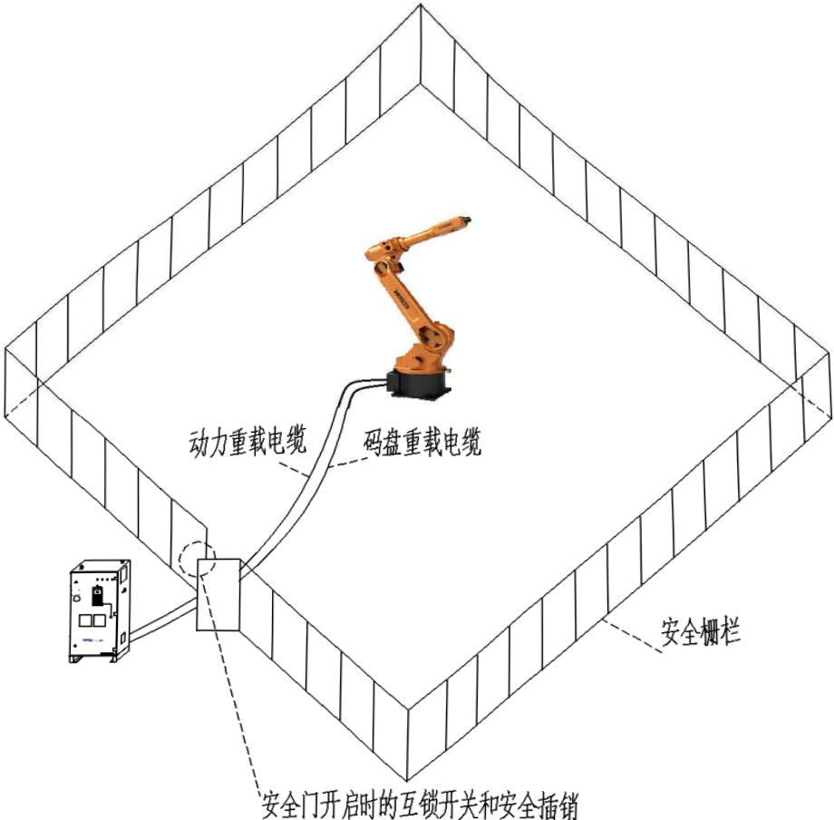

图1-1安全栅栏和安全门

<html><body><table border="1"><tr><td>注意</td></tr><tr><td>要确保用来防止危险（如停止机器人系统的危险运行等）的互锁装置不能成</td></tr><tr><td></td></tr><tr><td>为产生新的危险来源(如危险物掉落到工作区域）</td></tr></table></body></html>

## 第二章搬运与安装

### 2.1 搬运方法

搬运机器人控制柜时，主要有以下方法：

用吊车搬运；

】用叉车搬运。

#### 2.1.1 用吊车搬运

注意事项：

1．搬运前，应先卸除示教盒、线缆，再进行搬运。

2．搬运途中，不应接触搬运工具及机器人控制柜，不应站在控制柜下方，以防止砸伤等事故发生。

3．按照下图，使用吊绳、吊环螺钉等工具进行吊装运输。

4．在运输前，要确保吊环牢固，防止控制柜因松动而掉落损坏。

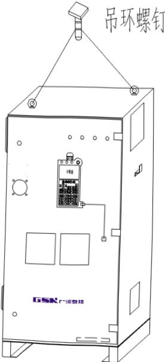

图2-1吊车吊装

#### 2.1.2 用叉车搬运

注意事项：

1．搬运前，应先卸除示教盒、线缆，再进行搬运。

2．搬运时，防止控制柜抖动，故可用绳缆或皮带等工具把控制柜固定在叉车上进行运输。

3．在搬运途中，防止控制柜受到碰撞而损坏。

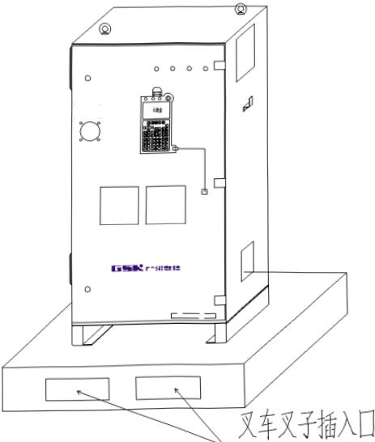

图2-2叉车搬运

### 2.2 控制柜外形尺寸

RH06A3-2060控制柜的外形尺寸，如图2-3。

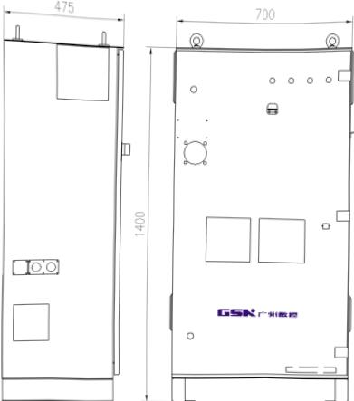

图2-3RH06A3-2060控制柜外形尺寸

### 2.3 安装所需要的空间

RH06A3-2060机器人控制柜安装时所需的空间，如图2-4。

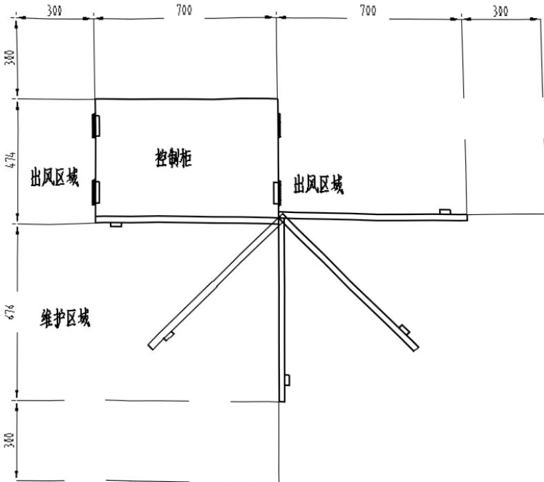

图2-4RH06A3-2060控制柜安装所需要的空间

添司a 

### 2.4 安装条件

表2-1

<html><body><table border="1"><tr><td>项目</td><td>规格和条件</td></tr><tr><td>额定电压</td><td>标配三相AC380V，50/60Hz</td></tr><tr><td>允许电压波动</td><td>允许电压波动：-10%~+10%</td></tr><tr><td rowspan="2">允许环境温度</td><td>运转时0℃~45℃ 运输和储藏时-20 ℃~60℃</td></tr><tr><td>温度系数~0.3 ℃/min</td></tr><tr><td rowspan="3">允许环境湿度</td><td>通常：65%RH以下，无结露</td></tr><tr><td>当最高温度为40℃，相对湿度不超过50%，无结露</td></tr><tr><td>短期（1个月内）：90%RH以下，无结露</td></tr><tr><td>海拔</td><td>海拔1000m以下</td></tr><tr><td>震动</td><td>0.5G以下</td></tr></table></body></html>

### 2.5 安装时的调整和确认项目

表2-2

<html><body><table border="1"><tr><td>序号</td><td>内容</td></tr><tr><td>1</td><td>检查控制柜内外的外观</td></tr><tr><td>2</td><td>检查固定螺钉端子是否切实连接</td></tr><tr><td>3</td><td>确认各种组件的安装位置的插入状态</td></tr><tr><td>4</td><td>确认变压器的输出电压</td></tr><tr><td>5</td><td>确认断路器和电缆情况</td></tr><tr><td>6</td><td>确认控制柜和示教盒的急停按钮是否完好</td></tr><tr><td>7</td><td>确认控制柜与机器人的接口信号是否完好</td></tr><tr><td>8</td><td>确认参数的设定是否正确</td></tr></table></body></html>

## 第三章电气组成

### 3.1 机器人整体结构

#### 3.1.1 整体连接

机器人控制系统由机器人本体、控制柜和示教盒三部分通过线缆连接而成，如图3-1（部分机型含变位机）。

图3-1机器人整体连接

#### 3.1.2 整体连接框图

机器人的电气接口连接方框图，如图3-2。

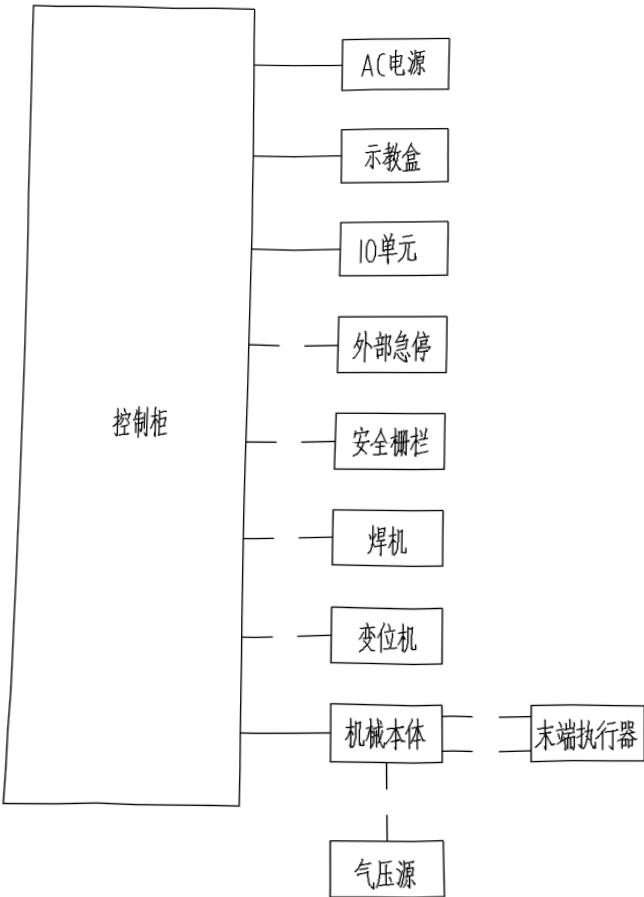

图3-2机器人电气连接方框图

### 3.2 机器人控制柜外布局

机器人控制柜外视图，如图3-3～图3-6。

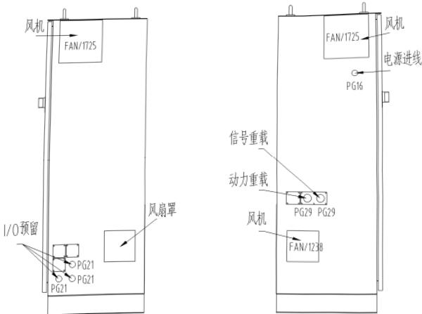

图3-4柜外右侧视图

图3-3柜外左侧视图

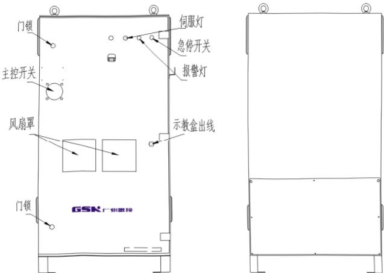

图3-5柜外正面视图

图3-6柜外背面视图

### 3.3 机器人控制柜柜内布局

机器人控制柜内部布局，如图3-7～图3-10。

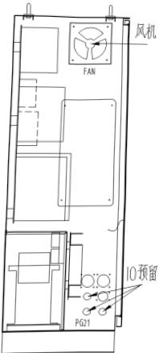

图3-7柜内左侧视图

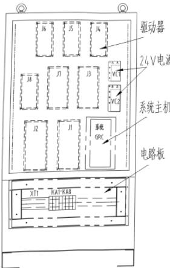

图3-9柜内正面视图

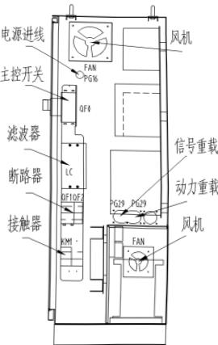

图3-8柜内右侧视图

图3-10柜内背面视图

### 3.4 机器人本体的电气布局

为机器人本体的电气布局说明，如图3-11～图3-12。

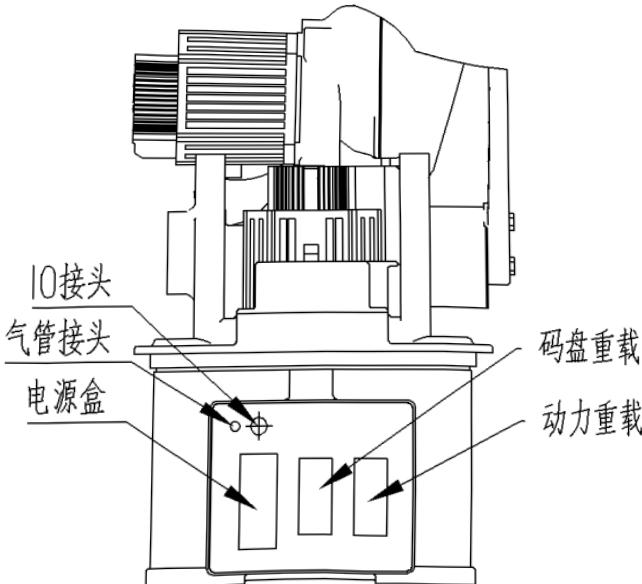

图3-11RH06A3-2060机器人本体底座的电气布局

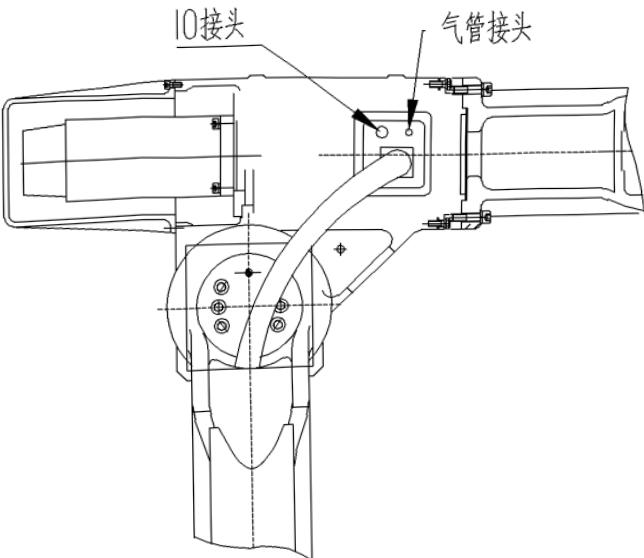

图3-12RH06A3-2060机器人本体箱体处的电气布局

## 第四章维护

### 4.1 日常维护

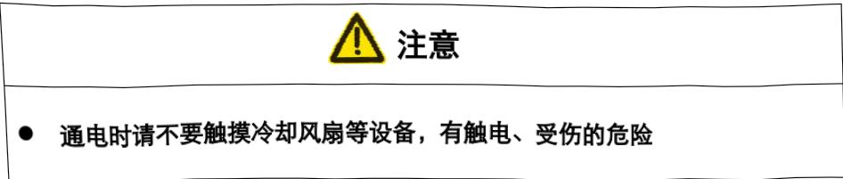

请务必按表4-1进行下列日常检查。

表4-1日常检查

<html><body><table border="1"><tr><td>维护设备</td><td>维护项目</td><td>维护时间</td><td>备注</td></tr><tr><td rowspan="2">控制柜</td><td>检查控制柜的门是否关好</td><td>每天</td><td></td></tr><tr><td>检查密封构件部分有无缝隙和损坏</td><td>每月</td><td></td></tr><tr><td>轴流风扇</td><td>确认风扇是否转动</td><td>每周</td><td>打开电源时</td></tr><tr><td>急停按钮</td><td>动作确认</td><td>每天</td><td>接通伺服时</td></tr><tr><td>安全开关</td><td>动作确认</td><td>每天</td><td>示教模式时</td></tr></table></body></html>

#### 4.1.1 控制柜的维护

控制柜正面如图4-1。

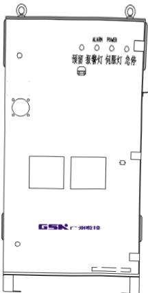

图4-1控制柜正面视图

##### 4.1.1.1 检查控制柜门

1．控制柜的设计是全封闭的构造，但因散热风扇的使用，仅能确保在一定程度上外部的粉尘、液体无法进入。

2．要确保控制柜门在任何情况下都处于完好关闭状态，即使在控制柜不工作时。

3．开关控制柜柜门时，必须用钥匙打开。

关门时先将主控门开关扭到非O-OFF处，把门掩上，主控门开关与门锁后，用钥匙按逆时针锁上即可；开门时将主控开关按逆时针扭到0-OFF处，然后用钥匙按顺时针开锁。

##### 4.1.1.2 检查密封构件部分有无缝隙和损坏

打开门时，检查门的边缘部的密封垫有无破损；

检查控制柜内部是否有异常污垢。如有，待分析、查明原因后，尽早清扫；

在控制柜门关好的状态下，检查有无缝隙。

#### 4.1.2 风扇的维护

风扇转动不正常，控制柜内温度会升高，控制柜可能就会出现异常故障，所以应检查风扇是否转动正常；

柜内风扇和背面轴流风扇在接通电源时转动，所以请检查风扇是否转动，以及确认排风口和吸风口的风量，确认其转动是否正常。

#### 4.1.3 急停按钮的维护

控制柜前门及示教盒上均有急停按钮，上电前必须确认急停按钮是否能正常工作。

### 4.2 供电电源电压的确认

子部位，确认供电电源电压是否正常。

表4-2电压确认

<html><body><table border="1"><tr><td>测定项目</td><td>端子</td><td>正常数值</td></tr><tr><td>输入电压</td><td>L1-L2、L2-L3、L3-L1</td><td>(0.9~1.1)×标称电压(AC 380V)</td></tr><tr><td>与保护地线之间电压 (PE相接地)</td><td>L1-PE、L2-PE、L3-PE</td><td>(0.9~1.1)×标称电压(AC220V)</td></tr></table></body></html>

### 4.3 缺相检查

按表4-3，进行缺相检查试验。

表4-3缺相检查

<html><body><table border="1"><tr><td>检查项目</td><td>检查内容</td></tr><tr><td>检查电缆线的配线</td><td>请确认电源电缆线三相380V连接是否正确，若有配线错误及断线时， 请更正处理。</td></tr><tr><td>检查输入电源</td><td>请准备万用表，检查输入电源的相电压。 判定值：(0.9~1.1)×标称电压（AC380V)。</td></tr><tr><td>检查断路器 (QFO) 有无损坏</td><td>请打开控制电源，用万用表检查断路器 (QF0)的进线端及出线端相间 电压。如果有异常，请更换断路器(QF0)。</td></tr></table></body></html>

## 第五章更换部件前的准备

<html><body><table border="1"><tr><td>危险</td></tr><tr><td>在操作机器人前，检查控制柜的前门急停按钮被按下时，伺服电源灯是否为</td></tr><tr><td>关闭状态。在紧急情况下若不能使机器人停止，会引起人员受伤或设备损坏</td></tr><tr><td>在机器人的活动范围内进行示教操作时，仔细阅读并遵守以下注意事项</td></tr><tr><td>】保持从正面观看机器人；</td></tr><tr><td>严格遵守操作步骤；</td></tr><tr><td>确保在紧急情况下操作人员可以退到安全的场所。 由于误操作所引起的机器人动作，可能引发伤亡事故。</td></tr><tr><td>进行以下操作时，请确认在机器人动作范围内没人，并且操作人员处于安全</td></tr><tr><td>位置</td></tr><tr><td>接通控制柜电源时；</td></tr><tr><td>》使用示教盒操作移动机器人时。</td></tr><tr><td>在机器人运行时，如有人进入运行范围可能会造成人身伤害事故。</td></tr><tr><td>如有问题，请立即按下控制柜或示教盒上的任一急停按钮。急停按钮位于控</td></tr><tr><td>制柜前</td></tr></tbody></table></body></html>

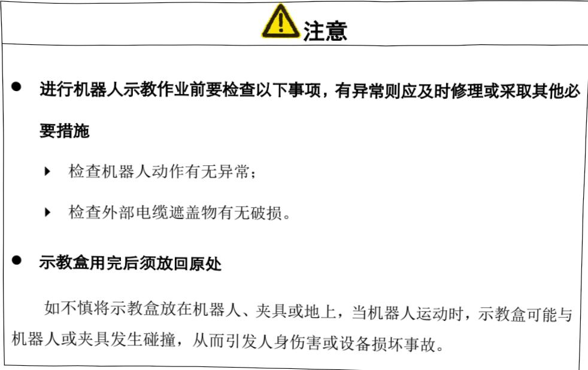

部件更换步骤如图5-1所示。

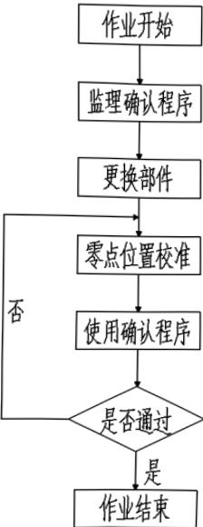

图5-1部件更换步骤

零点位置校准是将机器人位置与绝对编码器位置进行对照的操作，零点位置校准在出厂时

进行。在更换部件前，应建立确认程序，确认零点位置是否发生位置偏移，如发生零点位置偏移，需再次进行零点位置校准。再次进行零点位置校准时，可利用此程序对零点位置数据进行修正。

特别是在下列情况下，必须利用程序再次进行零点位置校准。

改变机器人本体与控制器的组合时；

】更换电池、伺服电机器时；

存储内存被删除时(换主接口板、电池耗尽时等)；

】机器人碰撞工件，零点偏移时。

### 5.1 确认程序的建立

为防止位置偏移，需建立一个示教了确认点的程序（确认点用程序）。确认点—用程序需示教一点为确认点的位置，并在该位置的接近点再示教一点。

## 第六章更换部件

### 6.1 控制柜部件的更换

<html><body><table border="1"><tr><td>危险</td></tr><tr><td>务必在断开电源后，再打开控制柜的门 否则有触电的危险。</td></tr><tr><td>切断电源5min后再更换伺服驱动单元、开关电源盒单元、系统(I/O单元）</td></tr><tr><td>接触器等组件。在这期间，请不要触摸接线端子 否则有触电的危险。</td></tr><tr><td></td></tr><tr><td>注意</td></tr><tr><td>维修中，在总电源（闸刀开关、开关等）控制柜及有关控制箱处贴上“禁止 通电”、“禁止合上电源”等警告牌</td></tr><tr><td>再生电阻器是高温部件，不要触摸，否则有烫伤的危险</td></tr><tr><td>维修结束后，请不要将工具遗留在控制柜内，确认控制柜的门是否关好</td></tr></table></body></html>

### 6.2 伺服驱动单元的更换

危险

更换伺服驱动单元，务必要在切断电源5min后进行

在这期间，请不要触摸接线端子，否则有触电的危险

## 更换步骤：

①关闭主电源5min后开始操作，其间绝对不能接触接线端子。

②取下伺服驱动单元连接的全部电线：

3相AC电源；

伺服电机电源（U、V、W、PE)；

控制信号水晶插头(CN1、CN2);

码盘信号高密插头（CN3);

抱闸2位塑料插头（CN5）。

③取下伺服驱动单元连接的地线。

4取下安装伺服驱动单元上的4个螺钉。

5握住伺服驱动单元将其取出。

⑥安装作业与拆卸作业相反，安装单元，安装插头。

### 6.3 开关电源盒的更换

更换开关电源盒，务必要在切断电源5min后进行

在这期间，请不要触摸接线端子，否则有触电的危险

## 更换顺序

①关闭主电源5min后开始操作，其间绝对不能接触端子。

②取下开关电源盒的全部电线。

】2相AC电源；

】输出侧24V直流电线（24V，0V)。

③取下接地线。

4取下安装开关电源盒的螺钉。

5握住开关电源盒将其取出。

⑥安装作业与拆卸作业相反。

### 6.4 系统主机单元的更换

危险

更换系统主机单元，务必要切断电源，否则有触电的危险

## 更换顺序：

①关闭主电源5min后开始操作，其间绝对不能接触端子。

②取下系统主机单元的全部电线。

2相DC电源

】输入/输出侧插头

】控制信号网线插头（P1，P2)

③取下接地线。

4取下安装系统主机单元的4个螺钉。

5握住系统主机单元将其取出。

⑥安装作业与拆卸作业相反。

### 6.5 接触器等组件的更换

危险

更换接触器等电气组件一定要切断外部电源，务必确认机器人控制柜没有电

源接入

## 更换顺序

①）关闭主电源5min后开始操作，其间绝对不能接触接线端子。

②）取下接触器等电气组件的全部电线

三相AC黑色多股线；

线圈控制线。

③握住接触器用一字螺丝刀翘起下面的白色卡子将其取出。

④安装作业与拆卸作业相反。

### 6.6 机器人本体编码器电池的更换

若机器人出现4000026报警：外部电池供电低于3.1V，则需要尽快更换本体编码器电池，否则可能会使机器人零点丢失。

若机器人出现4000025报警：外部电池低于2.5V，则机器人零点肯定已经丢失，机器人需要重新校准零点。

更换步骤：拆开机器人本体底座电池后盖，更换好本公司指定的电池，拔掉旧电池，装回电池后盖即可。

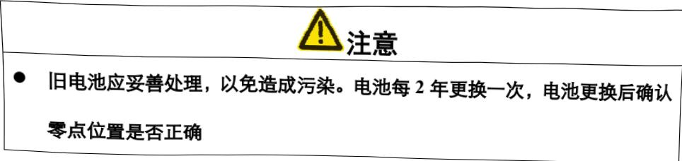

### 6.7 机器人GR-C控制系统部件一览表

表6-1机器人GR-C控制系统部件一览表

<html><body><table border="1"><tr><td>序号</td><td>名称</td><td>型号</td><td>单位</td><td>数量</td></tr><tr><td>1</td><td>主机单元</td><td>GRC01-BY(焊接专用)</td><td>台</td><td>1</td></tr><tr><td>2</td><td>示教盒</td><td>GRC01_BY-02A</td><td>台</td><td>1</td></tr><tr><td>3</td><td>示教盒通信线 (7m)</td><td>GRC01-00-773A</td><td>条</td><td>1</td></tr><tr><td>4</td><td>GR-C01 电柜转接线</td><td>GRC01-00-754</td><td>条</td><td>1</td></tr></table></body></html>

注：表6-1适用于示教盒在控制柜装配的新出线方式之后的焊接机器人系列产品。

### 6.8 控制柜主要部件清单

表6-2控制柜主要部件一览表

<html><body><table border="1"><tbody><tr><td>序号</td><td>名称</td><td>规格</td><td>单位</td><td>数量</td><td>供应厂家</td></tr><tr><td>1</td><td>电柜</td><td>RB08A1-86001</td><td>台</td><td>1</td><td>GSK</td></tr><tr><td>2</td><td>J3~J6，J8伺服驱动</td><td>GE2030T-LB1</td><td>台</td><td>5</td><td>GSK</td></tr><tr><td>3</td><td>J7伺服驱动</td><td>GE2050T-LB1</td><td>台</td><td>1</td><td>GSK</td></tr><tr><td>4</td><td>J1，J2 伺服驱动</td><td>GE2075T-LB1</td><td>台</td><td>2</td><td>GSK</td></tr><tr><td>5</td><td>断路器</td><td>NSC60E3020N</td><td>个</td><td>1</td><td>施耐德</td></tr><tr><td>6</td><td>滤波器</td><td>ANF-I04020H-A</td><td>个</td><td>1</td><td></td></tr><tr><td>7</td><td>断路器</td><td>SH203-D25</td><td>个</td><td>1</td><td>ABB</td></tr><tr><td>8</td><td>断路器</td><td>SH202-D3</td><td>个</td><td>1</td><td>ABB</td></tr><tr><td>6</td><td>交流接触器</td><td>SC-EIP，AC220V</td><td>个</td><td>1</td><td>富士</td></tr><tr><td>10</td><td>三相隔离变压器</td><td>GZK6.0KVA</td><td>台</td><td>1</td><td></td></tr><tr><td>11</td><td>电源盒</td><td>LRS-350-24(含支架)</td><td>个</td><td>1</td><td></td></tr><tr><td>12</td><td>电源盒</td><td>LRS-100-24</td><td>个</td><td>1</td><td></td></tr><tr><td>13</td><td>继电器</td><td>RJIS-CLD-D24</td><td>个</td><td>8</td><td>和泉</td></tr></table></body></html>

<html><body><table border="1"><tr><td>序号</td><td>名称</td><td>规格</td><td>单位</td><td>数量</td><td>供应厂家</td></tr><tr><td>14</td><td>直流继电器底座</td><td>和泉</td><td>SJ1S-05B</td><td>个</td><td>8</td></tr><tr><td>15</td><td>继电器</td><td>魏德米勒</td><td>DRI424024LD/7760056336</td><td>个</td><td>2</td></tr><tr><td>16</td><td>直流继电器底座</td><td>魏德米勒</td><td>SDI2COFECO/7760056349</td><td>个</td><td>2</td></tr><tr><td>17</td><td>蘑菇头急停开关</td><td>Φ22-B22-RR21-502-000</td><td>个</td><td>1</td><td>西门子</td></tr><tr><td>18</td><td>报警指示灯</td><td>YW1P-1BUQ4R</td><td>个</td><td>1</td><td>和泉</td></tr><tr><td>19</td><td>伺服通电指示灯</td><td>YW1P-1BUQ4R</td><td>个</td><td>1</td><td>和泉</td></tr><tr><td>20</td><td>轴流风机</td><td>1238HA2BMT</td><td>个</td><td>3</td><td></td></tr><tr><td>21</td><td>护套线(4*4)</td><td>RVV4*4mm2</td><td>米</td><td>5</td><td></td></tr><tr><td>22</td><td>码盘重载线</td><td>YM150075(UL20276)</td><td>条</td><td>1</td><td></td></tr><tr><td>23</td><td>动力重载线</td><td>SK-B2587-696</td><td>条</td><td>1</td><td></td></tr><tr><td>24</td><td>电池</td><td>ER34615-2</td><td>只</td><td>1</td><td></td></tr><tr><td>GRC</td><td>套</td><td>1</td><td>GSK</td><td>25</td><td>控制系统</td></tr></table></body></html>

## 第七章零件更换后的工作

### 7.1 机器人零点位置

设置绝对零点位置就是对机器人的机械原点进行位置校准，以确保机器人的运行安全和运动精度等。绝对零点位置设置是在出厂前根据机器人具体尺寸设置进行的，没有进行原点位置校准，不允许对机器人进行示教和再现操作，以防发生危险。

#### 7.1.1 零点位置校准

零点位置校准是将机器人位置与绝对编码器位置进行对照的操作。原点位置校准后，机器人机械原点位置与绝对编码器的绝对值数据是唯一对应的，也就是说，只有一组编码器的绝对值对应机器人机械原点位置。

在下列情况下必须再次进行零点位置校准。

改变机器人与控制柜的组合时；

】更换电机、绝对编码器时；

机器人碰撞工件或其他物件，零点偏移时。

#### 7.1.2 操作方法

按下示教盒上的急停按钮，在管理模式下，按下[TAB]键，切换到主菜单区，选择{系统设置}，可以打开零点设置画面，如下图7-1所示。

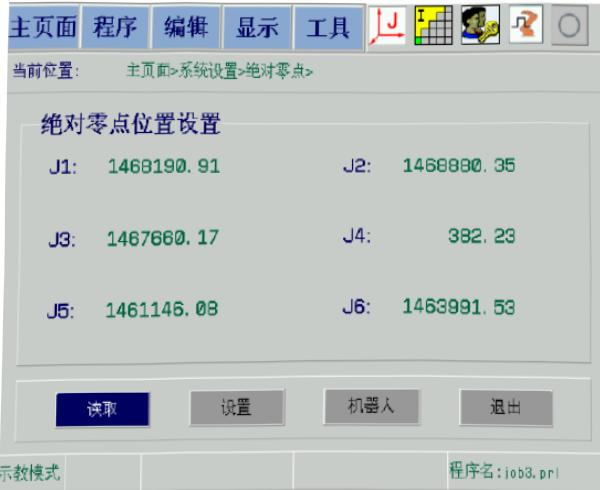

图7-1绝对零点校准界面

在该页面中，J1至J6显示的是上次设置的零点值。按照以下步骤完成零点位置的设定：

第一步：按[坐标设定]键选择关节坐标系。

第二步：移动机器人到机械零点位置（绝对零点位置）。绝对零点位置也就是机器人本体上的各轴正负向标记中间的三角标志对准的位置（或两边刻度尺中间刻度对齐，在一条直线上的位置）。

第三步：通过按[TAB]键切换到【读取】按钮，再按[选择]键，将读取当前各个关节的实际位置值。

第四步：按左右方向键，移动光标到【设置】按钮，再按[选择]键，将完成零点位置的设定。

#### 7.1.3 机器人的绝对零点位置姿态

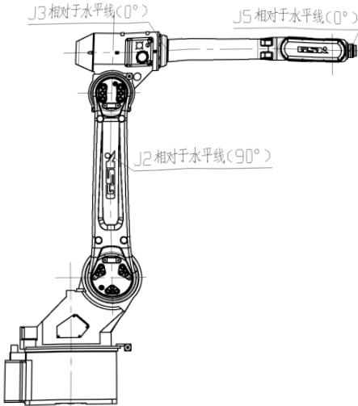

图7-2RH06A3-2060机器人零点姿态示意图

## 第八章I/O信号

### 8.1 输入信号连接电路

各输入点接高电平（+24V）有效，接线图如图8-1。

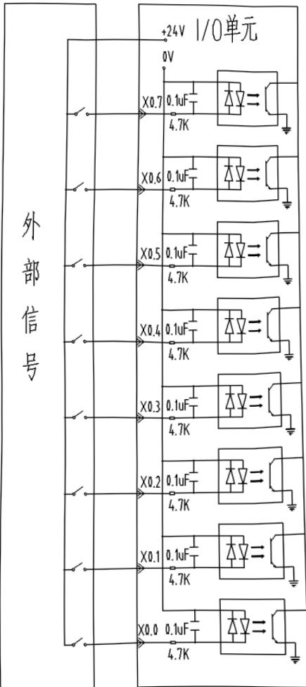

图 8-1高电平输入有效连接示意图

注：输入点4组共32个点，上图是以X0.0—X0.7这一组为例，其它组连接方式相同。

### 8.2 输出信号连接电路

输出信号点共32个，均为低电平“0”输出，每个点最大通过电流70mA。

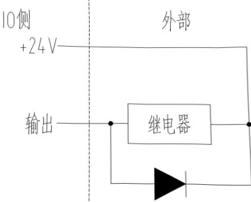

图8-2输出信号连接示意图

操作指令与端口的对应关系如表8-1、表8-2所示。

表8-1输入信号与端口对应关系

<html><body><table border="1"><tr><td colspan="8">输入信号的对应关系</td></tr><tr><td>指令</td><td>1/0输入</td><td>指令</td><td>I/0输入</td><td>指令</td><td>I/0输入</td><td>指令</td><td>1/0输入</td></tr><tr><td>INO</td><td>X0.0 *</td><td>IN8</td><td>X1.0*</td><td>IN16</td><td>X2.0*</td><td>IN24</td><td>X3.0</td></tr><tr><td>IN1</td><td>X0.1 *</td><td>IN9</td><td>X1.1*</td><td>IN17</td><td>X2.1*</td><td>IN25</td><td>X3.1</td></tr><tr><td>IN2</td><td>X0.2 *</td><td>IN10</td><td>X1.2*</td><td>IN18</td><td>X2.2*</td><td>IN26</td><td>X3.2</td></tr><tr><td>IN3</td><td>X0.3 *</td><td>IN11</td><td>X1.3*</td><td>IN19</td><td>X2.3</td><td>IN27</td><td>X3.3</td></tr><tr><td>IN4</td><td>X0.4 *</td><td>IN12</td><td>X1.4*</td><td>IN20</td><td>X2.4</td><td>IN28</td><td>X3.4</td></tr><tr><td>IN5</td><td>X0.5 *</td><td>IN13</td><td>X1.5*</td><td>IN21</td><td>X2.5</td><td>IN29</td><td>X3.5</td></tr><tr><td>IN6</td><td>X0.6 *</td><td>IN14</td><td>X1.6*</td><td>IN22</td><td>X2.6</td><td>IN30</td><td>X3.6</td></tr><tr><td>IN7</td><td>X0.7 *</td><td>IN15</td><td>X1.7*</td><td>IN23</td><td>X2.7</td><td>IN31</td><td>X3.7</td></tr></table></body></html>

表8-2输出信号与端口对应关系

<html><body><table border="1"><tr><td colspan="8">输出信号的对应关系</td></tr><tr><td>指令</td><td>1/0输出</td><td>指令</td><td>I/0输出</td><td>指令</td><td>I/O输出</td><td>指令</td><td>I/0输出</td></tr><tr><td>OT0</td><td>Y0.0 *</td><td>OT8</td><td>Y1.0*</td><td>OT16</td><td>Y2.0*</td><td>OT24</td><td>Y3.0</td></tr><tr><td>OT1</td><td>Y0.1 *</td><td>OT9</td><td>Y1.1*</td><td>OT17</td><td>Y2.1*</td><td>OT25</td><td>Y3.1</td></tr><tr><td>OT2</td><td>Y0.2 *</td><td>OT10</td><td>Y1.2*</td><td>OT18</td><td>Y2.2*</td><td>OT26</td><td>Y3.2</td></tr><tr><td>OT3</td><td>Y0.3 *</td><td>OT11</td><td>Y1.3*</td><td>OT19</td><td>Y2.3</td><td>OT27</td><td>Y3.3</td></tr><tr><td>OT4</td><td>Y0.4 *</td><td>OT12</td><td>Y1.4 *</td><td>OT20</td><td>Y2.4</td><td>OT28</td><td>Y3.4</td></tr><tr><td>OT5</td><td>Y0.5 *</td><td>OT13</td><td>Y1.5*</td><td>OT21</td><td>Y2.5</td><td>OT29</td><td>Y3.5</td></tr><tr><td>OT6</td><td>Y0.6 *</td><td>OT14</td><td>Y1.6*</td><td>OT22</td><td>Y2.6</td><td>OT30</td><td>Y3.6</td></tr><tr><td>OT7</td><td>Y0.7 *</td><td>OT15</td><td>Y1.7*</td><td>OT23</td><td>Y2.7</td><td>OT31</td><td>Y3.7</td></tr></table></body></html>

注：1.其中带*为系统占用信号，其它信号客户根据需要可以自行定义。

2.不用RSR、PNS功能时，IN8~IN17，OT8~OT17用户可自定义使用；使用RSR、PNS功能时，则IN8~IN17，OT8~OT17系统占用。

应用示例：

MAIN:

JUMP LAB1，IF $\mathrm{IN}24=\mathrm{ON}$ 日IF条件语句，如果输入信号IN24(X3.0)为高电平，则跳转到LAB1;

DOUT OT26,ON;如果IF条件不满足，则输出OT26(Y3.2)低

电平；

LAB1;跳转标识；

DOUT OT28，ON;输出OT28(Y3.4)低电平；

END;程序结束。

### 8.31 /0定义

#### 8.3.1 系统占用I/O接口定义

输入信号：

X0.0系统急停输入信号（0为急停报警状态，1为非急停状态)

X0.1系统暂停输入信号

X0.2系统启动输入信号（RSR或PNS模式加载作为再启动按键继续运行程序）

X0.3系统停止输入信号

X0.4系统使能输入信号

X0.5系统清除输入信号

X0.6系统焊接应用有效输入信号

X0.7系统回归作业原点输入信号

X1.0RSR启动信号

X1.1RSR启动信号

X1.2RSR启动信号

X1.3RSR启动信号

X1.4RSR启动信号

X1.5RSR启动信号

X1.6RSR启动信号

X1.7RSR启动信号

X2.0预约程序编号的输入端口

X2.1启动PNS程序的输入端口

X2.2本体硬限位输入信号（部分机型有此信号)

X2.3~X3.7为用户自定义输入信号。

输出信号：

Y0.0系统急停输出信号

Y0.1系统暂停输出信号

Y0.2系统运行输出信号

Y0.3系统停止输出信号

Y0.4系统使能输出信号

Y0.5系统清除报警输出信号

Y0.6系统焊接应用有效输出信号

Y0.7系统回归作业原点输出信号

Y1.0RSR启动信号输出

Y1.1RSR启动信号输出

Y1.2RSR启动信号输出

Y1.3RSR启动信号输出

Y1.4RSR启动信号输出

Y1.5RSR启动信号输出

Y1.6RSR启动信号输出

Y1.7RSR启动信号输出

Y2.0预约程序编号的输出信号

Y2.1启动PNS程序的输出信号

Y2.2系统报警灯输出信号

Y2.3～Y3.7为用户自定义输出信号。

说明：系统I/O信号与自定义I/O信号的具体功能使用请参考《工业机器人GR-C控制系统操作说明书》。

## 第九章伺服报警及其处理

表9-1伺服报警及处理方法

<html><body><table border="1"><tr><td>报警代码</td><td>报警名称</td><td>原因</td><td>处理方法</td></tr><tr><td rowspan="11">1</td><td rowspan="11">超速</td><td>①控制电路板故障 ②编码器故障</td><td>①更换伺服驱动单元 ②更换伺服电机</td></tr><tr><td>输入指令脉冲频率过高</td><td>正确设定输入指令脉冲</td></tr><tr><td>减速时间常数太小，使速度 超调量过大</td><td>增大加/减速时间常数</td></tr><tr><td>输入电子齿轮比太大</td><td>正确设置</td></tr><tr><td>编码器故障</td><td>更换伺服电机</td></tr><tr><td>编码器电缆不良</td><td>更换编码器电缆</td></tr><tr><td>伺服系统不稳定，引起超调</td><td>①重新设定有关增益 ②如果增益不能设置到合适值，则减小 负载转动惯量比率</td></tr><tr><td>负载惯量过大</td><td>①减小负载惯量 ② 更换更大功率的伺服驱动单元和电机</td></tr><tr><td>编码器零点错误</td><td>①更换伺服电机 ②请厂家重调编码器零点</td></tr><tr><td>①电机U、V、W引线接错 ②编码器电缆引线接错</td><td>正确接线</td></tr><tr><td rowspan="5">2</td><td rowspan="5">主电路过压</td><td>电路板故障</td><td>更换伺服驱动单元</td></tr><tr><td>①电源电压过高 电源电压波形不正常</td><td>检查供电电源</td></tr><tr><td>制动电阻接线断开</td><td>重新接线</td></tr><tr><td>① ）制动晶体管损坏 内部制动电阻损坏</td><td>更换伺服驱动单元</td></tr><tr><td>制动回路容量不够</td><td>①降低起停频率 ② 增加加/减速时间常数 ③ ）减小转矩限制值 ④ 减小负载惯量 更换更大功率伺服驱动单元和电机</td></tr></table></body></html>

<html><body><table border="1"><tr><td>报警代码</td><td>报警名称</td><td>原因</td><td>处理方法</td></tr><tr><td rowspan="5">3</td><td rowspan="5">主电路欠压</td><td>①电路板故障 ②电源保险损坏 ③软启动电路电路故障 ④整流器损坏</td><td>更换伺服驱动单元</td></tr><tr><td>①电源电压低 ②临时停电20 ms以上</td><td>检查电源</td></tr><tr><td>① ）电源容量不够 ②瞬时掉电</td><td>检查电源</td></tr><tr><td>散热器过热</td><td>检查负载情况</td></tr><tr><td></td><td></td></tr><tr><td rowspan="7">4</td><td rowspan="7">位置超差</td><td>电路板故障</td><td>更换伺服驱动单元</td></tr><tr><td>编码器故障</td><td>更换伺服电机</td></tr><tr><td>设定位置超差检测范围太小</td><td>增加位置超差检测范围</td></tr><tr><td>位置比例增益太小</td><td>增加增益</td></tr><tr><td>转矩不足</td><td>①检查转矩限制值 ②减小负载容量 ③更换更大功率伺服驱动单元和电机</td></tr><tr><td>指令脉冲频率太高</td><td>降低频率</td></tr><tr><td></td><td></td></tr><tr><td rowspan="4">5</td><td rowspan="4">电机过热</td><td>电路板故障</td><td>更换伺服驱动单元</td></tr><tr><td>电机过负载</td><td>①减小负载 ②降低起停频率 ③减小转矩限制值 ④减小有关增益 换更大功率伺服驱动单元和电机。</td></tr><tr><td>电机内部故障</td><td>更换伺服电机</td></tr><tr><td></td><td></td></tr><tr><td rowspan="2">6</td><td rowspan="2">速度放大器饱 和故障</td><td>电机被机械卡死</td><td>检查负载机械部分</td></tr><tr><td></td><td></td></tr><tr><td>7</td><td>驱动禁止异常</td><td>CCW、CW驱动禁止输入端 子都断开</td><td>检查接线、输入端子用电源</td></tr></table></body></html>

<html><body><table border="1"><tr><td>报警代码</td><td>报警名称</td><td>原因</td><td>处理方法</td></tr><tr><td>8</td><td>位置偏差计数 器溢出</td><td>①电机被机械卡死 ②输入指令脉冲异常</td><td>①检查负载机械部分 ②检查指令脉冲 ③检查电机是否接指令脉冲转动</td></tr><tr><td rowspan="5">6</td><td rowspan="5">编码器故障</td><td>编码器接线错误</td><td>检查接线</td></tr><tr><td>编码器损坏</td><td>更更换电机</td></tr><tr><td>编码器电缆不良</td><td>更换电缆</td></tr><tr><td>编码器电缆过长，造成编码 器供电电压偏低</td><td>①缩短电缆 ②采用多芯并联供电</td></tr><tr><td></td><td></td></tr><tr><td rowspan="2">10</td><td rowspan="2">控制电源欠压</td><td>输入控制电源偏低</td><td>检查控制电源</td></tr><tr><td></td><td></td></tr><tr><td rowspan="6">11</td><td rowspan="6">IPM模块故障</td><td>电路板故障</td><td>更换伺服驱动单元</td></tr><tr><td>伺服驱动单元U、V、W之间 短路</td><td>检查接线</td></tr><tr><td>接地不良</td><td>正确接地</td></tr><tr><td>电机绝缘损坏</td><td>更换电机</td></tr><tr><td>受到干扰</td><td>①增加线路滤波器 ②远离干扰源</td></tr><tr><td></td><td></td></tr><tr><td rowspan="4">12</td><td rowspan="4">过电流</td><td>伺服驱动单元U、V、W之间 短路</td><td>检查接线</td></tr><tr><td>电机绝缘损坏</td><td>更换电机</td></tr><tr><td>伺服驱动单元损坏</td><td>更换伺服驱动单元</td></tr><tr><td></td><td></td></tr><tr><td rowspan="6">13</td><td rowspan="6">过负载</td><td>电路板故障</td><td>更换伺服驱动单元</td></tr><tr><td>保持制动器没有打开</td><td>检查保持制动器</td></tr><tr><td>电机不稳定振荡</td><td>①调整增益 ）增加加/减速时间 ③减小负载惯量</td></tr><tr><td>① ）U、V、W有一相断线 ② 编码器接线错误</td><td>检查接线</td></tr><tr><td></td><td></td></tr><tr><td></td><td></td></tr></table></body></html>

<html><body><table border="1"><tr><td>警代码</td><td>报警名称</td><td>原因</td><td>处理方法</td></tr><tr><td rowspan="5">14</td><td rowspan="5">制动故障</td><td>电路板故障</td><td>更换伺服驱动单元</td></tr><tr><td>制动电阻接线断开</td><td>重新接线</td></tr><tr><td>）制动晶体管损坏 内部制动电阻损坏</td><td>更换伺服驱动单元</td></tr><tr><td>制动回路容量不够</td><td>①降低起停频率 ②增加加/减速时间常数 ③减小转矩限制值 ④减小负载惯量 ③换更大功率的伺服驱动单元和电机</td></tr><tr><td>主电路电源过高</td><td>检查主电源</td></tr><tr><td rowspan="3">15</td><td rowspan="3">编码器计数错 误</td><td>编码器损坏</td><td>更换伺服电机</td></tr><tr><td>编码器接线错误</td><td>检查接线</td></tr><tr><td>接地不良</td><td>正确接地</td></tr><tr><td rowspan="2">17</td><td rowspan="2">制动时间过长</td><td>输入电源电压长时间过高</td><td>接入满足伺服驱动单元工作要求的电源</td></tr><tr><td>无制动电阻或制动电阻偏 大，制动过程中，能量无法 及时释放，造成内部直流电 压的升高</td><td>连接正确的制动电阻</td></tr><tr><td>18</td><td>直流母线电压 过高，却没有 制动反馈</td><td>制动电路故障</td><td>更换伺服驱动单元</td></tr><tr><td>19</td><td>直流母线电压 没有达到制动 阀值时，却有 制动反馈</td><td>制动电路故障</td><td>更换伺服驱动单元</td></tr><tr><td>20</td><td>EEROM错误</td><td>芯片或电路板损坏</td><td>①更换伺服驱动单元 ②经修复后，必须重新设置伺服驱动单 元型号(参数No.1)，然后再恢复缺省 参数</td></tr><tr><td>21</td><td>电源缺相报警</td><td>三相输入电源缺相</td><td>检查输入电源</td></tr><tr><td>23</td><td>A/D转换 错误</td><td>①放大器或431问题 ②电流传感器损坏</td><td>更换伺服驱动单元</td></tr><tr><td>24</td><td>多圈数据 错误</td><td>在主电源上电期间，由于绝 对编码器数据异常引起</td><td>重启伺服初始化绝对编码器使报警复位</td></tr></table></body></html>

<html><body><table border="1"><tr><td>警代码</td><td>报警名称</td><td>原因</td><td>处理方法</td></tr><tr><td>25</td><td>外部电池错误</td><td>①外部电池低于2.5V ②绝对值编码器发生误动作</td><td>①更换外部电池 ② 更换伺服电机 重新设置机床零点</td></tr><tr><td>26</td><td>外部电池 报警</td><td>外部电池低于3.1V</td><td>更换外部电池</td></tr><tr><td>27</td><td>电机型号不匹 配</td><td>伺服驱动单元保存的电机型 号与当前使用的电机型号不 一致</td><td>重新设置相应的电机型号，恢复缺省值， 断电重启</td></tr><tr><td rowspan="2">28</td><td rowspan="2">码盘数据CRC 校验错误</td><td>在编码器的内存检查中发现 异常</td><td>①重启以重新初始化编码器 ② 重新向编码器写入电机型号 ③ 若频繁发生则需更换伺服电机</td></tr><tr><td>通信芯片或电路板损坏 因干扰影响通信质量，导致 数据传输错误 编码器故障</td><td>更换伺服驱动单元 检查调整编码器周围配线</td></tr><tr><td rowspan="2">29</td><td rowspan="2">绝对位置数据 异常报警</td><td>若频繁发生则更换伺服电机</td><td></td></tr><tr><td></td><td></td></tr><tr><td>30</td><td>编码器Z脉冲 丢失</td><td>①Z脉冲不存在，编码器损坏 ② 电缆不良 ③ ）电缆屏蔽不良 ④ 屏蔽地线未连好 5 编码器接口电路故障</td><td>①更换编码器 ② 检查编码器接口电路</td></tr><tr><td>31</td><td>编码器UVW信 号错误</td><td>① 编码器UVW信号损坏 ② ）编码器Z信号损坏 ③电缆不良 ④ ）电缆屏蔽不良 5 ）屏蔽地线未连好 ⑥编码器接口电路故障</td><td>①更换编码器 ② 检查编码器接口电路</td></tr><tr><td>32</td><td>编码器UVW信 号非法编码</td><td>①编码器UVW信号损坏 ②电缆不良 ③电缆屏蔽不良 ④屏蔽地线未连好 5 编码器接口电路故障</td><td>①更换编码器 ②检查编码器接口电路</td></tr><tr><td>33</td><td>总线通信 异常</td><td>①网线松动，接触不良 ②控制板内通信芯片损坏</td><td>①检查网线连接是否正常否则换控制网 线 ②更换伺服驱动单元</td></tr><tr><td>减轻负载</td><td>改善通风条件</td><td>伺服驱动单元损坏</td><td>更换伺服驱动单元</td></tr></tbody></table></body></html>

<html><body><table border="1"><tr><td>警代码</td><td>报警名称</td><td>原因</td><td>处理方法</td></tr><tr><td rowspan="2">36</td><td rowspan="2">三相主电源掉 电</td><td>三相主电源掉电或瞬时跌落</td><td>检查主电源，确保有正确的三相电压输 入</td></tr><tr><td>三相主电源检测电路故障</td><td>更换伺服驱动单元</td></tr><tr><td rowspan="2">37</td><td rowspan="2">读写绝对式码 盘EEPROM超 时</td><td>编码器电缆不良</td><td>更换电缆</td></tr><tr><td>通信芯片或电路板损坏</td><td>更换伺服控制板</td></tr></table></body></html>

注：若出现表中没有提到的报警号，请联系广州数控设备有限公司。

## 附录一电路总图

下图为RH06A3-2060焊接机器人(配焊接驱动器控制柜)的电源通路图。

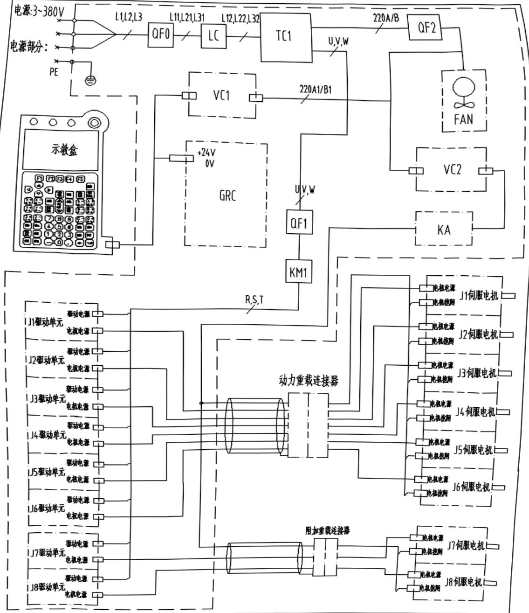

电路总图-电源通路

下图为RH06A3-2060焊接机器人(配焊接驱动器控制柜)的信号通路图。

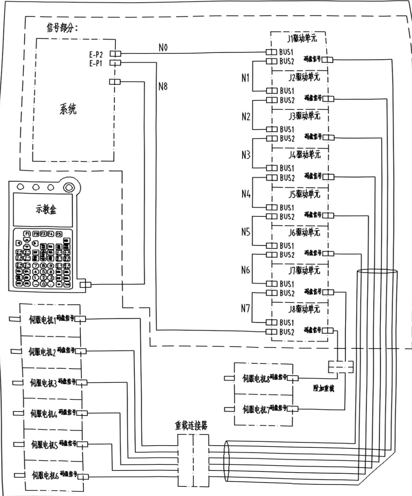

电路总图-信号通路

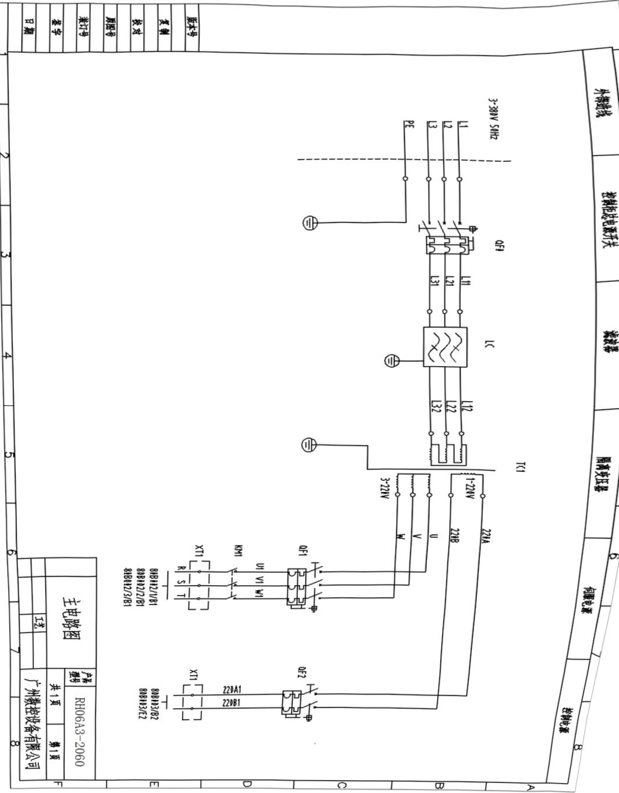

输入电源为3V~380V。下列图为RH06A3-2060焊接机器人(配焊接驱动器)的电路图，车

附录二 电路图

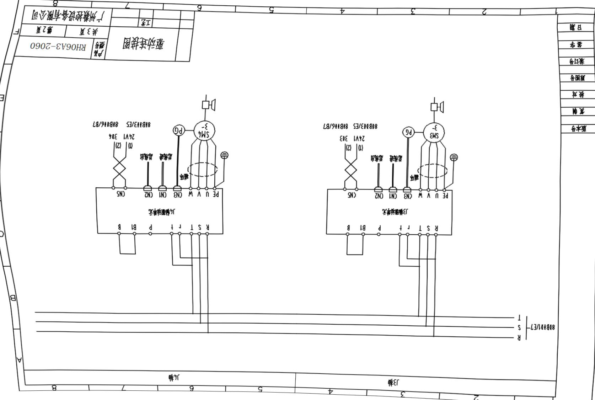

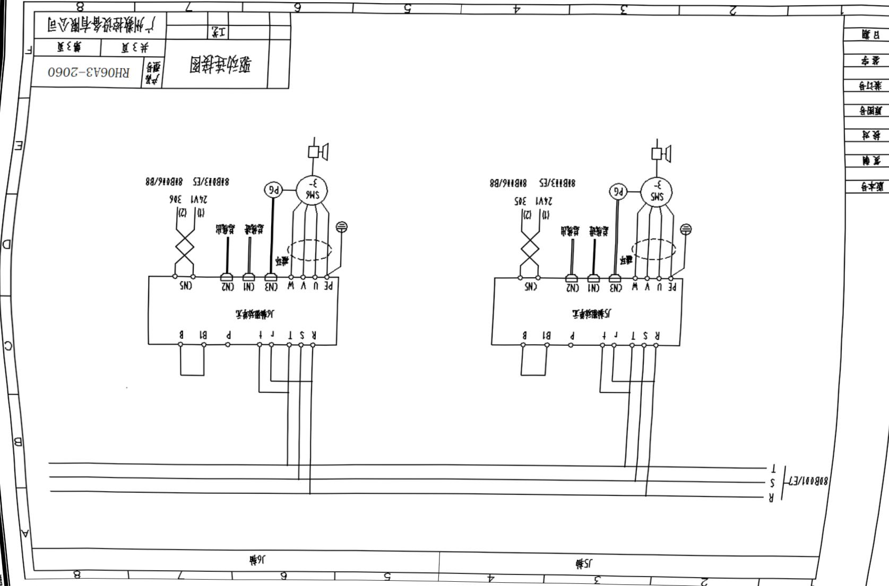

<html><body><table border="1"><tbody><tr><td></td><td>2 KM1线图</td><td>3 风扇</td><td></td><td>4 5 24V电源1</td><td>5</td><td>6 系统单元</td><td>24V电源2</td><td>8</td><td>221A1 8IB111/E8</td><td>B</td><td>N L PE VC1 101W</td><td>N L PE VC2 351W</td></tr><tr><td colspan="13">KA1 80B004B/E4 211 KA2 80B104B/E5 212</td><td>VC2 351W $\fra{}$ +24V</td></tr><tr><td colspan="13">+24V DV 24V1 IV1</td></tr><tr><td>24V2 0V2 (1) (2)</td><td>(1) (2) XT1 F 24V1 iV1</td><td>24V1 0V1 +24VIV 系统单元</td><td>□</td><td colspan="3">XT1 24V2 81B016/E2 80B004/A1</td><td>(1 *</td><td colspan="3">0V2 80B106/B2 8iB014/E1</td><td>版本号 复制</td><td>80B002/1/D480B102/1/D780116/E6 80B102/2/D4 8IB112/2/D7 81B012/3/D486B062/3/D7 81B014B/C4 8B014B/(4</td></tr><tr><td>220B1 8iB111/E8</td><td colspan="3" rowspan="2">8B014B/(4</td><td colspan="9">校对 原图号 装订号</td></tr><tr><td colspan="8"></td></tr><tr><td>KM1 1.一置为风肩也可以用于表示热交换求空调</td><td colspan="3" rowspan="3">FANx3</td><td colspan="4" rowspan="3"></td><td colspan="3" rowspan="3"></td></tr><tr><td></td></tr><tr><td>技术要求 2</td></tr><tr><td>签字 日期</td><td colspan="4" rowspan="2">6</td><td colspan="4" rowspan="2"></td></tr><tr><td>3</td><td colspan="4">4</td></tr></tbody></table></body></html>

<html><body><table border="1"><tbody><tr><td></td><td></td><td>2</td><td>3 X0.0与24V短接</td><td>4</td><td>5 示教盒急停按钮</td><td>6</td><td></td><td colspan="2">8</td><td>伺服通电指示灯</td><td>报警指示灯</td><td>控制柜急停按钮</td><td>安全栅栏急停按钮</td></tr><tr><td colspan="2">1D-端子排 XI(24V)</td><td>24V2 80B103/E7</td><td>24V1 8IB013/E5</td><td colspan="2">SB2</td><td>SB1</td><td colspan="2">SB3</td><td colspan="2">XT1 A</td><td colspan="2"></td></tr><tr><td rowspan="11">24V1 8IB113/E5</td><td rowspan="11">SB1-1</td><td rowspan="11">11 1 1 111</td><td rowspan="11">SB2-1</td><td rowspan="11"></td><td colspan="2">SB3-1</td><td colspan="2">KA2 80B104B/E5</td><td colspan="2"></td><td colspan="2">112</td></tr><tr><td colspan="2">0V1 81B13/E5</td><td>平 D1</td><td colspan="2">£</td><td colspan="2"></td><td>D</td></tr><tr><td colspan="3">KA2 (2</td><td>SB3-2</td><td colspan="2"></td><td colspan="2"></td></tr><tr><td colspan="4">111</td><td>SB2-2</td><td colspan="2">14</td><td colspan="2">1 I SB1-2</td></tr><tr><td colspan="4">版本号</td><td colspan="2">116</td><td colspan="2"></td><td colspan="2"></td></tr><tr><td>复制 校对</td><td colspan="3">iV2 80B103/E7</td><td>|/0-(Y2.2) 112 LE2</td><td colspan="2">KA1</td><td>KA2 80B103/(2-80B003/C2 -8B04B/C2</td><td colspan="2">LE1</td></tr><tr><td>原图号 装订号</td><td colspan="4">技术要求</td><td></td><td colspan="4"></td></tr><tr><td colspan="4"></td><td colspan="4">急停控制图 工艺</td><td colspan="4">产强号 共1页</td></tr><tr><td>签字</td><td colspan="4">1.SB1控制柜急，SB2示数金急，SB3安全提息 2.不接示盘忠时请短接105-10611-102号 3.不接外部安全停时请接114-105113-12号</td><td colspan="6"></td></tr><tr><td>日期</td><td colspan="4">6</td><td colspan="3"></td><td colspan="3"></td></tr><tr><td></td><td colspan="4">2</td><td colspan="3">3</td><td colspan="3">4</td></tr></tbody></table></body></html>

<html><body><table border="1"><tbody><tr><td></td><td>2 了 下 0V1 0V1 0V2 0V2 24V2 24V2 101 102 103 104 105 106 2 3</td><td>2</td><td>了</td><td>4</td><td>5</td><td>6</td><td>版本号</td><td></td><td>8</td><td>A</td><td>固定块 1 可接4mm{²线(高压) 2 挡板 3 4 5 6 7 8 6 可接2.5mm2线(低压) 10 A 11 12 13 14 15 16 挡板 固定块</td><td rowspan="13"></td></tr><tr><td rowspan="13">上</td><td rowspan="13">短接片</td><td colspan="7">下序号</td><td rowspan="13">B</td><td colspan="2"></td><td rowspan="13"></td></tr><tr><td>220B1</td><td>220B1</td><td>220B1</td><td></td><td>220B1</td><td></td><td></td></tr><tr><td>220B1</td><td colspan="2">220B1</td><td colspan="2">220B1</td><td colspan="2">220B1</td><td></td></tr><tr><td>24V1</td><td>24V1</td><td>0 0 0 。 0 。 0 0</td><td colspan="2">O 0 0 0 0 O 0</td><td></td><td colspan="2">24V1</td><td></td></tr><tr><td rowspan="11">24V1</td><td>24V1</td><td></td><td>24V1</td><td rowspan="2">0V1</td><td></td><td>0V1</td><td rowspan="11">0V1</td><td>0V1</td><td></td></tr><tr><td>0V2</td><td></td><td>0V2</td><td>0V2</td><td></td><td></td><td></td></tr><tr><td>0V2</td><td></td><td>0V2</td><td>0V2</td><td>24V2</td><td>24V2</td><td>0</td></tr><tr><td>24V2</td><td>24V2</td><td></td><td>24V2</td><td>101</td><td></td><td></td></tr><tr><td></td><td>101</td><td>102</td><td></td><td>0</td><td></td><td>102</td></tr><tr><td>103</td><td></td><td></td><td>103</td><td>13</td><td></td><td></td></tr><tr><td>104</td><td></td><td></td><td>O </td><td></td><td>104</td><td>14</td></tr><tr><td>105</td><td></td><td>0 0</td><td>0</td><td></td><td>105</td><td>15</td></tr><tr><td>106</td><td></td><td></td><td></td><td>106</td><td>16</td><td>版本号</td></tr><tr><td></td><td></td><td></td><td>复制</td><td></td><td>校对</td><td>G</td><td></td></tr><tr><td></td><td>装订号</td><td></td><td>图样 名称</td><td>接线端子定义图</td><td>产品 型号</td><td>RH06A3-2060</td><td></td></tr><tr><td>签字</td><td colspan="6" rowspan="2"></td><td></td></tr><tr><td></td><td>共1页</td><td>第1页</td><td></td></tr><tr><td></td><td colspan="6" rowspan="6"></td><td></td></tr><tr><td>日期</td><td>设计</td><td colspan="2" rowspan="4"></td><td rowspan="3">工艺</td></tr><tr><td>审核</td><td></td></tr><tr><td></td><td colspan="2"></td><td></td></tr><tr><td></td><td></td><td>2</td><td colspan="2">3</td><td>4</td></tr></tbody></table></body></html>

<html><body><table border="1"><tbody><tr><td colspan="3"></td><td colspan="4"></td><td rowspan="2">2</td><td colspan="2">3</td><td colspan="4"></td><td></td><td colspan="3"></td></tr><tr><td rowspan="11"></td><td>3</td><td></td><td></td><td>抱闸1</td><td>抱闸2</td><td>抱闸了</td><td>4</td><td>5</td><td colspan="4">6</td><td></td><td colspan="2"></td></tr><tr><td>抱间4</td><td>抱闸5</td><td>抱闸6</td><td>抱问信号</td><td>抱问信号 24V2 80B012/1/D481B2/1/D780B102/2/D48B12/2/B78B02/3/D48B2/3/D</td><td>D(8</td><td>24V2 81B103/E7 KA3 $1B+ D 0V2 80B003/E7 YB1 技术要求</td><td colspan="2">KA4 2B+ 山</td><td>KA5 3B+ □</td><td>KA6 4B+ D叶</td><td>KA7 5B+ 叶</td><td colspan="2">KA8 $6B+ 1</td><td>311 IV1</td></tr><tr><td>316 X7</td><td></td><td>302 D{3</td><td>00 D(4</td><td>304 DCS</td><td>315 DC6</td><td></td><td></td><td></td><td>2B+ 山</td><td>5B+ 叶</td><td colspan="2"></td><td></td></tr><tr><td></td><td></td><td></td><td></td><td></td><td></td><td></td><td></td><td></td><td></td><td></td><td colspan="2"></td><td></td></tr><tr><td></td><td colspan="3" rowspan="2"></td><td rowspan="2"></td><td rowspan="2"></td><td rowspan="2"></td><td colspan="2" rowspan="2"></td><td rowspan="2">版本号</td><td colspan="2" rowspan="2"></td><td rowspan="2"></td><td rowspan="2">复制</td></tr><tr><td></td></tr><tr><td>校对</td><td rowspan="5"></td><td colspan="3" rowspan="5"></td><td rowspan="5"></td><td rowspan="5"></td><td colspan="2"></td><td colspan="2"></td><td colspan="2"></td></tr><tr><td></td><td>808106/2</td><td>8B116/(3</td><td>81B016/(3</td><td>80B006/(4-8 1</td><td></td><td></td><td></td></tr><tr><td>装订号</td><td></td><td>抱闸控制图</td><td>产品 型号</td><td>RH06A3-2060</td><td></td><td></td><td>签字</td><td>共1页</td></tr><tr><td>日期</td><td></td><td></td><td>工艺</td><td></td><td>广州数控设备有限公司</td><td></td><td></td><td></td></tr><tr><td></td><td></td><td></td><td></td><td></td><td></td><td></td><td>2</td><td>3</td><td>4</td><td>5</td><td>6</td></tr></tbody></table></body></html>

<html><body><table border="1"><tbody><tr><td>2</td><td>3</td><td>4</td><td>5</td><td>6</td><td>7</td><td>8</td><td>动力重载接线表</td><td>JX1A</td><td>动力重载插头</td><td></td><td></td><td></td><td></td></tr><tr><td rowspan="14"></td><td rowspan="13">动力电缆ROBOT-16044-2</td><td colspan="8">针号</td><td colspan="2">线号</td><td colspan="2">信号</td></tr><tr><td>PE</td><td></td><td colspan="4"></td><td></td><td>GE驱动J1</td><td>U</td><td>1</td><td>4</td></tr><tr><td rowspan="2"></td><td></td><td>1V</td><td colspan="2">V</td><td>2</td><td>5</td><td></td><td></td><td>9</td><td>1W</td></tr><tr><td></td><td></td><td colspan="2"></td><td></td><td></td><td>PE</td><td></td><td></td><td></td></tr><tr><td rowspan="11">GE驱动J2</td><td>U</td><td>10</td><td colspan="2">1</td><td>2U</td><td></td><td></td><td></td><td>2</td><td>2V</td></tr><tr><td></td><td></td><td colspan="2"></td><td></td><td>2W</td><td>W</td><td>12</td><td>3</td><td></td></tr><tr><td></td><td></td><td colspan="2"></td><td></td><td>PE</td><td>U</td><td>17</td><td>7</td><td>0ε</td></tr><tr><td>GE驱动J3</td><td></td><td></td><td colspan="2"></td><td></td><td></td><td>V</td><td>18</td><td>0</td></tr><tr><td></td><td></td><td></td><td colspan="2"></td><td>W</td><td>19</td><td>6</td><td>ME</td><td></td></tr><tr><td></td><td></td><td></td><td colspan="2"></td><td>PE</td><td></td><td>24</td><td>10</td><td>4U</td></tr><tr><td>GE驱动J4</td><td>U</td><td colspan="2"></td><td></td><td></td><td></td><td>4V</td><td></td><td></td></tr><tr><td>V</td><td>25</td><td colspan="2">11</td><td></td><td></td><td></td><td></td><td></td><td></td></tr><tr><td>W</td><td>26</td><td colspan="2">12</td><td>4W</td><td></td><td></td><td></td><td></td><td></td></tr><tr><td>PE U V W</td><td>32</td><td colspan="2">PE2</td><td>20</td><td></td><td></td><td></td><td>5U</td><td>7</td></tr><tr><td>GE驱动J5</td><td></td><td colspan="2"></td><td></td><td></td><td></td><td>5</td><td>14</td><td>5V</td></tr><tr><td></td><td></td><td></td><td colspan="2"></td><td></td><td>6</td><td>15</td><td>5W</td><td></td><td></td></tr><tr><td></td><td></td><td></td><td colspan="2">PE U V W</td><td>0</td><td>31</td><td>PE1</td><td></td><td></td><td></td></tr><tr><td>27</td><td>16</td><td>6U</td><td colspan="2">GE驱动J6</td><td></td><td></td><td></td><td></td><td></td><td></td></tr><tr><td>28</td><td>17</td><td>6V</td><td colspan="2"></td><td></td><td></td><td></td><td>29</td><td>18</td><td>6W</td></tr><tr><td></td><td>屏藏FG壳体</td><td></td><td colspan="2"></td><td></td><td></td><td></td><td></td><td></td><td></td></tr><tr><td>SAA</td><td>$1B+</td><td></td><td>9</td><td>19</td><td>1B+</td><td></td><td></td><td>KA4</td><td>2B+</td><td>16</td></tr><tr><td></td><td></td><td></td><td></td><td>继电器</td><td>KA5</td><td>+0</td><td>2</td><td>21</td><td>+E</td><td></td></tr><tr><td></td><td></td><td></td><td></td><td></td><td>版本号</td><td>KA6</td><td>4B+</td><td>32</td><td>22</td><td>4B+</td></tr><tr><td></td><td></td><td></td><td></td><td></td><td></td><td>D-B(2)</td><td>KA7</td><td>5B+</td><td>15</td><td>E</td></tr><tr><td></td><td></td><td></td><td></td><td></td><td></td><td></td><td>CAA</td><td>6B+</td><td>22</td><td>24</td></tr><tr><td>复制</td><td></td><td></td><td></td><td></td><td>0V2</td><td>-0</td><td>7</td><td>25</td><td>1B-</td><td></td></tr><tr><td></td><td></td><td></td><td></td><td></td><td></td><td>2B-</td><td>14</td><td>26</td><td>2B-</td><td></td></tr><tr><td>接线端子</td><td></td><td></td><td></td><td colspan="2"></td><td></td><td></td><td>校对</td><td>-00</td><td>21</td><td>27</td></tr><tr><td>XT1</td><td></td><td></td><td></td><td></td><td></td><td>4B-</td><td>30</td><td>28</td><td>4B-</td><td></td></tr><tr><td></td><td colspan="4"></td><td></td><td></td><td></td><td>5B-</td><td>8</td><td>29</td><td>5B-</td></tr><tr><td></td><td colspan="4" rowspan="5"></td><td></td><td colspan="2"></td><td></td><td colspan="2">原图号</td><td>6B-</td></tr><tr><td></td><td></td><td>装订号</td><td></td><td>工艺 </td><td>产品 型号</td><td>RH06A3-2060</td><td></td><td>签字</td><td></td></tr><tr><td>共1页</td><td>第1页</td><td></td><td>日期</td><td></td><td></td><td>工艺</td><td></td><td>广州数控设备有限公司</td><td></td></tr><tr><td></td><td></td><td>日期</td><td>1</td><td>2</td><td></td></table></body></html>

<html><body><table border="1"><tbody><tr><td>1</td><td></td><td>2</td><td>3</td><td>4</td><td>5</td><td>6</td><td></td><td>8</td><td>A</td><td></td><td>码盘重载接线表</td><td>Group1 Group2 Group3 Group4 Group5 Group6</td></tr><tr><td rowspan="20">(cid:2) 25 黑白 1SD+$ Id: 码盘电缆-YM150075 信号重载插头（JX2A）</td><td colspan="8"></td><td colspan="6"></td></tr><tr><td>脚号</td><td>颜色</td><td>信号</td><td></td><td colspan="2">即号</td><td>颜色</td><td colspan="2">信号</td><td></td><td colspan="2"></td><td></td></tr><tr><td>26</td><td>黑</td><td>-051</td><td></td><td>A1</td><td>黑</td><td>15D-</td><td>25</td><td>黑白</td><td>1SD+</td><td>A2</td><td rowspan="14">黑白</td></tr><tr><td>19/21</td><td>红</td><td>1VCC</td><td>7</td><td></td><td>红白</td><td>1GND</td><td>15/17</td><td>红白</td><td>1GND</td><td>A5</td><td></td></tr><tr><td>外壳</td><td>屏蔽</td><td>1FG</td><td></td><td></td><td>S</td><td>屏蔽</td><td>1FG</td><td>c 19/21 红 2VCC </td><td></td><td></td><td></td></tr><tr><td>26</td><td>置</td><td>-00</td><td></td><td></td><td>B1</td><td>蛋</td><td>2SD-</td><td></td><td></td><td></td><td></td></tr><tr><td>25</td><td>黑白</td><td>2SD+</td><td>B2</td><td>黑</td><td>2SD+</td><td></td><td>19/21</td><td>红</td><td>2VCC</td><td>B4</td><td>红</td></tr><tr><td>15/17</td><td>红白</td><td>2GND</td><td>B5</td><td>红台</td><td>2GND</td><td></td><td></td><td></td><td></td><td></td><td></td></tr><tr><td>外壳</td><td>屏散</td><td>2FG</td><td></td><td></td><td></td><td></td><td>B3</td><td>屏蔽</td><td>2FG</td><td>c 19/21 红 3VCC 十</td><td></td></tr><tr><td>26</td><td>暴</td><td>-0SE</td><td>X</td><td>C1</td><td>黑</td><td>-OSE</td><td></td><td>25</td><td>黑白</td><td>3SD+</td><td>C2</td></tr><tr><td>19/21</td><td>巧</td><td>3VCC</td><td>C4</td><td>红</td><td>3VCC</td><td>D</td><td></td><td></td><td></td><td></td><td></td></tr><tr><td>15/17</td><td>红白</td><td>3GND</td><td>C5</td><td>红白</td><td>3GND</td><td></td><td>外壳</td><td>屏</td><td>3FG</td><td></td><td>C3</td></tr><tr><td>(ci) 19/21 19/21 红白 红白 4VCC 4VCC I</td><td></td><td></td><td></td><td>26</td><td>累</td><td>45D-</td><td></td><td>XX</td><td>D1</td><td>黑</td><td>4SD-</td></tr><tr><td>25</td><td>累白</td><td>45D+</td><td>D2</td><td>黑台</td><td>4SD+</td><td></td><td></td><td></td><td></td><td></td><td></td></tr><tr><td>19/21</td><td>红</td><td>4VCC</td><td>XX</td><td>D4</td><td>红</td><td>4VCC</td><td></td><td></td><td></td><td>15/17</td><td>红白</td></tr><tr><td>外壳</td><td>屏蔽</td><td>4FG</td><td></td><td></td><td></td><td>D3</td><td>屏散</td><td>4FG</td><td>(cid) 19/21 19/21 红白 红白 5VCC 5VCC I</td><td></td><td></td></tr><tr><td>26</td><td>果</td><td>5SD-</td><td>XX</td><td>A7</td><td>黑</td><td>5SD-</td><td></td><td></td><td></td><td></td><td></td></tr><tr><td>25</td><td>黑白</td><td>5SD+</td><td>B7</td><td>墨台</td><td>5SD+</td><td>19/21</td><td>巧</td><td>5VCC</td><td>D7</td><td>红</td><td>5VCC</td></tr><tr><td>15/17</td><td>红白</td><td>5GND</td><td>[8</td><td>红白</td><td>5GND</td><td>F</td><td>外壳</td><td>屏蔽</td><td>5FG</td><td></td><td>A8</td></tr><tr><td>c 19/21 红 6VCC 十</td><td></td><td></td><td></td><td>版本号</td><td>D-B(2)</td><td>26</td><td>累</td><td>6SD-</td><td></td><td>A9</td><td>置</td></tr><tr><td>复制</td><td>25</td><td>黑白</td><td>6SD+</td><td>B9</td><td>黑台</td><td>6SD+</td><td></td><td>19/21</td><td>红</td><td>6VCC</td><td></td></tr><tr><td></td><td>09</td><td>红</td><td>6VCC</td><td>校对</td><td>15/17</td><td>红白</td><td>6GND</td><td>08</td><td>红白</td><td>G</td><td>6GND</td></tr><tr><td>外壳 屏散 6FG B8 屏蔽 6FG</td><td>外壳</td><td>屏散</td><td>6FG</td><td></td><td>B8</td><td></td><td>屏蔽</td><td>6FG</td><td>原图号</td><td></td><td></td></tr><tr><td>装订号</td><td></td><td>工艺期( 工艺期( </td><td>产品 型号</td><td>RH06A3-2060</td><td></td><td>签字</td><td></td><td></td><td>共1页</td><td>第1页</td><td></td></tr><tr><td>日期</td><td></td><td></td><td>工艺</td><td>广州数控设备有限公司</td><td></td><td></td><td></td><td>日期</td><td></td><td></td><td></td></tr><tr><td>1</td><td>2</td><td></td><td>3</td><td>4</td><td></td><td></td><td></td><td></td><td></td><td></td><td></td></tr><tr><td></td><td colspan="4"></td><td colspan="4"></td><td></td><td></td><td></td></tr><tr><td></td><td colspan="4"></td><td></td><td></td><td></td><td></td><td></td><td></td><td></td></tr><tr><td></td><td colspan="4"></td><td></td><td></td><td></td><td></td><td></td><td></td><td></td></tr><tr><td></td><td colspan="4"></td><td></td><td></td><td></td><td></td><td></td><td></td><td></td></tr><tr><td></td><td colspan="4" rowspan="2"></td><td></td><td rowspan="2"></td><td colspan="2" rowspan="2"></td><td></td><td></td><td colspan="2"></td></tr><tr><td></td><td></td><td></td><td></td><td></td><td></td></tr><tr><td></td><td colspan="3" rowspan="6"></td><td></td><td colspan="2"></td><td></td><td></td><td colspan="2"></td><td></td></tr><tr><td></td><td</table></body></html>

## [附_三重载定义

下图为RH06A3-2060焊接机器人(配焊接驱动器)的重载定义图。

<html><body><table border="1"><tbody><tr><td></td><td></td><td>日期</td><td></td><td>签字</td><td></td><td>装订号</td><td></td><td>原图号</td><td></td><td>校对</td><td></td><td>复制</td><td>0)0-0</td><td>版本号</td><td></td><td></td><td></td></tr><tr><td colspan="18"></td></tr><tr><td>- JX1A 重载插头--脚号定义 JX2A</td><td colspan="3" rowspan="2">动力重载插头（控制柜侧）</td><td colspan="4" rowspan="11"></td><td colspan="8" rowspan="9"></td></tr><tr><td></td><td colspan="2">F</td></tr><tr><td>T</td><td></td><td colspan="2"></td><td></td></tr><tr><td></td><td></td><td colspan="2"></td><td>P</td></tr><tr><td>C</td><td>5</td><td colspan="2"></td><td></td></tr><tr><td>期</td><td>工</td><td>码盘重载插头（控制柜侧）</td><td></td></tr><tr><td></td><td colspan="2"></td><td></td><td></td></tr><tr><td>9</td><td>广州数控设备有限公司</td><td>共1页</td><td>产型</td><td colspan="2">RH06A3-2060</td><td></td></tr><tr><td>工</td><td>G</td><td>A</td><td>F</td><td colspan="2">E</td><td>B</td></tr><tr><td colspan="2">口</td><td>C</td><td></td><td></td><td></td></tr><tr><td></td><td></td><td></td><td></td><td></td></tr></tbody></table></body></html>

## 附录四本体I/0接线

下图为RH06A3-2060焊接机器人(配焊接驱动器)的I/O23芯线缆接线图。

<html><body><table border="1"><tbody><tr><td></td><td>2</td><td>3</td><td>4</td><td>5</td><td>6</td><td></td><td>8</td><td>A</td><td>版本号</td><td>内圈线芯 外圈线芯</td><td>本体内--1/0接线图3.2米</td></tr><tr><td>本体24芯/0插座（底座处）</td><td rowspan="14">本体24芯/0插座（小臂上）</td><td colspan="11"></td><td rowspan="14"></td></tr><tr><td colspan="11">JX4B</td></tr><tr><td>颜色</td><td>脚号</td><td>BTI/0</td><td>脚号</td><td colspan="3">颜色</td><td></td><td colspan="2"></td><td></td></tr><tr><td>黑</td><td>1</td><td></td><td colspan="4">黑</td><td colspan="2">1</td><td></td><td>白</td></tr><tr><td></td><td>赤</td><td>3</td><td colspan="4">赤</td><td>3</td><td></td><td></td></tr><tr><td></td><td></td><td>绿</td><td colspan="4">4</td><td>绿</td><td>4</td><td></td></tr><tr><td>黄</td><td>5</td><td>黄</td><td colspan="4">5</td><td></td><td></td><td></td></tr><tr><td>茶</td><td>9</td><td>茶</td><td colspan="4">6</td><td></td><td></td><td></td></tr><tr><td>青</td><td>1</td><td>青</td><td colspan="4">1</td><td></td><td></td><td></td></tr><tr><td>橙</td><td>8</td><td>橙</td><td colspan="4">0</td><td></td><td></td><td></td></tr><tr><td>灰</td><td>6</td><td>灰</td><td colspan="4">9</td><td></td><td></td><td></td></tr><tr><td>紫</td><td>10</td><td>紫</td><td colspan="4">10</td><td></td><td></td><td></td></tr><tr><td>银</td><td>11</td><td>银</td><td>11</td><td colspan="4"></td><td></td><td></td></tr><tr><td>桃</td><td>12</td><td>桃</td><td>12</td><td colspan="3"></td><td></td><td></td><td>13</td></tr><tr><td></td><td></td><td>白</td><td>14</td><td colspan="3">白</td><td>14</td><td></td><td></td></tr><tr><td></td><td></td><td>E</td><td>赤</td><td colspan="3">15</td><td>赤</td><td>15</td><td></td></tr><tr><td>绿</td><td>16</td><td>绿</td><td>16</td><td colspan="3"></td><td></td><td></td><td></td></tr><tr><td>黄</td><td>17</td><td>黄</td><td>17</td><td colspan="3"></td><td></td><td>茶</td><td>18</td></tr><tr><td></td><td></td><td>青</td><td>19</td><td>青</td><td>19</td><td></td><td></td><td></td></tr><tr><td>橙</td><td>20</td><td>橙</td><td>20</td><td>F</td><td></td><td></td><td>灰</td><td>21</td></tr><tr><td></td><td></td><td>版本号</td><td>紫</td><td>22</td><td>紫</td><td>22</td><td></td><td></td></tr><tr><td>D-A(1)</td><td>黑</td><td>2</td><td>黑</td><td>E</td><td></td><td></td><td></td><td></td></tr><tr><td>复制</td><td>屏蔽</td><td>24</td><td>屏蔽</td><td>24</td><td></td><td>G</td><td>校对</td><td></td></tr><tr><td>装订号</td><td></td><td>10线缆接线图</td><td>产品 型号</td><td>RH06A3-2060</td><td></td><td></td><td>签字</td><td></td></tr><tr><td>共1页</td><td colspan="7" rowspan="2">第1页</td><td colspan="4" rowspan="2"></td></tr><tr><td></td></tr><tr><td></td><td colspan="13" rowspan="2"></td></tr><tr><td></td></tr><tr><td>日期</td><td colspan="13"></td></tr><tr><td></td><td colspan="4" rowspan="2"></td><td colspan="2" rowspan="2"></td><td colspan="2">日期</td></tr><tr><td></td><td colspan="2"></td></tr><tr><td></td><td colspan="7">2</td></tr></tbody></table></body></html>

