在RSP600系列水平机器人产品使用说明书中，我们将尽力叙述各种与此系列产

品使用相关的事项。限于篇幅限制及产品具体使用等原因，不可能对产品中所有不必做和/

或不能做的操作进行详细的叙述。因此，本产品使用说明书中没有特别指明的事项均视为“不

可能”或“不允许”进行的操作。

本使用手册的版权，归广州数控设备有限公司所有，任何单位与个人进行出版或复印均属于非法行为，广州数控设备有限公司将保留追究其法律责任的权利。

## 前言

尊敬的客户：

对您惠顾选用广州数控设备有限公司RSP600系列水平机器人（简称机器人）产品，本公司深感荣幸并深表感谢！

为保证产品安全、正常与有效地运行工作，请您务必在安装、使用产品前仔细阅读本使用说明书。

## 安全警告

操作不当将引起意外事故，必须要具有相应资格的人员

才能操作本机器人产品。

# 安全注意事项

使用前（安装、运转、保养、检修等），请务必熟读并全部掌握本使用说明书和其他随行文件资料。在熟知全部设备知识、安全及注意事项后才能开始使用。

本使用说明书中的安全事项分为“危险”、“注意”、“强制”、“禁止”四类，将分别说明。

A 危险误操作时有危险，可能发生死亡或重伤事故

注意误操作时有危险，可能发生中等程度伤害或轻伤事故

强制必须严格遵守的事项

禁止禁止的事项

另外，即使是“注意”所记载的内容，也会因情况不同而产生严重后果，因此任一注意事项都极为重要，请务必严格遵守。

虽然不符合“注意”或“危险”的内容，但为了确保安全和有效的操作，用户也必须遵守的事项，将会在相关处加以叙述

## 强制

《RSP600系列水平机器人使用说明书(机械分册》是以机器人的本体结构内容为中心的技术说明资料。为确保本产品的正常使用和妥善保养及维修，其中包括安全注意事项、使用注意事项、详细的规格说明、保养及检修的项目等内容。请务必在认真阅读并充分理解和掌握的基础上使用

另外，关于安全的有关内容编写在本产品《RSP600系列水平机器人使用说明书（电气分册》的“第一章安全设备”中，阅读本使用说明书前，也请务必熟读安全内容，以确保正确操作使用

## 注意

使用说明书中的图解，有的为说明细节取下盖子或安全罩进行绘制，运转此类部件时，务必按照规定将盖子或安全罩还原后，再按使用说明书要求运转

使用说明书中的图片，为代表性示例，可能与所购买产品不同

使用说明书有时由于产品改进、规格变更及说明书自身更便于使用等原因而进行适当的修改，修改后的说明书将更新封面右下角的资料版本号，并以修订版发行

由于破损、丢失等原因需定购说明书时，请与本公司销售部联系，按封面的资料版本号订购

客户擅自进行产品改造，不在本公司保修范围之内，本公司概不负责

<html><body><table border="1"><tbody><tr><td>危险</td></tr><tr><td>操作机器人前，按下控制柜上的急停键，并确认伺服电源被切断，同时控制柜上的伺服 电源灯熄灭</td></tr><tr><td>紧急情况下，若不能及时制动机器人，则可能引发人身伤害或设备损坏事故</td></tr><tr><td>急停后再接通伺服电源时，先解决造成急停的故障后再接通伺服电源</td></tr><tr><td>由于误操作造成的机器人动作，可能引发人身伤害事故</td></tr><tr><td>在机器人动作范围内示教时，请遵守以下事项</td></tr><tr><td>》保持从正面观察机器人</td></tr><tr><td>遵守操作步骤</td></tr><tr><td>考虑机器人突然向自己所处方位运动时的应变方案</td></tr><tr><td>确保设置躲避场所，以防万一</td></tr><tr><td>由于误操作造成的机器人动作，可能引发人身伤害事故</td></tr><tr><td>进行以下作业时，请确认机器人的动作范围内没有人，并且操作者处于安全位置操作</td></tr><tr><td>控制柜接通电源时</td></tr><tr><td>用示教盒操作机器人时</td></tr><tr><td>试运行时 再现运行时</td></tr><tr><td></td></tr><tr><td>不慎进入机器人动作范围内或与机器人发生接触，都有可能引发人身伤害事故。另外， 发生异常时，请立即按下急停键</td></tr><tr><td>急停键位于控制柜前门及示教盒的右上侧</td></tr></tbody></table></body></html>

## 安全责任

制造者的安全责任

-制造者应对所提供的机器人产品及随行供应的附件在设计和结构上已消除和/或

控制的危险负责。

一制造者应对所提供的机器人产品及随行供应的附件的安全负责。

制造者应对提供给使用者的使用信息和建议负责。

使用者的安全责任

——使用者应通过产品安全操作的学习和培训，并熟悉和掌握安全操作的内容。

一使用者应对自己增加、变换或修改原机器人产品、附件后的安全及造成的危险负责。

一使用者应对未按使用说明书的规定操作、调整、维护、安装和贮运产品造成的危

险负责。

本使用说明书由最终用户收藏！

诚挚的感谢您——在使用广州数控设备有限公司的产品时，

对本公司的友好支持！

## 目录

第一章开箱检查..  
  
1.1确认装箱内容.1  
1.2确认型号...1  
第二章搬...3  
2.1搬运方法....3  
2.1.1使用吊车...3  
第三章 安..7  
3.1安全栏的设置..7  
3.2机器人安装方法..7  
3.2.1安装举例..8  
3.3安装现场和环境12  
第四章基本规格.....13  
4.1基本规格参数一览表...13  
4.2机器人各轴名称及方向..14  
第五章保养、检修...15

5.1检修间隔及检修项目..15  
5.2电池更换步骤及注意事项，.17  
5.3丝杠和花键油脂补充步骤.19 ## 第一章开箱检查

确认机器人和控制柜为同一型号。在设置多台机器人时，请特别加以注意：如果型号不匹配，机器人可能不能精确运行，并可能引起人员受伤或设备损坏等危险

### 1.1 确认装箱内容

到货之后，请确认装箱内容。

标准规格机器人有以下三部分（如有选项，请确认其他内容）

机器人本体

控制柜

示教盒（检查包装是否完好，液晶屏是否有破损）

### 1.2 确认型号

确认机器人与控制柜的型号是否一致。

## 第二章搬运

注意

起吊操作、吊车的操作请委托有操作资格的人员进行

否则有可能发生人身伤害、设备损坏等事故

搬运时应避免过度的震动和冲撞否则对精密设备的性能会有影响

### 2.1 搬运方法

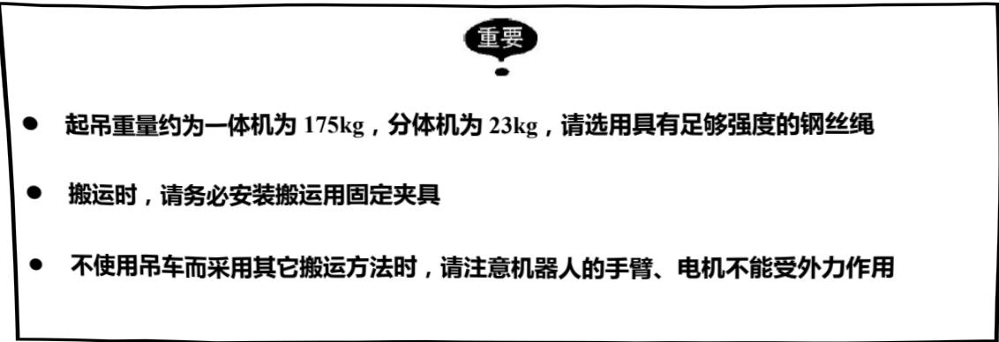

#### 2.1.1 使用吊车

机器人的开箱和移动、搬运，原则上请使用吊车。

使用钢丝绳，利用吊环螺钉起吊搬运，这时，请务必对照按“图2-1一体机搬运姿态”和“图2-2分体机搬运姿态”的姿态（出厂姿态）进行起吊搬运。

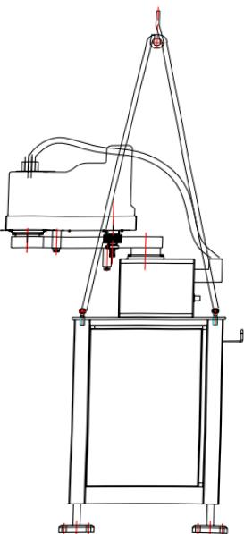

图2-1一体机搬运姿态

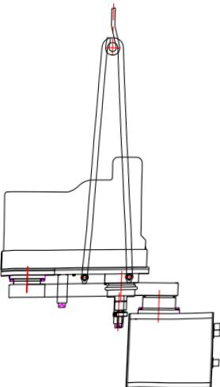

图2-2分体机搬运姿态

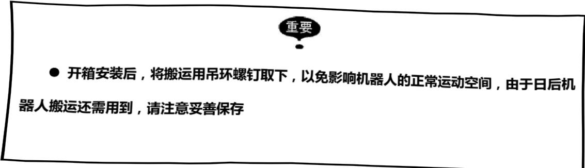

## 第三章安装

<html><body><table border="1"><tbody><tr><td>危险</td></tr><tr><td>设置安全栏 设置牢固可靠安全栏，否则有可能发生人身伤害、设备损坏等事故！</td></tr><tr><td>机器人要放置在即使机器人手臂伸到最长，其手腕部的工具和工件的尖端点也不会碰</td></tr><tr><td>到安全栏的位置</td></tr><tr><td>否则有可能发生人身伤害、设备损坏等事故</td></tr><tr><td>机器人不固定不能进行通电和运转 否则有可能发生倾倒、人身伤害、设备损坏等事故</td></tr><tr><td>否则有可能发生人身伤害、设备损坏等事故</td></tr><tr><td></td></tr><tr><td></td></tr><tr><td>注意 不要安装或运转有损坏、缺少零件的机器人</td></tr><tr><td>误动作有可能引起人身伤害、设备损坏等事故</td></tr><tr><td>设置完成后，在最初通电前，请务必取下搬运固定夹具</td></tr><tr><td>否则有可能损坏驱动部分</td></tr></tbody></table></body></html>

### 3.1 安全栏的设置

按中华人民共和国国家标准GB11291.1—2011/ISO10218-1: 2006《工业环境用机器人安全要求第1部分：机器人》第5章的有关“安全防护装置”的规定，为避免机器人运转中造成设备损坏、操作者及周围人员人身伤害，请务必设置牢固可靠的安全栏。

### 3.2 机器人安装方法

机器人的安装对其功能的发挥十分重要，特别值得注意的是基座的固定和地基能够承受机器人加减速时的动载荷以及机器人和夹具的静态重量。

另外，机器人的安装面不平整时，有可能发生机器人变形，性能受影响。机器人安装面的平面度，请确保在0.5mm以下。基座的固定，按照“3.2.1安装举例”中的方法进行。

#### 3.2.1 安装举例

首先把机器人安装底板固定在地面上，安装底板必须具有足够的强度和刚度，我们推荐安装底板的厚度为25mm以上，选用4个M12以上的地脚螺栓把安装底板固定在地面上。

分体机器人的底座应通过其上四个安装孔用M8内六角螺钉（推荐长度为35mm）牢固地固定在机器人安装底板上，为使内六角螺钉和地脚螺栓在设备运行中不发生松动，请按“图3-1机器人安装举例”的方法充分固定。

一体机器人地脚安装螺钉是.$4\times M12$ ,可以直接用膨胀螺钉或地脚螺钉固定于地面或地面,

钢板上面。

若机器人实际应用过程中工作位置需要加高，请在分体机器人底座和机器人安装底板之间增加支座垫高。先将支座与安装底板相连，再将机器人安装在支座上，支座的强度和刚度参照底座标准，连接螺钉与机器人底座安装螺钉要求相同。

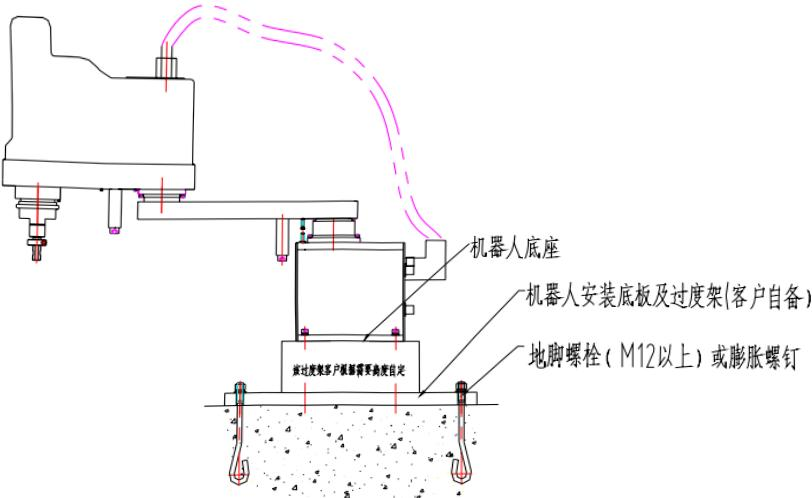

图3-1分体机器人安装举例

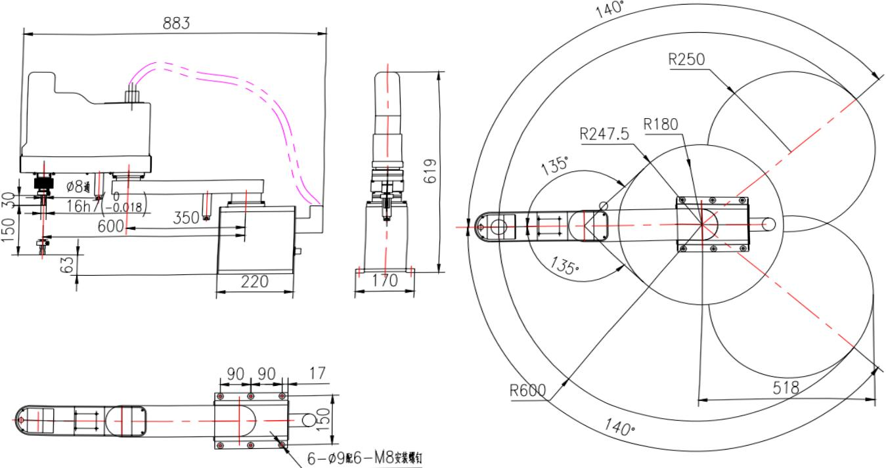

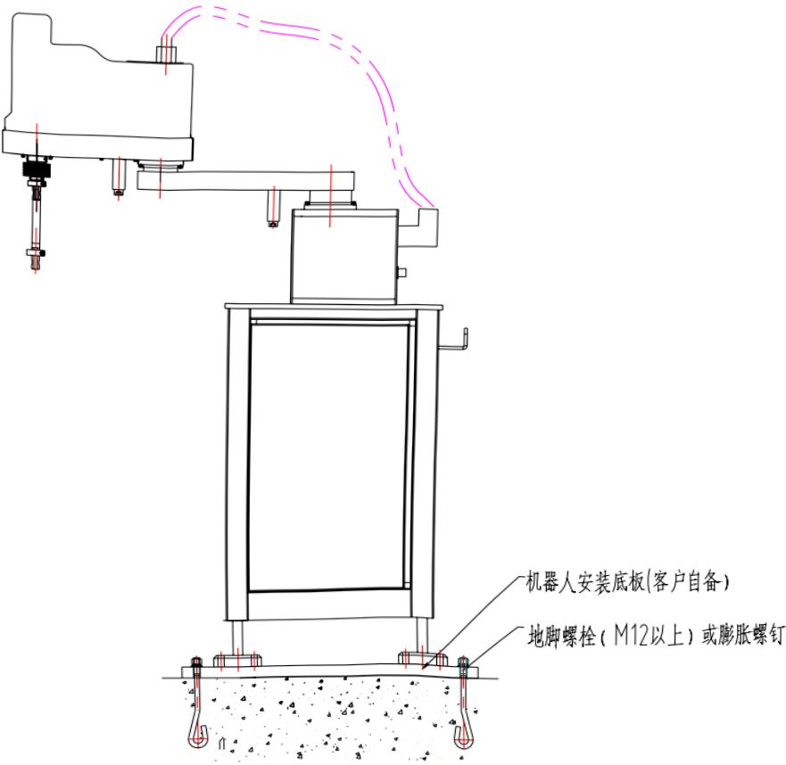

图3-3一体机器人安装举例

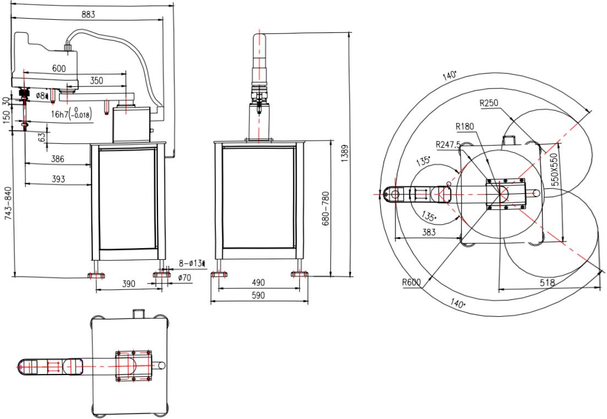

图3-4一体机器人底座安装尺寸

### 3.3 安装现场和环境

机器人安装现场必须满足以下环境条件

机器人使用环境应在海拔1000m以下

 运转时，环境的温度应在0℃～ 40℃范围内

湿度较小、较干燥的场所（湿度20%~80%RH，无凝露）

➢灰尘、粉尘、油烟、水等较少的场所

➢不存在易燃、腐蚀性液体及气体的场所

 远离大的电器噪声源（TIG焊接装置等)的场所

安装面的平面度在0.5mm以下

## 第四章基本规格

### 4.1 基本规格参数一览表

表4-1基本规格参数

<html><body><table border="1"><tbody><tr><td colspan="3" rowspan="2">项目</td><td>RSP600A (B) 15</td></tr><tr><td>规格与参数</td></tr><tr><td colspan="3">最大负载</td><td>5kg</td></tr><tr><td colspan="3">额定负载</td><td>2kg</td></tr><tr><td colspan="3">最大工作范围</td><td>600mm</td></tr><tr><td colspan="3">循环周期时间(2kg负载时)</td><td>0.68s</td></tr><tr><td rowspan="6">各轴规格 及运动范围</td><td rowspan="2">X轴</td><td>手臂长度</td><td>350mm</td></tr><tr><td>旋转角度</td><td>±140°</td></tr><tr><td rowspan="2">Y轴</td><td>手臂长度</td><td>250mm</td></tr><tr><td>旋转角度</td><td>±135°</td></tr><tr><td>Z轴</td><td>行程</td><td>150mm</td></tr><tr><td>R轴</td><td>旋转范围</td><td>±360°</td></tr><tr><td rowspan="3">最大单轴速度</td><td colspan="2">X、Y轴</td><td>5.5m/s</td></tr><tr><td colspan="2">Z轴</td><td>1.1m/s</td></tr><tr><td colspan="2">R轴</td><td>588°/s</td></tr><tr><td rowspan="3">重复精度 （精度重复性）</td><td colspan="2">X、Y轴</td><td>±0.01mm</td></tr><tr><td colspan="2">Z轴</td><td>±0.01mm</td></tr><tr><td colspan="2">R轴</td><td>±0.01°</td></tr><tr><td colspan="3">本体质量</td><td>150kg(一体式) 23kg (分体式)</td></tr></tbody></table></body></html>

### 4.2 机器人各轴名称及方向

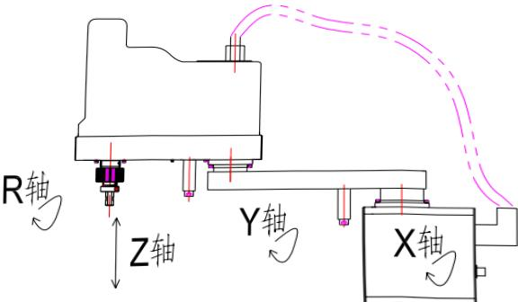

图4-1机器人各轴名称及方向

## 第五章保养、检修

危险

保养、检修作业及配线作业，必须在切断电源，并贴上如“禁止通电”标志后进行否则有可能发生触电、人身伤害等事故

保养、检修作业由指定的专业人员完成否则有可能发生触电、人身伤害等事故拆卸、清理请与我公司联系

### 5.1 检修间隔及检修项目

注意

正确的检修作业，不仅能使机器人经久耐用，对防止故障及确保安全也是必不可少的。

检修包含的各个阶段及各阶段必要的检修项目见“表2检修项目一览表”。

在“表2检修项目一览表”的右栏，将检修人员分为“专业人员”、“有资格者”、“制造公司（即广州数控设备有限公司）人员”三类，按不同检修作业的要求指定不同资质的人员进行各项检修作业。

检修间隔时间的设定，请按伺服电源接通时间计算

表2中的检修间隔，以焊接作业为基准，其他用途或使用条件特殊时，有必要单独分析再作结论

特别应注意，对于高使用频率的应用，须缩短检修间隔，请与本公司洽谈

表5-1检修项目一览表

<html><body><table border="1"><tr><td colspan="2" rowspan="2">检修部位</td><td colspan="6">检修间隔</td><td rowspan="2">方法</td><td rowspan="2">检修处理内容</td><td colspan="3">检修人员</td></tr><tr><td>日 常</td><td>间隔 1000h</td><td>间隔 5000h</td><td>间隔 10000h</td><td>间隔 20000h</td><td>间隔 30000h</td><td>专业 人员</td><td>有资 格者</td><td>制造公 司人员</td></tr><tr><td>(1)</td><td>外部导线</td><td>O</td><td></td><td></td><td></td><td></td><td></td><td>目测</td><td>检查有无污迹、损伤</td><td>O</td><td>O</td><td>O</td></tr><tr><td>(2)</td><td>整体外观</td><td>O</td><td></td><td></td><td></td><td></td><td></td><td>目测</td><td>清扫尘埃、铁屑，检查 各部分有无龟裂、损伤</td><td>O</td><td>O</td><td>O</td></tr><tr><td>(3)</td><td>X轴电机</td><td>O</td><td></td><td></td><td></td><td></td><td></td><td>目测</td><td>有无漏油^</td><td>O</td><td>O</td><td>O</td></tr><tr><td>(4)</td><td>底座螺栓</td><td></td><td>O</td><td></td><td></td><td></td><td></td><td>扳手</td><td>检查有无缺失、松动； 补缺、拧紧</td><td>O</td><td>O</td><td>O</td></tr><tr><td>(5)</td><td>盖类螺栓</td><td></td><td>O</td><td></td><td></td><td></td><td></td><td>螺丝 刀扳 手</td><td>检查有无缺失、松动； 补缺、拧紧</td><td>O</td><td>O</td><td>O</td></tr><tr><td>6)</td><td>底座插座</td><td></td><td>O</td><td></td><td></td><td></td><td></td><td>手触</td><td>检查有无松动，插紧</td><td>O</td><td>O</td><td>O</td></tr><tr><td>(7</td><td>R轴 同步皮带</td><td></td><td></td><td>O</td><td></td><td></td><td></td><td>手触</td><td>检查皮带张紧力及磨 损程度</td><td></td><td>O</td><td>O</td></tr><tr><td rowspan="2">(8)</td><td rowspan="2">机内导线 (X、Y、Z、 轴导线)</td><td></td><td></td><td></td><td>O</td><td></td><td></td><td>目测 万用 表</td><td>检测底座的主插座与 中间插座的导通试验 （确认时用手摇动导 线)</td><td></td><td>O</td><td>O</td></tr><tr><td></td><td></td><td></td><td></td><td>O</td><td></td><td></td><td>更换1</td><td></td><td>O</td><td>O</td></tr><tr><td rowspan="2">(9)</td><td rowspan="2">机内导线 (R轴导 线）</td><td></td><td></td><td></td><td>O</td><td></td><td></td><td>目测 万用 表</td><td>端子间的导通试验</td><td></td><td>O</td><td>O</td></tr><tr><td></td><td></td><td></td><td></td><td>O</td><td></td><td></td><td>更换1</td><td></td><td>O</td><td>O</td></tr><tr><td>(10)</td><td>机内 电池组</td><td></td><td></td><td></td><td>O</td><td></td><td></td><td></td><td>控制器显示电池报警 或间隔10000H时换电 池</td><td></td><td>O</td><td>O</td></tr><tr><td>(11)</td><td>X轴 减速机</td><td></td><td></td><td>O</td><td>O</td><td></td><td></td><td></td><td>检查有无异常（异常时 更换)。</td><td></td><td>O</td><td>O</td></tr><tr><td>(12)</td><td>Y轴 减速机</td><td></td><td></td><td>O</td><td>O</td><td></td><td></td><td></td><td>检查有无异常（异常时 更换）。</td><td></td><td>O</td><td>O</td></tr><tr><td>(13)</td><td>R轴 减速机</td><td></td><td></td><td>O</td><td></td><td></td><td></td><td></td><td>检查有无异常（异常时 更换）。</td><td></td><td>O</td><td></td></tr><tr><td>(14)</td><td>Z轴丝杠 螺母及花 键螺母</td><td></td><td></td><td>O</td><td></td><td></td><td></td><td>油枪</td><td>检查有无异常（异常时 更换)。补油$2（间隔 3000H)</td><td></td><td></td><td></td></tr><tr><td>(15)</td><td>大修</td><td></td><td></td><td></td><td></td><td></td><td>O</td><td></td><td></td><td></td><td></td><td></td></tr></tbody></table></body></html>

*1机内导线（X、Y、Z、R部分）使用20000H时需更换。

*2各部位使用的油脂请参照“表3油脂一览表”。

*3发生漏油时，油脂可能侵入电机。由于油脂渗漏引起电机故障时，请立即与本公司联系。

表5-2油脂一览表

<html><body><table border="1"><tr><td>作业序号</td><td>使用油脂</td><td>检修部位</td></tr><tr><td>(14)</td><td>1号锂基极压润滑脂</td><td>丝杠螺母及花键螺母</td></tr></table></body></html>

注：作业序号与“表2检修项目一览表”中的检修部位序号一致。

### 5.2 电池更换步骤及注意事项

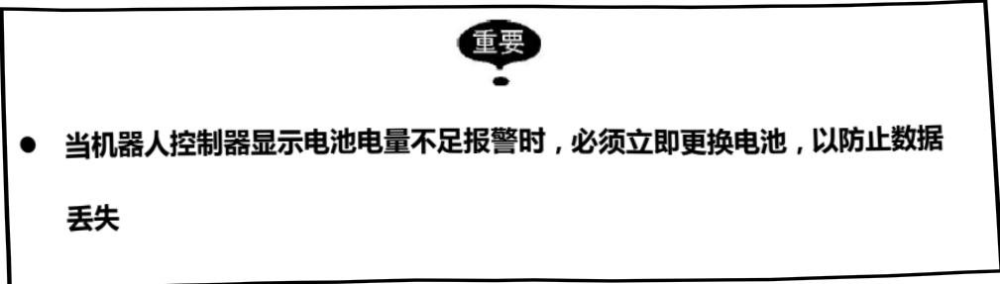

在“图11电池盒位置”中显示电池组的安装位置。

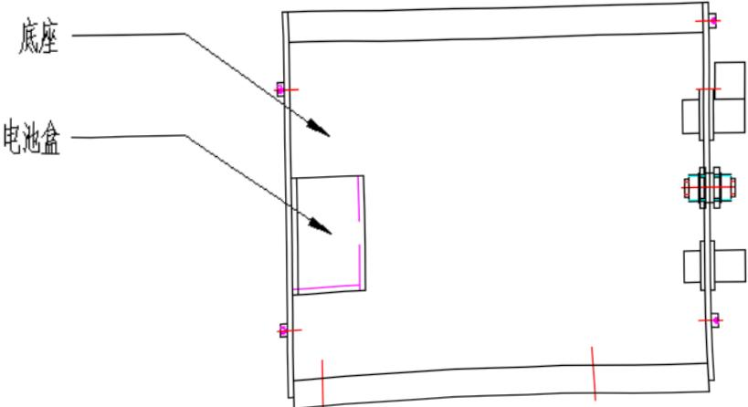

图5-1电池盒位置

图5-2电池组连接

当系统显示需要更换电池时，请按照以下步骤操作：

➢关闭控制器主电源；

➢拆下盖板，拉出电池组，以便更换；

把电池组从支架上取下；

➢把新电池组插在支架空闲的插座上；

拔下旧电池组；

为防止数据丢失，必须先连接新电池组，再拆旧电池组

把新电池组装到支架上；

重新装好盖板。

### 5.3 丝杠和花键油脂补充步骤

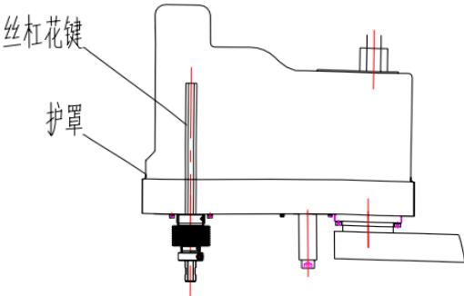

图5-3丝杠花键润滑图

①如上图所示，先拆掉护罩；

②在花键丝杠位置涂抹润滑油脂；

③在丝母注油孔注入润滑油脂；

④一般在连续运转3000h后，应涂抹润滑脂一次，并清洁内部污渍；

⑤本机所用减速机为免维护部件，不需要特别润滑，在保修期内如发现有异响，应及时联系我公司通知减速机厂家更换部件。

