##### 州数控设备有限公司UIPMENTCO...LTO 

## 机器人运营中心

地址：广州市萝岗区观达路22号邮编：510530

网址：www.gsk.com.cn 

电话：400-0512-028/020-82221187（机器人销售）

专真：020-82222895

网址：www.gsk.com.cn 

邮箱：gskrobot@gsk.com.cn 

## ? GSN 

@广州数控GSK 

@广州数控

@广州数控GSK 

gzgsk.1688.com 

@广州数控设备有限公司

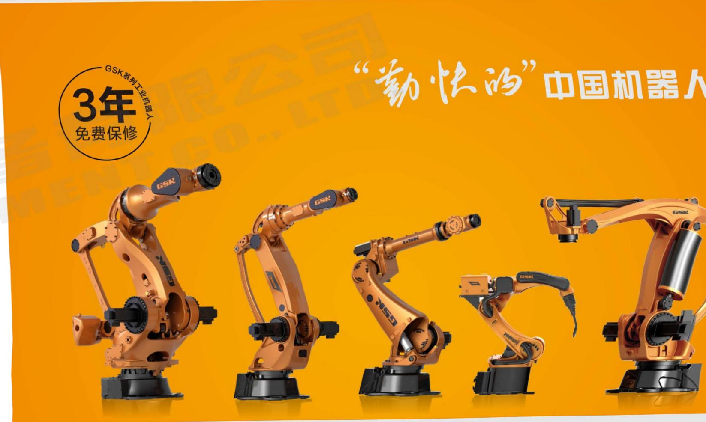

## 目录

公司简介…………………………………………………………………………………………………………………………………………………………………………………………………………………………………………………………02  
机器人家族………………………………………03  
关键功能部件RMD系列C系列水平多关节机器人RB系列RH系列………………………………………………………………………………………………………………………………………………………………………………………………………………………………………………………………………………………171615130511  
附加设备介绍20  
视觉系统&离线编程技术…………………………………21  
“智能制造”&"数字化工厂"整体解决方案及工程实施22  
应用案例23  
部分合作伙伴41  
我们的服务42

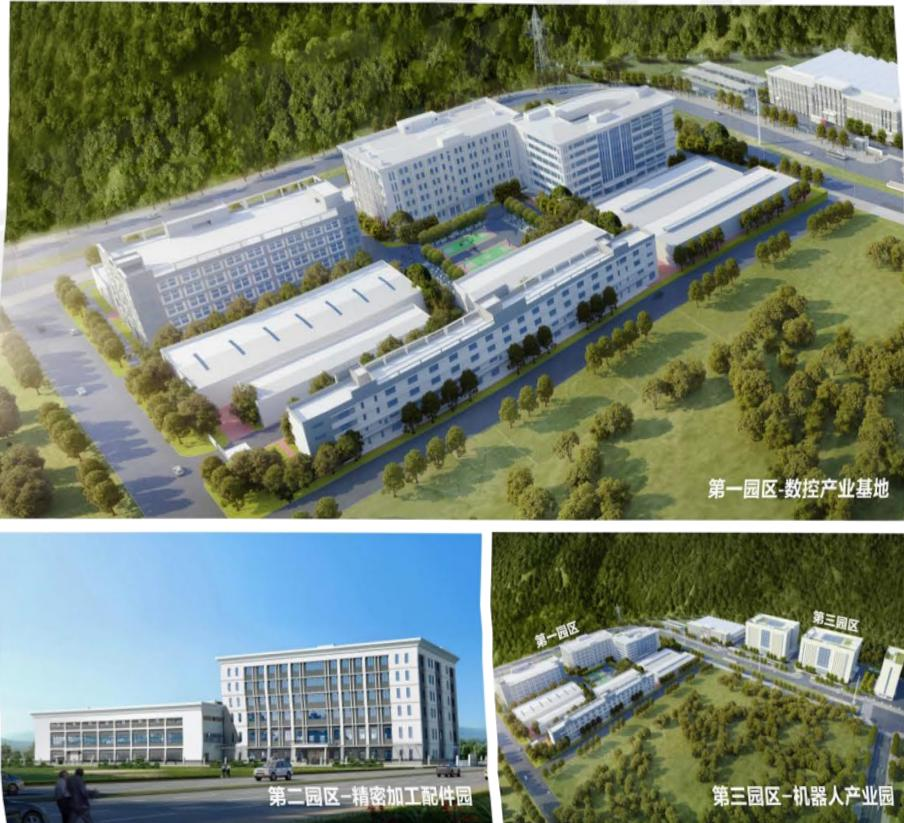

## 中国南方数控产业基地

广州数控设备有限公司（简称：广州数控、GSK）成立于1991年，历经艰苦创业、勤奋创新、智能创造再起步，成为国家级高新技术企业，作为国内专业技术成熟的成套智能装备解决方案提供商，被誉为中国南方数控产业基地。

面向数控机床、自动化控制、注塑制品等行业，广州数控为用户提供机床数控系统、伺服驱动、伺服电机、数控机床连锁展销、机床数控化工程，自动化控制系统、工业机器人、全电动精密数控注塑机、数控培训学院等自动化制造全过程解决方案。

广州数控是中国机床工具工业协会理事长单位、中国机器人产业联盟副理事长单位、中国软件行业协会理事长单位、中国机械联合会理事单位、中国机电装备维修与改造技术协会理事单位。荣获国家科学进步奖二等奖，拥有国家级企业技术中心、博士后科研工作站、工程技术研发中心、工程实验室，公司拥有精良的生产设备和工艺流程，科学规范的质量控制体系保证每套产品合格出品：拥有完善的售后服务网络和专业的技术服务团队，以“精益求精，让用户满意”的服务精神，全方位、多层次、科学高效的服务管理方式和手段，保证用户在短时间内得到快捷、可靠、有效的响应。

## 打造百年企业、铸就金质品牌。

我们相信，未来工业将是智能制造的世界，数控技术、人工智能将无处不在，改变着工业制造方式以及人类的生活方式。广州数控愿意与合作伙伴一起成长，合作共享价值，通过持续不断的技术进步与创新努力构建一个更精准、更高效、更智能的制造平台，促进人与机、机与机、机与工厂的有机交融，为提升用户产品价值和效益，为推动智能装备国产化过程不懈努力，进而用中国装备，装备中国，走向世界。

## 机器人家族

## 勤快的"中国机器人

依托30年工业控制技术研发和制造经验，GSK研发生产了具有完全自主知识产权的工业机器人，包括机器人控制器、伺服电机和伺服驱动等关键功能部件。目前，广数工业机器人已成功推出搬运、焊接、打磨、喷涂、码垛、并联等六大系列，产品型号多达40余种。

作为“国家智能制造装备发展专项“承担企业，GSK自主研制的工业机器人承载了公司数控系统产品一贯的高品质和高技术，可以根据用户需求，提供性能优越的机器人，以及机器人自动化应用所需的工装夹具、物流输送线等的设计与制作。

## RB系列

<html><body><table border="1"><tbody><tr><td colspan="2" rowspan="2">型号</td><td rowspan="2">自由度 驱动方式</td><td rowspan="2">有效负载 (kg)</td><td rowspan="2">重复定 位精度 (mm)</td><td colspan="6">运动范围（°)</td><td colspan="6">最大速度（°/s)</td><td colspan="2">手腕允许惯量kg.m</td><td colspan="3">允许最大扭矩（N.m）</td><td rowspan="2">本体重量 (kg)</td><td rowspan="2">运动半径 (mm)</td></tr><tr><td>J1</td><td>J2</td><td></td><td>J3</td><td>J4</td><td>J5 J6</td><td>J1</td><td>J2</td><td>J3</td><td>J4</td><td>J5</td><td>J6</td><td>J4 J5</td><td>J6</td><td>J4</td><td>J5</td><td>J6</td></tr><tr><td colspan="2">RB03A1-562</td><td>6 交流伺服驱动</td><td>3</td><td>±0.02</td><td>±150</td><td>+136~-51</td><td>+64~-131</td><td>±150</td><td>±120</td><td>±360</td><td>375</td><td>375</td><td>419</td><td>600</td><td>600</td><td>750 0.077</td><td>0.077</td><td>0.029</td><td>9.3</td><td>9.3</td><td>4.5</td><td>562</td><td>36</td></tr><tr><td colspan="2">RB06-900</td><td>6 交流伺服驱动</td><td>6</td><td>±0.03</td><td>±170</td><td>+135~-100+155~-110</td><td></td><td>±170</td><td>±120</td><td>±360</td><td>337.5</td><td>270</td><td>375</td><td>300</td><td>375</td><td>468</td><td></td><td></td><td>12</td><td>10</td><td>6</td><td>900</td><td>60</td></tr><tr><td colspan="2" rowspan="2">RB08Q1-1440</td><td>6 交流伺服驱动</td><td>6（焊接用)</td><td>±0.05</td><td>±155</td><td>±90</td><td>+90~-270</td><td>±180</td><td>±130</td><td>±360</td><td>225</td><td>200</td><td>225</td><td>450</td><td>360</td><td>650 /</td><td></td><td>0.2720.074</td><td>17.2</td><td>17.2</td><td>10</td><td>1440</td><td>70</td></tr><tr><td>6 交流伺服驱动</td><td>8（搬运用)</td><td>±0.05</td><td>±155</td><td>±90</td><td>+90~-270</td><td>±180</td><td>±130</td><td>±360</td><td>200</td><td>160</td><td>200</td><td>450</td><td>360</td><td>650</td><td>/ 0.272</td><td>0.074</td><td>17.2</td><td>17.2</td><td>10</td><td>1440</td><td>70</td></tr><tr><td colspan="2">308A3 RB08A3-1490</td><td>6 交流伺服驱动</td><td>8</td><td>±0.04</td><td>±170</td><td>+120~-85</td><td>+83~-150</td><td>±180</td><td>±135</td><td>±360</td><td>200</td><td>200</td><td>200 400</td><td>356</td><td>600</td><td>/</td><td>0.19</td><td>0.065</td><td>14</td><td>12</td><td>7</td><td>1490</td><td>185</td></tr><tr><td>系列</td><td>RB08A3-1700</td><td>6 交流伺服驱动</td><td>8</td><td>±0.04</td><td>±170</td><td>+120~-85</td><td>+83~-150</td><td>±180</td><td>±135</td><td>±360</td><td>180</td><td>180</td><td>180</td><td>400</td><td>356</td><td>600</td><td>/</td><td>0.19</td><td>0.065</td><td>14 12</td><td>7</td><td>1700</td><td>187</td></tr><tr><td rowspan="2">20A3</td><td>RB12-1500</td><td>6 交流伺服驱动</td><td>12</td><td>±0.04</td><td>±170</td><td>+120~-85</td><td>+83~-150</td><td>±180</td><td>±135</td><td>±360</td><td>160</td><td>160</td><td>160</td><td>300 300</td><td>360</td><td>0.33</td><td>0.33</td><td>0.17</td><td>24</td><td>24</td><td>13</td><td>1500</td><td>186</td></tr><tr><td>RB20A3-1700</td><td>6 交流伺服驱动</td><td>20</td><td>±0.04</td><td>±170</td><td>+160~-80</td><td>+76~-112</td><td>±180</td><td>±138</td><td>±360</td><td>175</td><td>175</td><td>180</td><td>330</td><td>330</td><td>450</td><td>/</td><td>0.93</td><td>0.4 40</td><td>50</td><td>22</td><td>1700</td><td>265</td></tr><tr><td>系列</td><td>RB20A3-1900</td><td>6 交流伺服驱动</td><td>15</td><td>±0.04</td><td>±170</td><td>+160~-80</td><td>+76~-112</td><td>±180</td><td>±138</td><td>±360</td><td>175</td><td>175</td><td>180</td><td>330</td><td>330</td><td>450</td><td>/</td><td>0.93</td><td>0.4 40</td><td>50</td><td>22</td><td>1900</td><td>273</td></tr><tr><td>335 列</td><td>RB35-1850</td><td>6 交流伺服驱动</td><td>35</td><td>±0.04</td><td>±170</td><td>+120~-85</td><td>+85~-155</td><td>±180</td><td>±135</td><td>±360</td><td>160</td><td>160</td><td>175</td><td>310</td><td>360</td><td>375</td><td>2.46</td><td>2.46 1.41</td><td>75</td><td>75</td><td>68</td><td>1850</td><td>369</td></tr><tr><td>RB50A1-2071</td><td>RB35-2050</td><td>6 交流伺服驱动</td><td>30</td><td>±0.04</td><td>±170</td><td>+120~-85</td><td>+85~-155</td><td>±180</td><td>±135</td><td>±360</td><td>160</td><td>160</td><td>160</td><td>310</td><td>360</td><td>375 2.46</td><td>2.46</td><td>1.41</td><td>75</td><td>75</td><td>68</td><td>2050</td><td>372</td></tr><tr><td rowspan="4">80 列</td><td></td><td>6 交流伺服驱动</td><td>50</td><td>±0.05</td><td>±178</td><td>+130~-90</td><td>+75~-200</td><td>±360</td><td>±115</td><td>±360</td><td>171</td><td>171 171</td><td>215</td><td>251</td><td>365</td><td>51.5</td><td>51.5</td><td>16</td><td>196</td><td>196</td><td>127</td><td>2071</td><td>650</td></tr><tr><td>RB80-2250</td><td>6 交流伺服驱动</td><td>80</td><td>±0.06</td><td>±180</td><td>-84~+164</td><td>-193~+68</td><td>±360</td><td>±130</td><td>±360</td><td>140</td><td>155</td><td>140</td><td>215</td><td>230</td><td>270 36.3</td><td>27.5</td><td>18.9</td><td>324</td><td>328</td><td>186</td><td>2250</td><td>680</td></tr><tr><td>RB80-2080</td><td>6 交流伺服驱动</td><td>100</td><td>±0.06</td><td>±180</td><td>-84~+164</td><td>-193~+68</td><td>±360</td><td>±130</td><td>±360</td><td>140</td><td>160</td><td>140</td><td>205 220</td><td>260</td><td>36.3</td><td>27.5</td><td>18.9</td><td>401</td><td>406</td><td>232</td><td>2080</td><td>678</td></tr><tr><td rowspan="2">RB80A1-2550</td><td>6 交流伺服驱动</td><td>50</td><td>±0.06</td><td>±180</td><td>-84~+164</td><td>-193~+68</td><td>±360</td><td>±115</td><td>±360</td><td>140</td><td>155</td><td>140</td><td>215 251</td><td>285</td><td>27.4</td><td>43.7</td><td>22</td><td>203</td><td>211</td><td>117</td><td>2550</td><td>744</td></tr><tr><td>6</td><td>交流伺服驱动 80</td><td>±0.06</td><td>±180</td><td>-84~+164</td><td></td><td>-193~+68 ±360</td><td>±115 ±130 ±125 ±115 ±115 ±115 ±115 ±125 ±125 ±115 ±115</td><td>±360 ±360 ±360 ±360 ±360 ±360 ±360 ±360 ±360 ±360 ±360</td><td>110 100 100 100 88 85 110 110 110 80 80</td><td>130 94 94 94 94 95 100 100 100 85 85</td><td>130 120 120 104 104 95 100 100 100 88 88</td><td>215 205 169 152 152 120 180 180 180 110 110</td><td>230 220 200 160 118 120 150 150 150 98 98</td><td>270 260 220 220 200 180 200 200 200 170 175</td><td>27.4 43.7 36.3 27.5 64.5 64.5 85 85 160 160 160 160 160 160 160 160 160 550 550</td><td>22 18.9 51.1 45 100 100 100 100 160 500 500</td><td>324 401 784 951 1274 1600 1600 1600 100 1600 235 235</td><td>328 406 784 951 1274 1600 1600 1600 1600 3400 3400 3400 3400</td><td>186 232 411.5 490 686 850 850 850 850 1700 1700</td><td>2550 3500 3100 2790 2700 2508 2850 2850 3200 3400 2882</td><td>744 1210 1300 1350 1430 1800 1650 1650 1680 3340 3300</td></tr><tr><td rowspan="2">30 列 RB130A1-3100 RB165A1-2790 RB210-2700 8300 系列 RB350-3400 RB500-2882</td><td>RB130A1-3500 6 6 6 RB300-2508 6 RB300A1-2850 6 RB300A2-2850 6 RB300A2-3200</td><td>6 交流伺服驱动 交流伺服驱动 130 交流伺服驱动 交流伺服驱动 交流伺服驱动 交流伺服驱动 交流伺服驱动 6 交流伺服驱动 6 交流伺服驱动 6 交流伺服驱动</td><td>100 165 210 300 300 300 220 350 500</td><td>±0.08 ±0.08 ±0.08 ±0.08 ±0.10 ±0.10 ±0.10 ±0.10 ±0.10 ±0.10</td><td>±175 ±175 ±175 ±175 ±175 ±175 ±175 ±175 ±178 ±178</td><td>+75~-60 +75~-60 +75~-60 +75~-60 ±55 ±70 ±70 ±70 +105~-60 +105~-60</td><td>+80~-185 ±360 +80~-185 ±360 +80~-185 ±360 +80~-185 ±360 +116~-85 ±360 -85~+130 ±360 -85~+130 ±200 -85~+130 ±200 +70~-62 ±180 +70 ~-62 ±180</td></table></body></html>

注：避免与易燃易爆及腐蚀性气体、液体接触；勿溅水、油、粉尘；远离电器噪声源（等离子）。

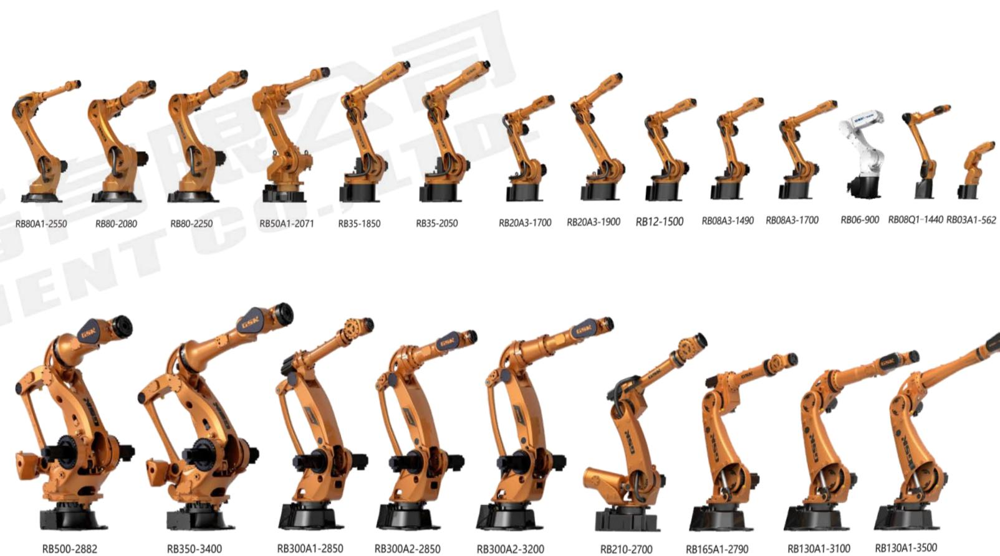

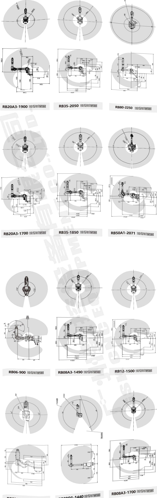

## RH系列

<html><body><table border="1"><tbody><tr><td rowspan="2">型号</td><td rowspan="2">自由度</td><td rowspan="2">驱动方式</td><td rowspan="2">有效负载 (kg)</td><td rowspan="2">重复定 位精度 (mm)</td><td colspan="6">运动范围（)</td><td colspan="8">最大速度（°/s)</td><td rowspan="2">允许最大扭矩（N.m)</td><td colspan="4">运动半径</td><td rowspan="2">本体重量 (kg)</td></tr><tr><td>J1</td><td>J2</td><td>E</td><td>J3</td><td>J4</td><td>J5</td><td>J6</td><td>J1</td><td>J2</td><td>E</td><td>J3</td><td>J4</td><td>J5</td><td>J6</td><td>J4</td><td>J5</td><td>J6</td><td>(mm)</td></tr><tr><td>RH06A2-1490</td><td>6</td><td>交流伺服驱动</td><td>6</td><td>±0.05</td><td>±170</td><td>+115~-80</td><td>/</td><td>+80~-150</td><td>±180</td><td>±135</td><td>±360</td><td>200</td><td>200</td><td>/</td><td>200</td><td>282</td><td>370</td><td></td><td>630 14</td><td>12</td><td>6</td><td></td><td>1490</td><td>190</td></tr><tr><td>RH06A2-2000</td><td>6</td><td>交流伺服驱动</td><td>6</td><td>±0.05</td><td>±170</td><td>+140~-70</td><td>/</td><td>+75~-140</td><td>±180</td><td>±135</td><td>±360</td><td>175</td><td>165</td><td>/</td><td>195</td><td>282</td><td>370</td><td></td><td>630</td><td>14 12</td><td></td><td>6</td><td>2000</td><td>265</td></tr><tr><td>RH06A3-1490</td><td>6</td><td>交流伺服驱动</td><td>6</td><td>±0.05</td><td>±170</td><td>+120~-85</td><td>/</td><td>+83~-150</td><td>±180</td><td>±135</td><td>±360</td><td>200</td><td>200</td><td>/</td><td>200</td><td>400</td><td>356</td><td>600</td><td>14</td><td>12</td><td>7</td><td></td><td>1490</td><td>185</td></tr><tr><td>RH06B1-1605</td><td>7</td><td>交流伺服驱动</td><td>6</td><td>±0.05</td><td>±170</td><td>+110~-70</td><td>±90</td><td>+80~-150</td><td>±180</td><td>±135</td><td>±360</td><td>200</td><td>173</td><td>200</td><td>200</td><td>288</td><td>375</td><td></td><td>630</td><td>14 12</td><td>6</td><td></td><td>1605</td><td>215</td></tr></tbody></table></body></html>

备注：RH06A2装配送丝机运动范围为（80°~-90°)

避免与易燃易爆及腐蚀性气体、液体接触；勿溅水、油、粉尘；远离电器噪声源（等离子）。

## 紧密配合无缝连接

SK机器人与焊机均为全自主研制产品，可根据特殊需要定制功能。

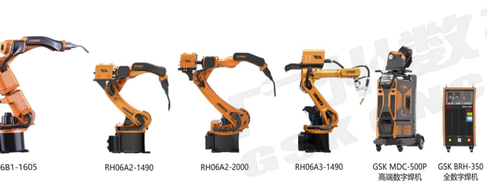

GSK系列焊接机器人，可与GSK、MEGMEET、EWM、LORCH、KEMPPI、ESAB焊机实现DeviceNet总线数字通讯，与LINCOLN、OTC、Panasonic焊机实现I/O模拟通讯，也可根据客户要求使用目前的焊机改造。

GSK广州数控MEGMEET 

RH06A2-1490运动范围图

RH系列

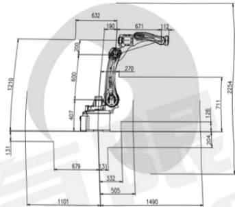

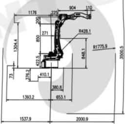

RH06A2-2000 运动范围图

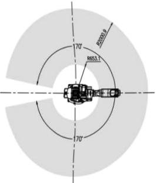

RH06B1-1605 运动范围图

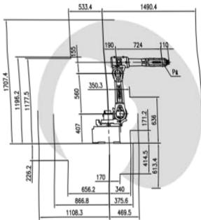

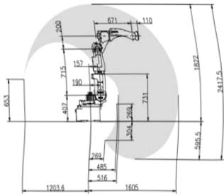

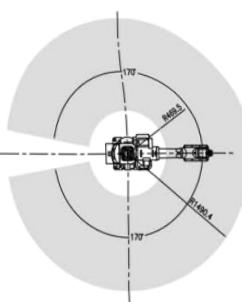

<html><body><table border="1"><tbody><tr><td rowspan="2">型号</td><td rowspan="2">自由度</td><td rowspan="2">驱动方式</td><td rowspan="2">有效负载 (kg)</td><td rowspan="2">重复定位精度 (mm)</td><td colspan="4">运动范围（）</td><td colspan="4">最大速度(°/s)</td><td rowspan="2">手腕允许负载惯量 (kg·m{)</td><td rowspan="2">循环节拍 (回/小时)</td><td rowspan="2">运动半径 (mm)</td><td rowspan="2">本体重量 (kg)</td></tr><tr><td>J1</td><td>J2</td><td>J3</td><td>J4</td><td>J1</td><td>J2</td><td>J3</td><td>J4</td></tr><tr><td>RMD08</td><td>4</td><td>交流伺服驱动</td><td>8</td><td>±0.05</td><td>±170</td><td>+90~-40</td><td>+68~-90</td><td>±360</td><td>251</td><td>195</td><td>195</td><td>367.5</td><td>0.25</td><td>1800?</td><td>1433</td><td>180</td></tr><tr><td>RMD20</td><td>4</td><td>交流伺服驱动</td><td>20</td><td>±0.05</td><td>±170</td><td>+106~-45</td><td>+73~-90</td><td>±360</td><td>175</td><td>175</td><td>185</td><td>330</td><td>0.51</td><td>1780</td><td>1755</td><td>266</td></tr><tr><td>RMD35</td><td>4</td><td>交流伺服驱动</td><td>35</td><td>±0.05</td><td>±170</td><td>+95~-45</td><td>+75~-90</td><td>±360</td><td>160</td><td>160</td><td>175</td><td>375</td><td>1.24</td><td>1560</td><td>2100</td><td>360</td></tr><tr><td>RMD50</td><td>4</td><td>交流伺服驱动</td><td>50</td><td>±0.1</td><td>±178</td><td>+90~-40</td><td>+65~-78</td><td>±360</td><td>171</td><td>171</td><td>171</td><td>222</td><td>4.5</td><td>1700</td><td>2154</td><td>660</td></tr><tr><td>RMD120-2400</td><td>4</td><td>交流伺服驱动</td><td>120</td><td>±0.1</td><td>±180</td><td>+85~-40</td><td>+120~-20</td><td>±360</td><td>145</td><td>130</td><td>140</td><td>420</td><td>53</td><td>2200</td><td>2404</td><td>1020</td></tr><tr><td>RMD160</td><td>4</td><td>交流伺服驱动</td><td>160</td><td>±0.1</td><td>±180</td><td>+100~-44</td><td>+121~-15</td><td>±360</td><td>123</td><td>123</td><td>128</td><td>300</td><td>78</td><td>1500</td><td>3150</td><td>1500</td></tr><tr><td>RMD200</td><td>4</td><td>交流伺服驱动</td><td>200</td><td>±0.1</td><td>±180</td><td>+100~-44</td><td>+121~-15</td><td>±360</td><td>105</td><td>107</td><td>114</td><td>242</td><td>78</td><td>1300</td><td>3150</td><td>1500</td></tr><tr><td>RMD300</td><td>4</td><td>交流伺服驱动</td><td>300</td><td>±0.1</td><td>±180</td><td>+100~-44</td><td>+121~-15</td><td>±360</td><td>85</td><td>90</td><td>100</td><td>190</td><td>134</td><td>1000?</td><td>3150</td><td>1500</td></tr></tbody></table></body></html>

主：①测试轨迹高150mm，宽1000mm，实际循环时间受实际工况影响；避免与易燃易爆及腐蚀性气体、液体接触；勿溅水、油、粉尘；远离电器噪声源（等离子）。②测试轨迹高200mm，宽1000mm，实际循环时间受实际工况影响；③测试轨迹高400mm，宽2000mm，实际循环时间受实际工况影响；

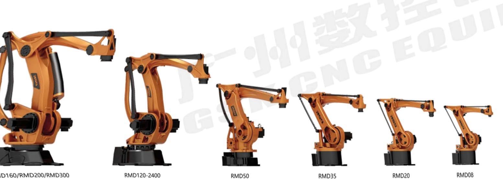

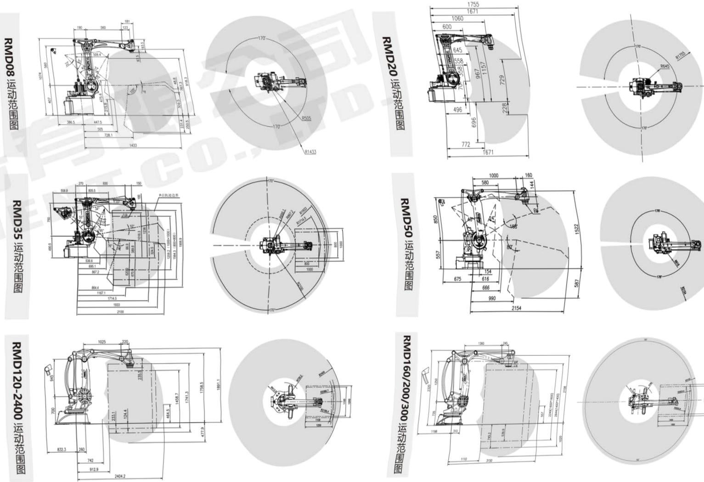

## C系列

<html><body><table border="1"><tbody><tr><td rowspan="2">型号</td><td rowspan="2">自由度</td><td rowspan="2">驱动方式</td><td rowspan="2">额定负载 (kg)</td><td rowspan="2">最大负载 (kg)</td><td rowspan="2">重复定位精度 (mm)</td><td rowspan="2">工作范围 (mm)</td><td rowspan="2">回转角度 (°)</td><td rowspan="2">最大加速度 (m/s{2)</td><td rowspan="2">最大速度 （空载)(m/s)</td><td colspan="2">典型节拍时间(S)</td><td rowspan="2">整机重量 (kg)</td></tr><tr><td>25/305/25[mm]</td><td>30/400/30[mm]</td></tr><tr><td>C3-1100</td><td>3</td><td>交流伺服驱动</td><td>1</td><td>3</td><td>±0.05</td><td>Φ1100x250</td><td>-</td><td>120</td><td>10</td><td>0.33(0.3kg)/0.38(1kg)</td><td>0.48（0.3kg）/0.50（1kg）</td><td>95</td></tr><tr><td>C3-1600</td><td>3</td><td>交流伺服驱动</td><td>1</td><td>3</td><td>±0.05</td><td>Φ1600x300</td><td>-</td><td>100</td><td>10</td><td>0.33(0.3kg)/0.38（1kg)</td><td>0.48（0.3kg)/0.50（1kg）</td><td>95</td></tr><tr><td>C4-1100</td><td>4</td><td>交流伺服驱动</td><td>1</td><td>3</td><td>±0.05</td><td>Φ1100x250</td><td>±180</td><td>120</td><td>10</td><td>0.33(0.1kg)/0.38(1kg)</td><td>0.48(0.1kg)/0.50(1kg)</td><td>110</td></tr></tbody></table></body></html>

备注：避免与易燃易爆及腐蚀性气体、液体接触；勿溅水、油、粉尘；远离电器噪声源（等离子）。

## 水平多关节机器人

<html><body><table border="1"><thead><tr><td rowspan="2">型号</td><td rowspan="2">标准周期 (s)</td><td rowspan="2">额定负载 (kg)</td><td rowspan="2">最大负载 (kg)</td><td colspan="6">轴规格</td><td colspan="3">最高速度</td><td colspan="2">重复精度*（mm）</td><td rowspan="2">本体重量 (kg)</td></tr><tr><td colspan="2"></td><td colspan="2"></td><td></td><td></td><td></td><td></td><td></td><td></td><td></td></tr></thead><tbody><tr><td>X轴</td><td>Y轴</td><td>Z轴</td><td>R轴</td><td>X、Y轴 (m/s)</td><td>Z轴 (m/s)</td><td>R轴 (/s)</td><td>X、Y轴</td><td>Z轴</td><td>R轴</td><td>手臂长度</td><td>旋转角度 ±140° ±140°</td><td>手臂长度</td><td>旋转角度</td><td>行程</td><td>旋转范围</td></tr><tr><td>一体机RSP600A15</td><td>0.68</td><td>2</td><td>5</td><td>350mm 350mm</td><td>250mm 250mm</td><td>±135° ±135°</td><td>150mm 150mm</td><td>±360° ±360°</td><td>5.5m/s 5.5m/s</td><td>1.1m/s</td><td>588°/s</td><td>±0.01 ±0.01</td><td>±0.01</td><td>±0.01°</td><td>160/23</td></tr></tbody></table></body></html>

应用领域：电子产品工业、塑料工业、药品工业和食品工业等领域，完成抓取、装配、涂胶等作业。

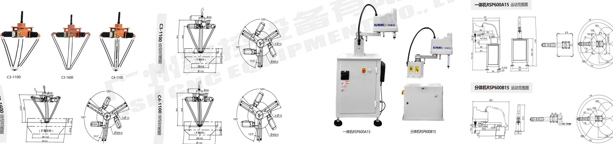

## 关键功能部件

## 控制柜（控制器&示教盒）

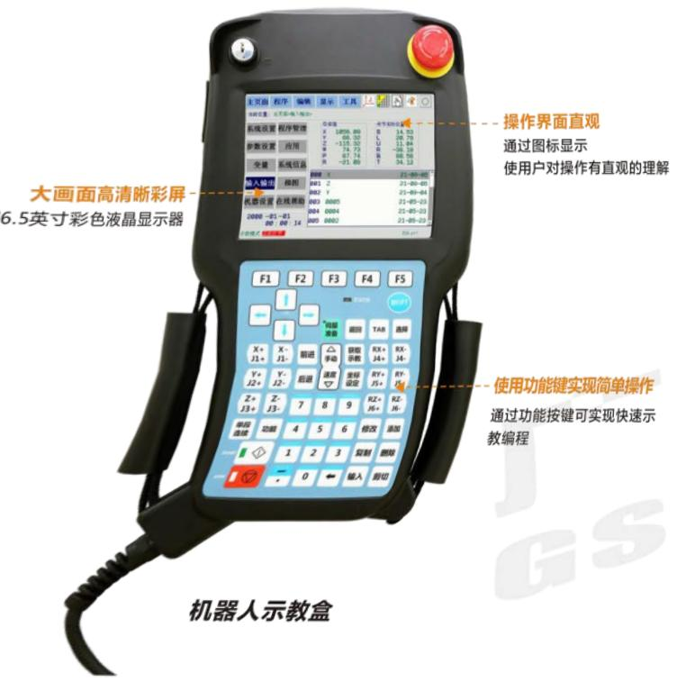

主要包括：控制器（电柜&示教盒）、SJTR系列伺服电机、GL系列一体化伺服驱动单元、GE系列交流同步伺服驱动单元、内摆线十字滚柱减速机。

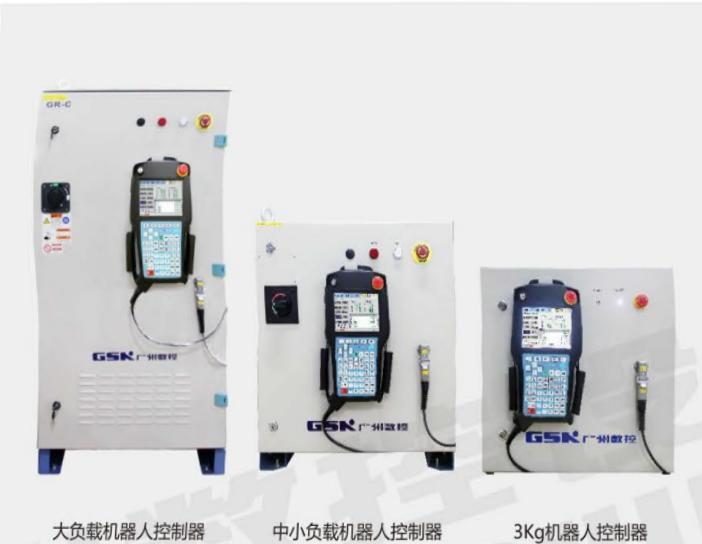

## 特点

采用自主研发的GSK-RC控制系统，机器人始终能够根据实际载荷对加减速进行优化，尽可能缩短操作周期时间；

具备内部软PLC功能，使整线方案应用集成的逻辑控制变得更灵活。

嵌入式机器人控制器：基于ARM+DSP+FPGA硬件结构，可支持到10轴，运算速度达到500MIPS，

具有高速运动控制现场总线、以太网、CAN以及DeviceNet任一接口，可实现连续轨迹示教和在线示

教，具备远程监控和诊断功能；机器人现场总线（GSK-Link）：具有高速实时特性，突破带宽与实时性的矛盾，兼顾通讯速率和实时控制的特点，解决不同模块间数据实时交互问题；动力学辨识控制技术：综合考虑机器人运动过程中重力、哥氏力、离心力等外力干扰运用自适应辨识控制技术提高机器人的动态性能。

<html><body><table border="1"><tbody><tr><td>项目</td><td>GSK-GRC</td><td></td></tr><tr><td rowspan="6">控制系统</td><td>示教方法</td><td>示教再现/远程控制</td></tr><tr><td>驱动方式</td><td>数字总线式交流伺服</td></tr><tr><td>控制轴数量</td><td>6轴(可扩展至10轴)</td></tr><tr><td>位置控制方式</td><td>PTP/CP</td></tr><tr><td>速度控制</td><td>TCP恒速控制</td></tr><tr><td>坐标系统</td><td>关节坐标/笛卡尔坐标/用户坐标/工具坐标</td></tr><tr><td rowspan="3">记忆</td><td>记忆介质</td><td>Flash Memory(闪存）</td></tr><tr><td>记忆容量</td><td>256M</td></tr><tr><td>记忆内容</td><td>点，直线，圆弧，条件命令等</td></tr><tr><td rowspan="2">动作</td><td>插补功能</td><td>线性插补，圆弧插补</td></tr><tr><td>手动操作速度</td><td>5段可调（限速250mm/s)</td></tr><tr><td rowspan="4">编辑</td><td>添加，输入，复制，剪切，删除，修改，查看</td><td></td></tr><tr><td>外部控制输入</td><td>条件设定</td></tr><tr><td>通用物理IO</td><td>数字I/0板，标准输入/输出各32点，可扩展、支持2路模拟量输出（0~10V）</td></tr><tr><td>应用</td><td>弧焊，搬运，涂胶，喷涂等</td></tr><tr><td>外部通信</td><td>USB、以太网、Modbus TCP</td><td>保护功能</td></tr><tr><td>保养功能</td><td>定期检查异常记录</td><td></td></tr><tr><td>异常检出功能</td><td>紧急停止异常，控制时序异常，伺服异常，码盘异常，示教盒异常，用户操作异常，点焊异常，弧焊异常，传感器异常</td><td>诊断功能</td></tr><tr><td>原点复位</td><td>由码盘电池支持，不需要每次开机进行原点复位。</td><td></td></tr><tr><td>冷却系统</td><td>风冷</td><td>70<dB</td></tr><tr><td>0~40℃（无霜冻）/0~90%RH（不结霜）</td><td>环境温度/湿度范围</td><td>三相AC220V50/60HZ（小部分机型单相）（注：出口机器人按当地电压配置）</td></tr><tr><td>电源</td><td>接地</td><td>D类以上机器人专用接地</td></tr><tr><td></td><td></td><td></td></tr><tr><td></td><td></td><td></td></tr><tr><td></td><td></td><td></td></tr></tbody></table></body></html>

## 关键功能部件

主要包括：控制器（电柜&示教盒）、SJTR系列伺服电机、GL系列一体化伺服驱动单元、GE系列交流同步伺服驱动单元。

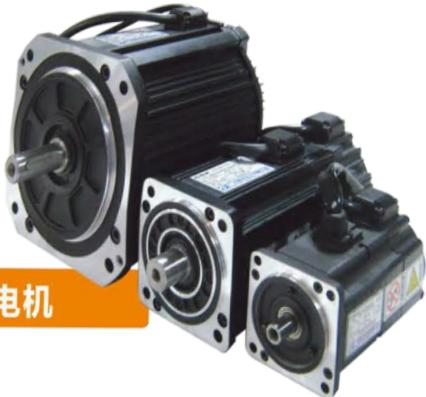

## GSKSJTR系列伺服电机

## 点

采用优化的电磁设计，电磁噪声低、运行平稳、效率高；

采用高性能稀土永磁材料，低速特性好、过载能力强（3倍）；

采用17位绝对式高速、高精度光电编码器，与高性能驱动单元配合可作高精度控制；

采用进口高精度轴承和转子高精度动平衡工艺，确保电动机运行在最高转速范围内稳定可靠、振动小、噪声低

电动机在-15℃~40℃环境温度及粉尘油雾环境下可靠使用；

具有高转矩惯量比，快速响应能力强。

## GSKGL系列一体化伺服驱动单元

## 分参数

<html><body><table border="1"><tbody><tr><td>项目 号</td><td>额定功率 (kW)</td><td>额定电流 (A)</td><td>零速转矩 (N.m)</td><td>额定转矩 (N.m)</td><td>最大转矩 (N.m)</td><td>额定转速 (r/min)</td><td>最高转速 (r/min)</td><td>转动惯量 (kg.m2)</td></tr><tr><td>SJTR-MZ003E</td><td>0.1</td><td>1.2</td><td>0.318</td><td>0.318</td><td>0.955</td><td>3000</td><td>5000</td><td>0.05×10</td></tr><tr><td>SJTR-MZO05E</td><td>0.16</td><td>1.65</td><td>0.5</td><td>0.5</td><td>1.5</td><td>3000</td><td>5000</td><td>0.07×10</td></tr><tr><td>OSJTR-MZ006E</td><td>0.2</td><td>2.9</td><td>0.637</td><td>0.637</td><td>1.91</td><td>3000</td><td>6000</td><td>2.71×10</td></tr><tr><td>OSJTR-MZ010E</td><td>0.3</td><td>3.1</td><td>1.0</td><td>1.0</td><td>3.0</td><td>3000</td><td>6000</td><td>3.36×10</td></tr><tr><td>OSJTR-MZ013E</td><td>0.4</td><td>3.3</td><td>1.27</td><td>1.27</td><td>3.81</td><td>3000</td><td>6000</td><td>3.88×10</td></tr><tr><td>OSJTRE-MZ040C</td><td>0.84</td><td>5.5</td><td>4</td><td>4</td><td>12</td><td>2000</td><td>3500</td><td>1.3×10³</td></tr><tr><td>OSJTRE-MZ060C</td><td>1.26</td><td>8.6</td><td>6</td><td>6</td><td>18</td><td>2000</td><td>3500</td><td>1.9×10</td></tr><tr><td>OSJTRE-MZ080C</td><td>1.68</td><td>11.2</td><td>8</td><td>8</td><td>24</td><td>2000</td><td>3500</td><td>2.9×10</td></tr><tr><td>OSJTRE-MZ100C</td><td>2.1</td><td>14.3</td><td>10</td><td>10</td><td>30</td><td>2000</td><td>3500</td><td>3.4×10</td></tr><tr><td>OSJTRE-MZ120C</td><td>2.5</td><td>14.5</td><td>12</td><td>12</td><td>33.8</td><td>2000</td><td>2800</td><td>3.9×10</td></tr></tbody></table></body></html>

GL系列一体化伺服驱动单元，是广州数控最新研发的具有工业以太网总线通信接口的6轴一体的机器人专用伺服驱动，具备较好低速性能、宽范围惯量匹配、高动态响应及兼容广（可适配17~26位编码器）等特点，以满足各种机器人的使用需求。目前按照功率已分为大、中、小三款型号，覆盖负载范围3kg35kg的4~6关节机器人，同时可支持双轴扩展模块适配变位机满足焊接应用。

## 特点

更节能：采用共母线整流技术，相比传统独立式伺服单元可降低能耗15~35%；更紧凑：采用一体化电柜后相比单轴伺服电柜体积减小幅度达50%以上；更可靠：通过散热器与风道的合理布置保证散热效果，提升伺服防护等级；更安全：具备高响应、高可靠的安全抱闸功能以及动态制动功能，有效提升人机安全性；易维护：整合优化物理接口，减少接插件，提升安装维护的便利性和产品可靠性；易用性：可在机器人系统界面实现伺服参数调试、状态监控及故障报警和处理等；高级碰撞软浮动功能：针对焊接应用开发的焊枪碰撞柔顺控制功能，可以更好的保护焊枪以及避免位置偏点等问题。

## 变位机

## 附加设备介绍

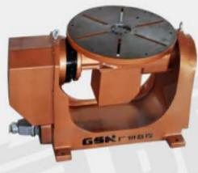

双轴变位机HBS150-1

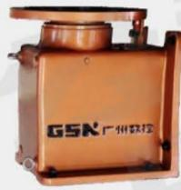

单轴变位机HBD250-1

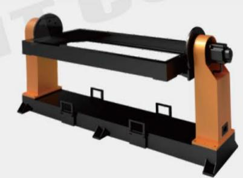

<html><body><table border="1"><tbody><tr><td rowspan="2">型号</td><td rowspan="2">驱动方式</td><td rowspan="2">最大负载 (kg)</td><td rowspan="2">重复定位 精度 (mm)</td><td colspan="2">运动范围 (°)</td><td colspan="2">额定转速 (°/sq$</td><td colspan="2">额定转矩 (N.m)</td><td rowspan="2">本体重量 (kg)</td></tr><tr><td>倾动轴</td><td>回转轴</td><td>倾动轴</td><td>回转轴</td><td>倾动轴</td><td>回转轴</td></tr><tr><td>HBS150-1</td><td>交流伺服驱动</td><td>200</td><td>±0.15</td><td>±135</td><td>±370</td><td>125</td><td>124</td><td>330</td><td>144</td><td>200</td></tr><tr><td>HBD250-1</td><td>交流伺服驱动</td><td>300</td><td>±0.10</td><td>/</td><td>±370</td><td>/</td><td>124</td><td>/</td><td>244</td><td>105</td></tr><tr><td colspan="10">特点：采用广州数控自主开发的减速机和伺服电机控制，能将焊接工件的各类焊缝转动到最佳位置，避免立焊、仰焊，进一步提高焊 接质量及生产效率。机器人控制系统不仅可以控制机器人本体的运动，而且还可对变位机进行自动控制发出焊接开始指令，自动控制 和调整焊接参数（电压、电流），可自动检测起弧成功与否。单轴变位机也可用于自动化上下料。</td></tr></tbody></table></body></html>

## 头尾式单轴伺服变位机

<html><body><table border="1"><tbody><tr><td>额定负载 (kg)</td><td>额定转矩 (N.M)</td><td colspan="2">标准翻转半径 (mm)</td><td colspan="2">最大翻转角度 (°$</td><td>额定翻转速度 (R/Min)</td><td>重复定位精度 (mm)</td><td colspan="2">变位框架尺寸 (mm)</td></tr><tr><td></td><td></td><td colspan="2"></td><td colspan="2"></td><td></td><td colspan="2"></td></tr><tr><td>500</td><td>700</td><td colspan="2">700</td><td>±360</td><td colspan="2">15</td><td>±0.1</td><td colspan="2">2000*800*130</td></tr><tr><td colspan="3">1000</td><td colspan="2">1000</td><td colspan="2">700</td><td colspan="3">±360</td></tr><tr><td colspan="3">变位机外形尺寸 (mm)</td><td colspan="2">主轴回转盘 (mm)</td><td colspan="4">转轴中心高 (mm)</td><td>供电条件</td></tr><tr><td colspan="3">2750*520*1100</td><td colspan="2">φ400 φ400</td><td colspan="4">900</td><td>7轴/8轴机器人电柜控制* 7轴/8轴机器人电柜控制*</td></tr><tr><td colspan="9">3250*550*1100</td></tr></tbody></table></body></html>

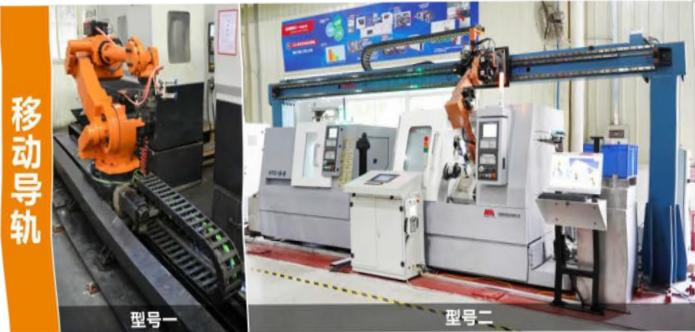

<html><body><table border="1"><tr><td>型号</td><td>适用机器人</td><td>最大运行速度 (m/s)</td><td>重复定位精度 (mm)</td><td>最大负载 (kg)</td><td>安装条件</td></tr><tr><td>型号一 （地面安装方式）</td><td rowspan="2">RB系列 多关节机器人</td><td rowspan="2">1.5 （与电机相关）</td><td rowspan="2">±0.05</td><td>800</td><td rowspan="2">环境温度：0~45° 环境湿度：20~80%RH（不结露</td></tr><tr><td>型号二 （龙门移动方式）</td><td>(最高) 400</td></tr></table></body></html>

## 视觉系统&离线编程技术

## 视觉系统

点：广州数控机器视觉系统，集成机器视觉系统基础功能和多种高精算法，适用多种业务场景，可实现对工件或被测物的识别、测量、缺陷检测等功能。具有强大的视觉分析功能，通过简单灵活的配置，便可快速构建机器视觉应用系统，功能丰富、性能稳定可靠，用户操作界面友好。

用：视觉定位、测量、检测和识别等不同领域应用需求。

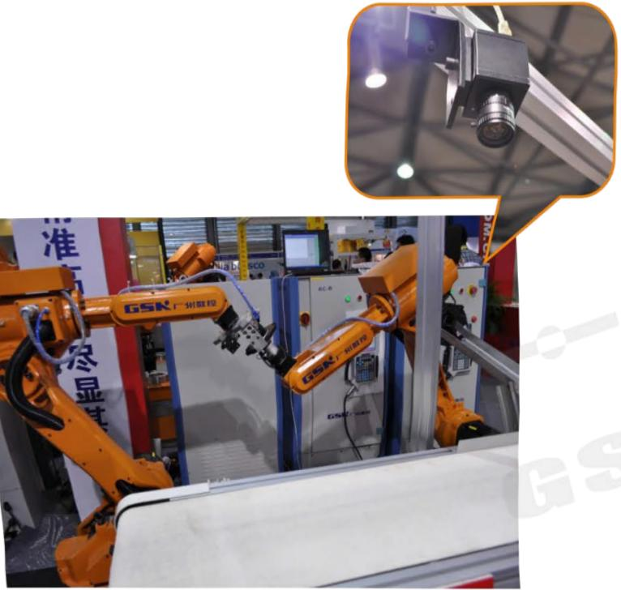

利用机器人视觉系统完成分拣搬运工作

## 离线编程系统

特点：利用离线编程软件生成预加工轨迹，再通过坐标变换及优化输出采用机器人语言编写的加工文件，实现复杂轨迹的生成。

应用：主要应用于三维实体的切割、涂胶、喷涂、铣削、雕刻和打磨等操作。

.

## GSK产线单元控制系统

面向机加工领域的监控管理系统，进行各类零件加工的生产设备组线：

利用GSK-LINK现场总线实现数控机床、工业机器人及生产线辅助运转设备的高速连接；

在线和离线编程支持；

简单人性化的操作；

最大限度的为您提高生产效率和产品质量的稳定性，降低人工成本

优化和改善您的管理体系。

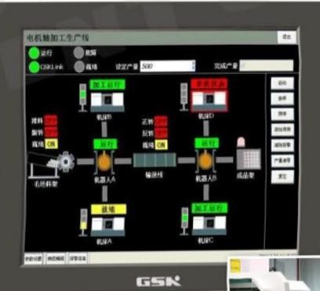

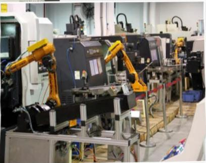

## “智能制造”&”数字化工厂”整体解决方案及工程实施

## GSK总控管理系统

用于实现“数字化工厂”、“智能化车间”的管理系统；

CAM和CAPP应用与管理；

方便快捷的流程规划；

生产产能的计算与调整；

设备使用率的统计；

生产流程干涉；

评估C/T等。

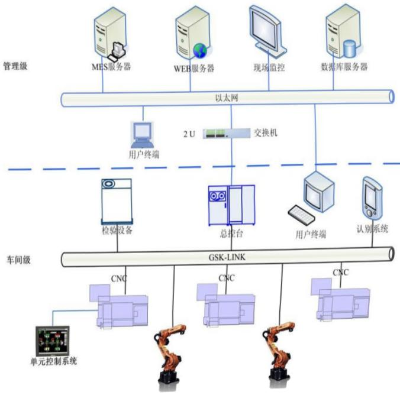

## 应用案例

## 搬运/上下料应用

## GSKRB08搬运机器人汽车内饰自动切割飞边的应用

## 户要求

机器人替代人工实现注塑件飞边自动切割。

## 用效果

人工放毛还料于固定治具中定位并确认；1台RB08搬运机器人，1套等离子切割设备，将切割头安装在机器人六轴末端法兰处；人工示教机器人编程，机器人沿着产品轮廓飞边切除；机器人替代人工，人工换班，可24小时随时作业，稳定完成工作任务；机器人切割飞边，可有效减少切割不到位，漏切问题，保证产品一致性；大大提升产品品质，提升企业影响。

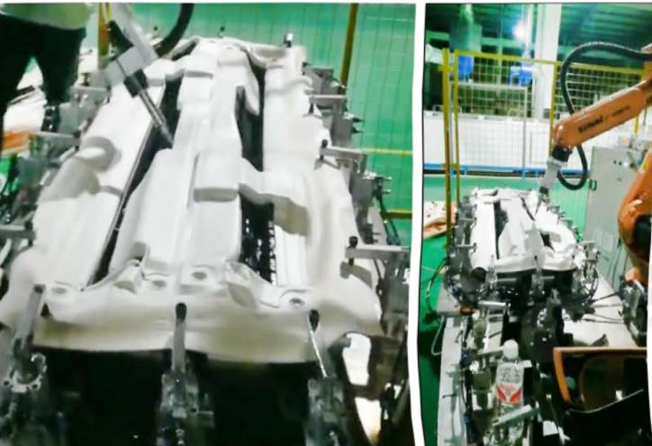

## GSKRB08搬运机器人在机床上下料的应用

## 客户要求

·1台机器人与2台数控机床组成一套机器人上下料系统；·紧密配合零件加工的生产节拍，保证工作效率。

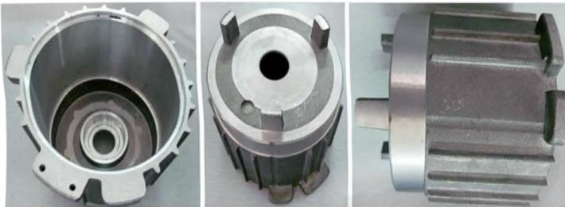

## 应用效果

零件占用空间较大，为保证2小时以上的加工量及定位精度，采用双伺服高精度滑台设计，交替运行生产效率高；毛坯上料机构与成品下料机构为一体式结构，缩短了机器人的运行时间，保证了自动化生产时的连续性，流畅性；机器人的高灵活性也让它能在较小的空间变换姿态，增加了空间利用率；控制系统采用GSK98作为主控单元，操作简单，稳定性好。

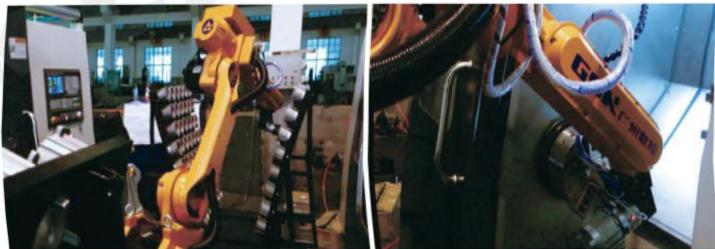

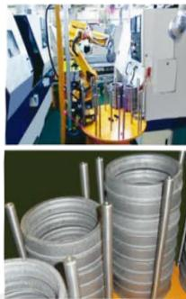

## GSKRB08搬运机器人在车床上下料的应用

## 客户要求

采用2台车床完成零件的两道工序的加工第一道工序加工零件内圆和端面，耗时40s；第二道工序加工零件外圆、端面和槽，耗时48s。应用效果

采用伺服旋转上料台，定位精度高；旋转分度通过GSK96数控系统编程实现，通用性强；通过无杆气缸将零件抓取提升，保证了2小时以上的自动化生产生产节拍配合紧密，使用时运行很流畅

## GSKRB08搬运机器人在加工中心上下料的应用

## 客

●·1台机器人与2台加工中心组成一套机器人上下料系统；

·零件图示无颜色标注可识别；

57秒一个节拍，完成零件的加工。

## 应用效果

工件在机床上装夹，采用销定位，精度要求较高；采用2台上料机，换料时，机器人正常作业，保证生产过程的连续性；加工上下料效率高，不占用机床等待时间，实现全过程100%加工时间利用率。

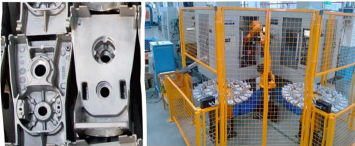

## GSKRB08搬运机器人在盘类零件上下料的应用

## 客户要求

一台RB08机器人与2台数控车床，一台自动上下料辅助设备组成机器人车床上下料系统；· 能够紧随工件的生产节拍，确保生产效率和工作过程的安全稳定可靠；机器人在断电、断气时，抓手所吸取的工件不能松开或脱落，抓手具有位置确认开关；●上下料系统需要有较强的柔性，可以通用于多种工件的自动上下料。

## 应用效果

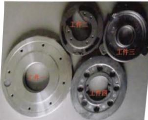

此套解决方案以经济性、安全性、良好的操作性、可靠性作为设计准则，并且具备较高的柔性，只需要对旋转上料机和机器人抓手做稍微调整即可适用于客户提供的四种零件的上下料加工；机器人输出，车床输入，机器人进入车床后输出该信号，车床接收到该信号互锁禁止所有运动机构的动作，直至机器人完全退出车床后复位该信号，确保机器人与机床配合的安全可靠；控制系统具有软/硬限位，控制异常、急停等故障显示和报警功能，机器人在断电、断气时，抓手所吸取的工件不会松开或脱落；此解决方案可一天三班制运行，工人提供充足的坏料即可实现连续加工，生产效率高。

## GSKRB08搬运机器人在齿轮加工上下料的应用

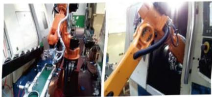

## 客户要求

·1台机器人配2台车床组成上下料系统·紧密配合生产节拍，保证生产效率应用效果

·该项目为齿轮加工，车床夹具配合精度高，间隙小，来料为滚动槽传送随意性大，经济实用；

·机器人抓手增加设计二次定位装置，保证齿轮装入车床夹具的一致性；·加工上下料效率高，定位精准，不占用机床等待时间，实现全过程100%加工时间利用率。 # 应用案例

## GSKRB08搬运机器人在电机轴上下料的应用

## 户要求

所需要加工的工件是长度360~490mm、重量3~6kg左右的电机转轴；生产线的加工节拍在140s以内，即一条生产线平均70s出1件成品：工作过程确保稳定安全可靠

## 用效果

者料架一次可放置MS100L毛坏棒180根，可满足约3个小时的连续加，更换直径相同长度不同规格的棒料，无需调整，更换直径不同的料只需稍作调整；

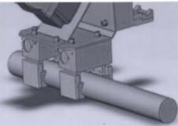

放式料架由电机驱动，分料轮运行并将坏料带至机器人上料位给机器人输料，如果传感器一分钟内检测不有物料时电机停转，并发出警示信号提醒工人往料仓加料，整机设置有多重保护，安全可靠；产纲领按照每月26天，每天2班16小时计，按照MS100L零件加工时间计算，65s内整线出一件成品，月量18000多件。完全满足客户的要求。

## GSKRB08搬运机器人与压铸机配合浇注的应用

## 客户要求

·机器人替代人工搬运，给1台压铸机浇注铝水

## 应用效果

·机器人替代人工，可24小时随时作业，稳定完成工作任务；压铸行业是一个有一定危险性的行业，高温对工人的身心健康有一定的影响，使用机器人可避免各种事故的发生；铸造专家认为机器人在铸件行业中的应用是大势所趋，这既是市场的推动，也是技术升级的要求。所趋，这既是市场的推动，也

## GSK RB08在冲压车间的应用

## 客户要求

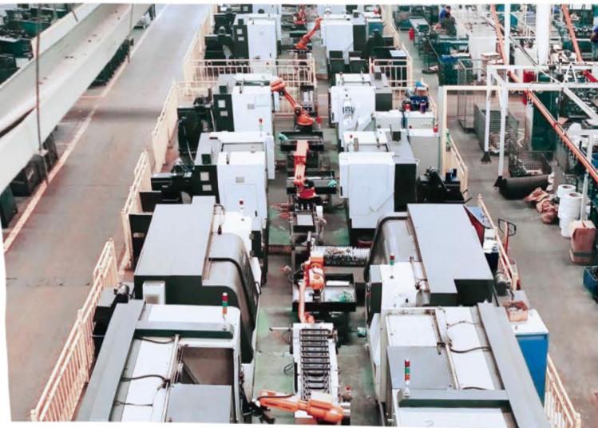

·冲压车间压力机自动化联线，共8台冲床连续冲压；·冲压后工件通过机器人从冲床上取出后平行放入下一台冲床这一过程重复到最后一道工序，机器人在最后台冲床完成冲压后取出工件放在传送带上，由人工检查和装箱。中台冲复，机最后

平均十秒生产一个成品，每天生产时间24小时，产量为8600件，相对人工提升约15%；安全可靠，杜绝工作事故。

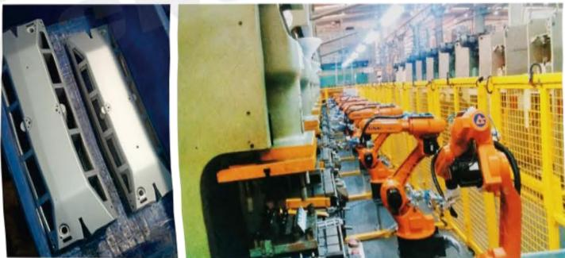

## 应用效果

## GSKRB08搬运机器人在电水壶粗冲自动线的应用

## 客户要求

·机器人配合冲床实现电水壶上下料，控制过程稳定安全可靠，密切配合节拍，客户要求整线节拍为12-14s/pcs，保证效率。

## 应用效果

·提高操作安全性，降低人工劳动强度和工伤发生几率

·提高产品质量和一致性，降低人力成本；

·本冲压线节拍为9.5s，每天运行两班，缩短了加工循环时间，提高了生产效率；

·本能能够在高速生产中实现精确定位。

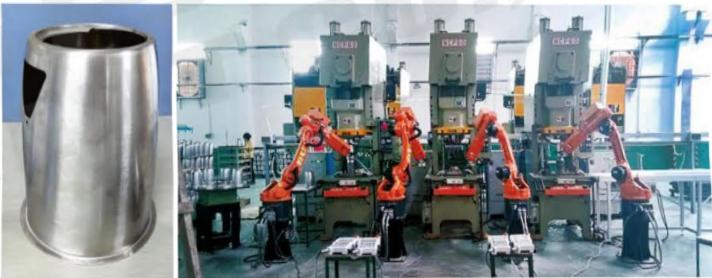

## GSKRB08搬运机器人在空调外壳冲压上下料的应用

## 客户要求

·机器人配合冲床实现空调外壳上下料，控制过程稳定安全可靠；·密切配合生产节拍，保证生产效率。

## 应用效果

·机器人抓手采用框架式吸盘结构，方便调整，以适应不同尺寸的同类型工件提高操作安全性，降低人工劳动强度和工伤发生几率；·与传统人工操作相比，机器人与冲压机配合加工可达到10秒的加工周期，·缩短了加工循环时间，提高了生产效率；·能够在高速生产中实现精确定位。

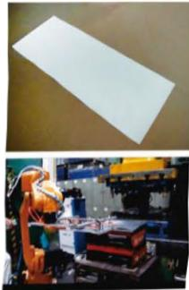

## 案例12

## 客户要求

## GSKRB08搬运机器人与挤压机配合上下料的应用

·由2台机器人与2台冷挤压机四轴油压机完成棒料的两次挤压成型工作；·挤压工件：经磷化处理的棒料；

·由1台机器人负责上料，另1台机器人负责从第1台油压机上取料再上到第2台上料并取料。

## 应用效果

轴类零件，采用滚动仓式上料方式（含定位、分离机构），保证了2小时以上的自动化生产；

零件与油压机磨具的预留间隙为0.08mm，有力地论证了RB08机器人的使用重复精度（模具未增加设计辅助定位装置）；

与原始人工操作相比，通过两台RB08机器人协同工作，缩短了两道工序间的等待时间，一个完整的工件加工周期是30s；

RB08较高的灵活性使得它即使在较小的空间仍能以合适的姿态规避障碍；·人性化操作编程使得客户能在最短时间熟悉并掌握操作，缩短投入使用时间。

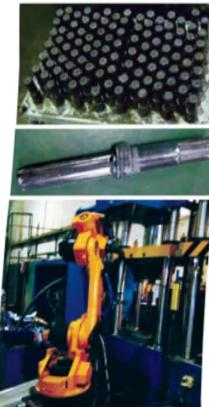

## GSKRB08搬运机器人在机床上下料的应用

## 客户要求

·1台机器人与2台数控机床组成1套机器人上下料系统，以低成本、高可靠为设计原则；夹具可以同时夹持两个零件，紧密配合零件加工的生产节拍，保证工作效率。

## 应用效果

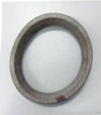

设计以经济性为原则，采用零件上、下料一体式结构；

根据零件有些许锥度的特性，翻转机构简单而实用

·采用气动式高精度旋转机构，简化控制，降低成本；

考虑到车床内部空间，车床卡盘与刀架的距离≤260mm，机器人手爪采用直角式排列结构。

## 应用案例

## GSKRB08搬运机器人在电机后端盖生产线上的应用

## 客户要求

·产品为电机端盖，2台车床分别加工正反两面（对生产自动化有较好的教学示范作用）。

## 应用效果

电机后端盖生产线采用2台机器人实现双工位加工，双夹手实现上下料一体，不占用机床加工时间，充分提

高加工效率；

满足客户生产节拍的要求，对于教学演示有较为重要的示范意义；

整个生产线设有监控装置，机床与机器人间有互锁保护，确保加工过程的安全可靠。

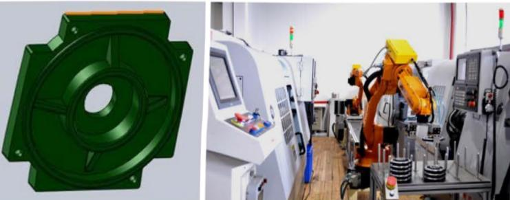

## GSKRB08、GSKRB20搬运机器人自动冲压产线应用

## 客户要求

机器人配套冲压设备构成自动冲压产线。

## 立用效果

2台RB20、4台RB08搬运机器人，从料仓抓取工件，二次定位后放入冲压设备进行各工序冲压，放置工件于

成品料仓，完成自动冲压；针对可磁化材料采用磁性分张器进行分张，不可磁化材料采用锯齿分张器进行分张，防止工件叠料；稳定高效生产，保证产品质量：自动冲压产线已成为自动化工厂的目标，具有很大的应用市场。

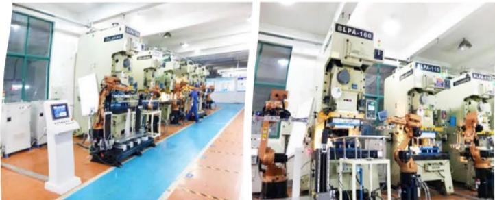

## GSKRB20搬运机器人在齿轮零件上下料的应用

## 客户要求

·上下料系统有较强的柔性，可以通用多种规格的工件；·齿轮毛坏重量2~6kg，结合齿轮加工工艺，实现齿轮零件在车床和加工中心自动上下料；上下料；·配合零件加工的生产节拍，合理布局，保证产量。

## 应用效果

采用多工位环形储料架，每个工位定位机构可调节，夹指可调节或更换，以适应多种规格的工件；1台机器人对2台车床，1台机器人对应2台加工中心上下料，2台机器人之间通过皮带线运输工件，组成自动化生产线；使用GSK产线单元控制系统，管理机器人与机床、机器人与储料架、机器人与皮带线等相关设备的通信，并对生产产能的计算和设备使用率的统计等进行管理。

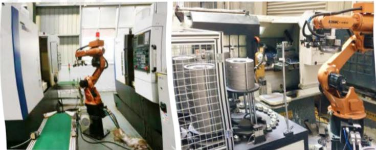

## GSKRB20搬运机器人与冲床配合冲压的应用

## 客户要求

·在原有产线上升级，最后四道工序改造成自动化单元·机器人替代人工搬运，机器人给冲床上下料；·自动化单元需在原有产线实现无缝对接，满足节拍要求

## 应用效果

·工人将前道工序的半成品放在输送线上，通过上方的视觉系统定位，机器人抓取工件给冲床上料，实现与机器人的对接；使用5台机器人分别给4台冲床上下料，产品最终从输送线流出，由人工取件：改造后的产线节省了三个工人，明显节约生产成本机器人替代人工，可24小时随时作业，稳定完成工作任务；免各种事故的发生。冲压行业是一个有一定危险性的行业，工人长时间做重复性的劳动，容易产生疲劳与厌倦，使用机器人可避

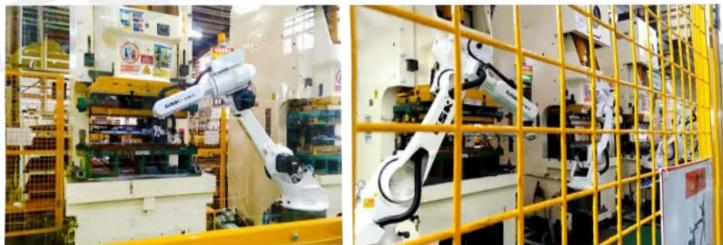

## GSKRB20搬运机器人火焰切割系统配合应用

## 客户要求

机器人替代人工切割工件，切割精度为5mm；

合理地设计工件定位夹具，考虑产品兼容性（共有2类产品，每类

产品有2种规格）。

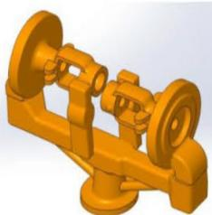

## 应用效果

采用“一对二“的布局形式，即一台机器人，两个转台，每个转台的气动夹具分别可兼容同种类型两种规格

的工件，工人在转台一侧上下料；机器人上搭载火焰切割系统，配合转台完成复杂的切割路径；与使用人工切割相比，缩短了产品装夹时间，加快了切割速度，显著提高生产效率；切割专家认为，火焰切割自动化在行业中是大势所趋，这既是市场的推动，也是技术升级的要求。

## GSKRB20搬运机器人在车床上下料的应用

## 客户要求

·1台机器人与2台车床组成一套机器人上下料系统，每台车床单独完成工件

工序的加工；

·至少完成5种不同型号工件的加工。

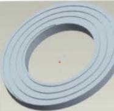

## 应用效果

·通过调整回转工作台盘面上的定位柱位置，更换夹爪，实现至少5种盘类工件的上下料加工；采用1台回转工作台上下料，所有工件加工完后，统一由人工对回转工作台工件进行上下料。

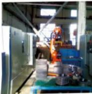

## 应用案例

## GSKRB20搬运机器人在滚齿机上下料的应用

## 客户要求

1台机器人与3台设备组成一套机器人上下料系统；

第1台滚齿机加工零件齿形，第2台倒棱机加工零件齿形边角，第3台剃齿机加工零件齿轮轮廊；

60秒一个节拍，完成零件的加工。

## 用效果

工件在机床上装夹，采用销定位，精度要求较高；

采用1台上下料架，采用伺服旋转上下料架，重复定位精度高，保证了2小时以上的自动化生产；

加工上下料效率高，不占用机床等待时间，实现全过程100%加工时间利用率。

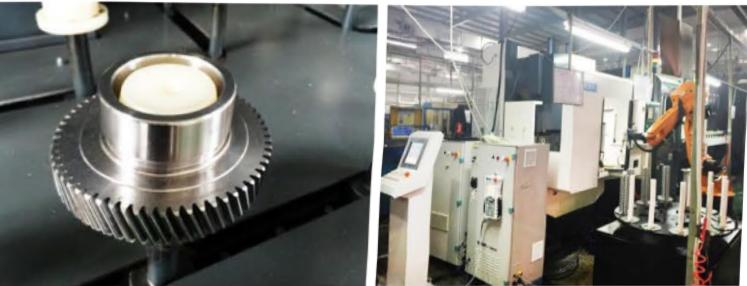

## GSKRB50搬运机器人在轮毂上下料的应用

## 户要求

毂上下料，机器人夹下图中黄色箭头所指外圆，三爪卡盘端面与小凸台紧，车床车轮毂内孔、端面及外圆，用时3分45秒；床钻孔攻螺纹、铣大端面各大孔，用时7分

## 效果

工零件为汽车轮毂，采用中心推进机构保证零件在车床卡盘上的定位精度；导轨增加了机器人运动行程，可同时给多台机床上下料；定位系统解决了传送带上工件杂乱摆放抓取问题。

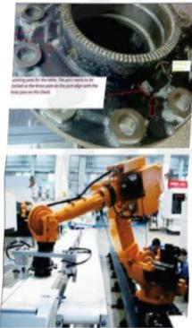

## GSKRB50搬运机器人在多轴机床加工上下料的应用

## 客户要求

·2台机器人与4台多轴机床组成一套机器人上下料系统；·机床4个工位同时上下料，加工端面孔、侧面孔及攻螺纹孔；·80秒一个节拍，完成4个零件的加工

## 应用效果

·工件在机床上装夹，采用销定位，精度要求较高；

·采用1台多工位环形上料架，机器人同时抓取4个工件，重复定位精度高，保证了2小时以上的自动化生产；

·中转台通过磁偶式无杆气缸对零件进行转运，通过回转气缸及夹紧气缸对零件进行换向，实现两台机器人的

· 工序衔接。

·换料时，机器人正常作业，保证生产过程的连续性；

·加工上下料效率高，不占用机床等待时间，实现全过程100%加工时间利用率。

## c)  

## 客户要求

·机器人替代人工夹持蜡模进行沾浆与浮砂工作。

## 应用效果

· 1台RB50搬运机器人，从料仓抓取工件，进行沾浆浮砂、将工件放回料仓，完成工作；·机器人穿防护服进行防尘，控制柜采用密封工业空调散热；机器人替代人工，可24小时随时作业，稳定完成工作任务；沾浆浮砂是高粉尘工作，对人体健康有一定损害，雇工困难，机器人解决了这一难题；在众多行业都存在沾浆浮砂工艺过程，应用前景可观。

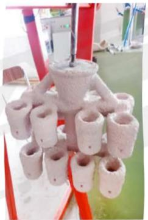

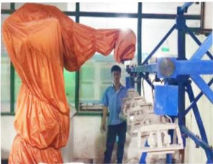

## GSK165搬运机器人2D视觉汽车底板随动抓取应用

## 客户要求

·汽车底板信息：尺寸：1700mm×1500mm，重量：20kg，材质；Q235A；·工件在皮带上以750mm/s的速度输送，机器人需随动抓取工件：·产线上同时有4种不同的工件，机器人需自动识别抓取；·整线节拍需每6秒完成1件工件装箱；

## 应用效果

输送线上来料随动且位置不确定，采用2D视觉引导机器人随动抓取；为兼容4款产品抓取，机器人手抓采用可调节的端拾器结构；产线配置：4台广数RB165机器人、两条皮带输送线、两套视觉移动定位捕捉系统、4套工件抓取端拾器、1套产线控制系统；该项目打破了进口品牌机器人在这一领域里的应用垄断，在国内处于领先水平；该自动化线可节省12个工人，如果按汽车厂3班倒，可节省36个工人。以每个工人10万一年的人工成本

算，全年节省360万，项目投入当年即可回本。

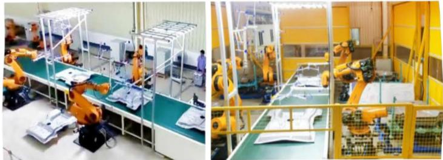

## GSKRB165搬运机器人3D视觉引导冷凝器搬运应用

## 客户要求

·将随意摆放在静止积放链托盘上的冷凝器搬运到匀速运动中的皮带输送线上；·将匀速运动皮带输送线上一定条件下随意摆放的冷凝器搬运到静止积放链托盘上；·兼容6种不同工件的抓取；整线节拍为10秒。

## 应用效果

·冷凝器外形不规则，抓取结构为空间立体抓取，在积放链托盘及皮带线上随意摆放；用3D视觉引导机器人抓取方案，机器人手抓采用仿形结构，与冷凝器接触部分采用软聚氨酯；积放链托盘上冷凝器抓取通过识别冷凝器端部白色塑料特征引导定位，相机安装在机器人手抓上；输送线上冷凝器抓取通过识别冷凝器表面特征引导定位，相机固定在输送线上方；用2台RB165机器人从积放链托盘搬运冷凝器到输送线上，形成2个下件自动化集成工作站。用2台RB165机器人从输送线搬运冷凝器到积放链托盘上，形成2个上件自动化集成工作站。

## 应用案例

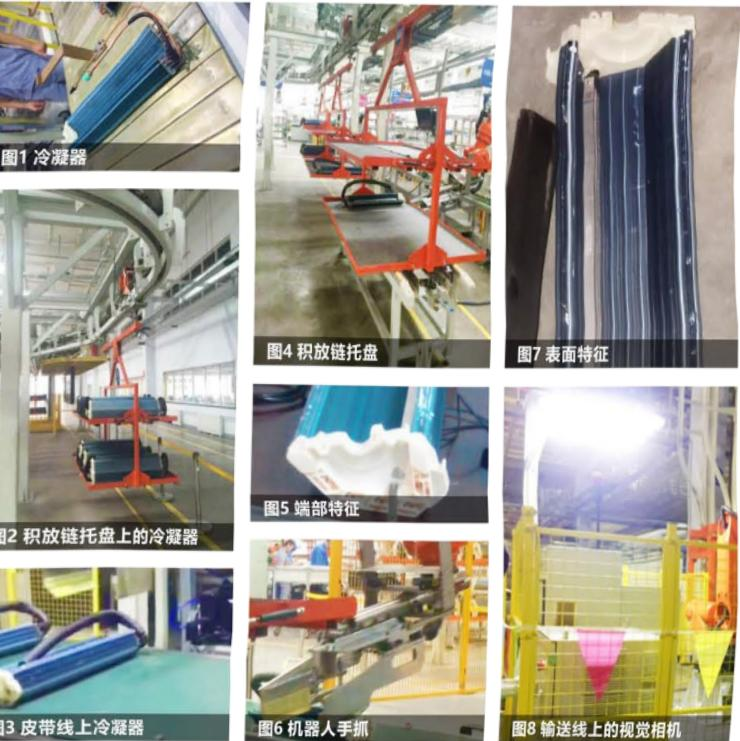

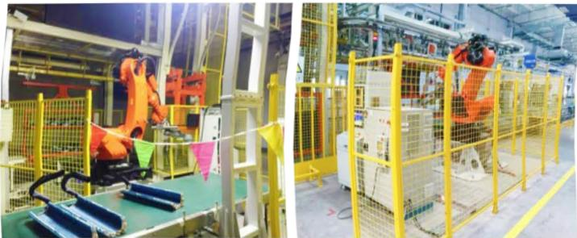

## 用优势

机器人替代人工，通过3D视觉引导稳定抓取，产线节拍为10秒；

可24小时随时作业，稳定完成工作任务；

达到机器人自动识别工件并自动搬运上下料的预期目的，可同时适用于6种产品的生产与相互间的换产；

后期通过更换抓手可适用于更多的产品。

## 焊接应用

## 模板行业的应用

客户要求

机器人替代人工，双工位交替焊接。

产品图片

## 应用效果

·普工装夹工件，气动夹紧定位工件，机器人按预设程序完成焊接，双工位人机交替作业；·配套自动清枪剪丝机构，有效保证生产的连续性

由2台机器人替代2个焊工同时焊接，可长时间稳定作业；·焊接行业是一个高危险行业，高温/烟尘/弧光对工人的身心健康有一定的影响，使用机器人可避免各种事故

的发生；焊接机器人在制造行业中的应用是大势所趋，既能节约制造成本，又大大的提高了产品的品质，并且有效保

证制造企业产能的稳定性，是人工密集型制造企业向智能制造企业转型的基本元素。

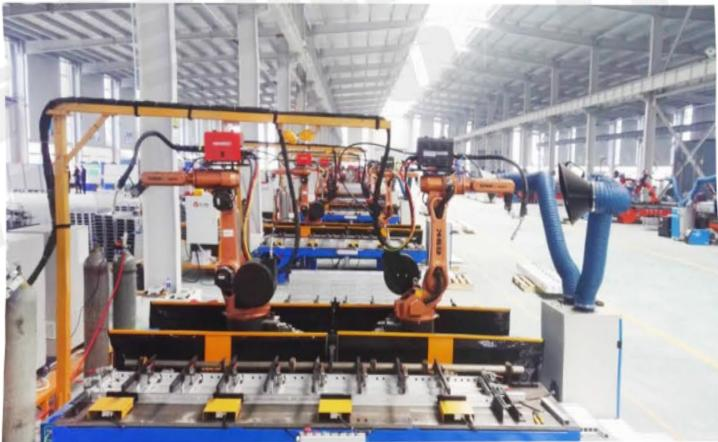

## GSKRH06焊接机器人在小家电行业的应用

客户要求

·机器人替代人工焊接，不锈钢薄板（0.6mm）焊接，不能有明显变形及焊穿。

## 应用效果

普工装夹工件，气动夹紧定位工件，机器人按预设程序完成焊接；

机器人配套光纤传输型激光焊机，可高速连续性焊接；

由机器人替代焊工，由激光焊接机代替传统氩弧焊机；

焊接速度比传统氩弧焊要大幅提升，焊接变形小，焊道成型一致性及色泽优于氩弧焊；

焊接耗材的使用成本低于氩弧焊。

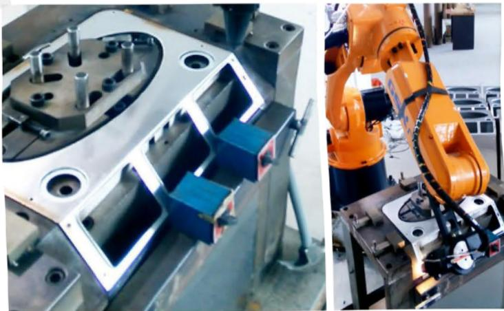

## GSKRH06焊接机器人在电气行业的应用

客户要求

·机器人替代人工上下料及焊接，不锈钢制品TIG焊接。

应用效果

·机器人抓取工件旋转于定位工装，自动夹紧定位工件，机器人按预设程序完成焊接；机器人配套气动夹手及氩弧焊机，可自动上下料后再自动焊接；·由机器人替代操作工及焊工，实现全自动焊接，无需人工参与；·工装为柔性化工装，长宽根据所选程序可自动可调整

## 应用案例

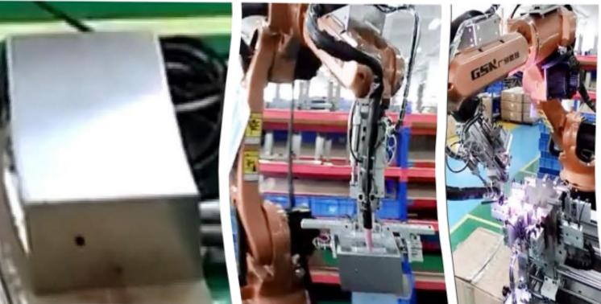

## GSKRH06焊接机器人在车桥焊接工装上的应用

## 客户要求

将点焊好的半成品进行满焊，焊接不允许扭曲，不能出现虚焊，咬边，气孔等焊接缺陷，焊接工装尽量简单。

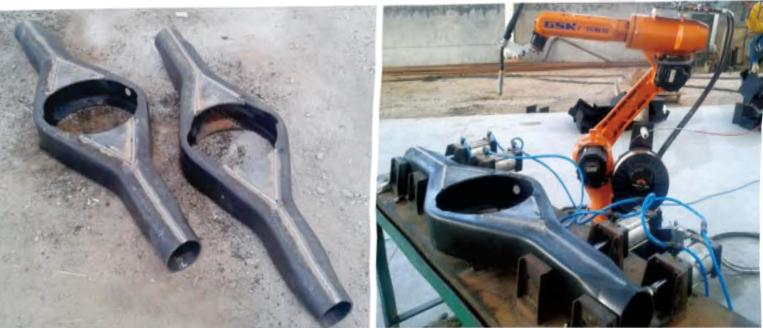

## GSKRH06焊接机器人在某机械公司焊接工装上的应用

## 客户要求

·将点焊好的半成品进行满焊，焊接不允许扭曲；

工作站能适用不同规格的产品，在焊接的同时可以对焊接件进行拆装，节约时间；

工作站要求结构紧凑，合理利用空间，有弧光防护等。

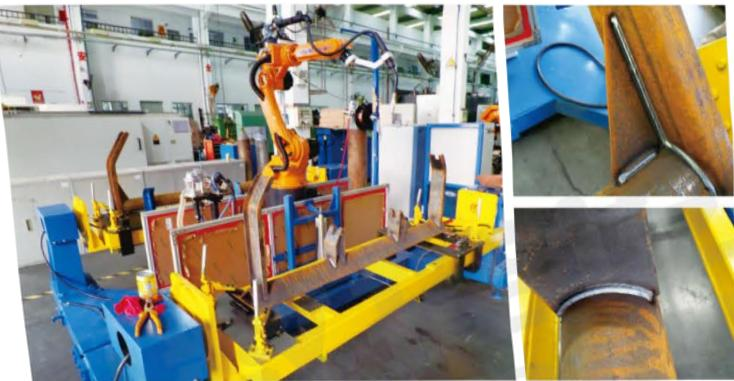

## SKRH06焊接机器人在武汉某公司焊接工装上的应用

## 客户要求

·将零件各分件拼焊起来，焊接不允许扭曲，在焊接的同时可以对焊接件进行拆装，节约时间。

## 应用效果

● 采用工业机器人焊接代替人工焊接，提高了焊接件的焊接质量与效率，焊缝外观漂亮，提升视觉美感。

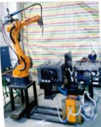

## GSKRH06焊接机器人捷昌线性传动公司焊接工装上的应用

## 客户要求

·将散件装夹在专用夹具上进行满焊，焊接不允许扭曲，不能出现虚焊，咬边，气孔等焊接缺陷；·在机器人可达范围内，尽量减少人工于两工位之间的活动范围，合理布局工作站，上下料布局合理·工作站具备防弧光等安全设施，两工位独立进行，互不干涉，进一步提高设备的使用率；·工作台适用三种产品的焊接需求。

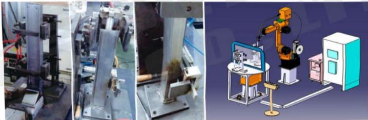

## GSKRH06焊接机器人激光焊接的应用

## 客户要求

·1台机器人与1个焊接工位组成一套机器人焊接系统；要求无明显焊穿焊透，焊缝成型一致性好。

## 应用效果

·人工装夹工件，采用气动夹紧定位，工件一次性装夹完成所有焊接工作；焊缝成型美观一致，无焊穿焊透现象，品质稳定，焊后变形小

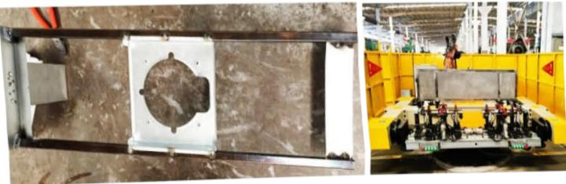

## GSKRH06焊接机器人MAG/CO2焊接的应用

## 客户要求

·产品焊接后必须符合甲方技术、工艺图纸要求以及品质要求；

对接焊缝间隙小于0.5mm；

·角接焊缝间隙小于1mm；

工件焊缝处的一致性误差小于0.3mm；

零件焊缝处表面应无油、无锈、无污物；

·焊接完成后，工件零件不应有焊接毛刺等瑕疵；

·焊接效率：每件产品焊接时间≤30S/件

## 应用效果

·人工装夹工件，采用气动夹紧定位，翻转轴配合机器人完成一次性所有焊接工作；·人工装夹工件时，机器人于另一侧焊接，保证生产过程的连续性。

## GSKRH06焊接机器人在汽车配饰焊接工装上的应用

## 客户要求

·将散件装夹在专用夹具上进行满焊，焊接不允许扭曲，不能出现虚焊，咬边，气孔等焊接缺陷；在机器人可达范围内，尽量减少人工于两工位之间的活动范围，合理布局工作站，工作站要紧凑，合理利用空间，减少占地面积；工作站具备防弧光、安全光栅等安全设施，两工位独立进行，互不干涉，进一步提高设备的使用率。

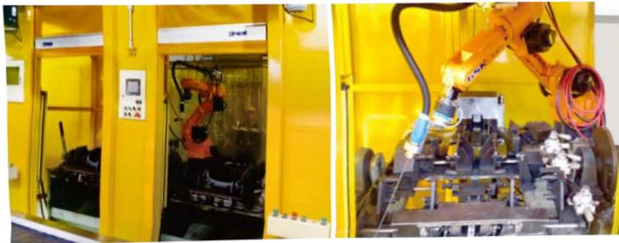

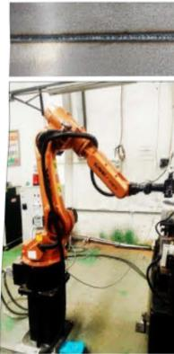

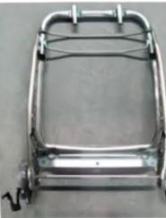

## 应用案例

## 冲压/码垛应用

## RMD08码垛机器人在钣金冲压的应用

户要求

使用4台机器人分别给3台冲床上下料，成品最终从输送线流出；

上下料系统有较强的柔性，可以通用多种规格的工件。

## 用效果

工人将前道工序的半成品放在输送线上，通过上方的视觉系统定位，机器人抓取工件给冲床上料，实现与机

器人的对接；

使用4台机器人分别给3台冲床上下料，产品最终从输送线流出，由人工取件；

改造后的产线节省了3个工人，明显节约生产成本；

机器人替代人工，可24小时随时作业，稳定完成工作任务；

具有操作方便，效率高，工件良率高等优点

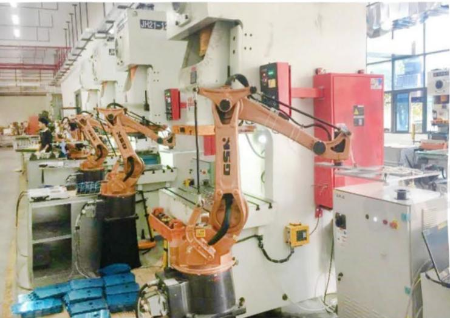

## GSKRMD08机器人应用于某公司1185左右面板自动冲压产线

客户要求

· 机器人配套冲压设备构成1185左右面板自动冲压产线

## 应用效果

机器人替代人工，可24小时连续作业，稳定完成工作任务·稳定高效生产，保证产品质量

·自动冲压产线已成为自动化工厂的目标，具有很大的应用市场

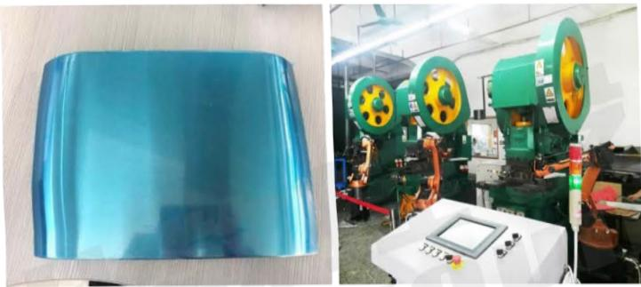

## GSKRMD08机器人应用于某公司热水壶壳体冲压

客户要求

机器人代替人工，完成“冲孔一冲底边一放置下料线”的工艺流程

## 应用效果

●机器人可长时间持续生产，有效提高产能·更换机器人手爪，可兼容不同产品的生产

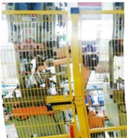

## GSKRMD08机器人在某家电公司真空内容器上下料应用

## 客户要求

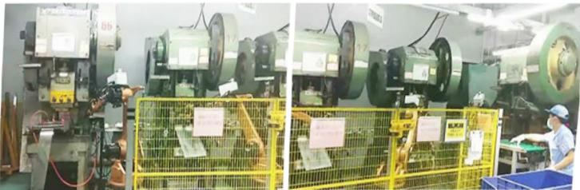

·适应多种规格真空内容器工件生产：最大重量约1.5Kg；

●机器人从皮带线抓取内容器放入真空滚焊设备，同时取出滚焊完成的内容器放入自动激光打标设备完成生产；

生产节拍：16秒/件；

## 应用效果

·机器人替代人工，可24小时持续作业，稳定完成工作任务；

·适应产线生产节拍，采用1对2滚焊机的布局方式，实现生产节拍13秒/件，节约生产成本、提高效率

·家电行业普遍生产特性就是品种类多、设备兼容性强、生产工序频繁单一、劳动力密集、生产交期短，采用

机器人替代人工生产，降低生产成本、掌控生产周期

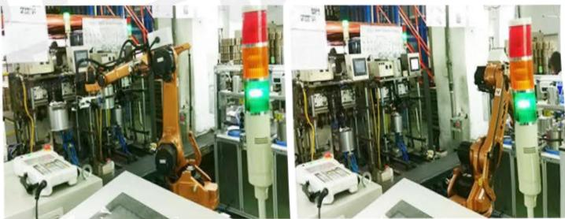

## GSKRMD08机器人在深某公司冲压内容器自动生产应用

客户要求

·机器人替代人工，完成3台63吨冲床、上下料机之间的工件输送及上下料

·产品型号多，单次生产批量不多，机器人夹具通用性强，需要实现不同产品抓取上下料。

·生产专机加工时间6秒，产线生产产能：350件/小时；

## 应用效果

·采取兼容柔性化机械手设计，用较少的改造成本解决了多型号、小批量生产在同一产线生产的难题；·机器人作业与冲床紧密配合，工作稳定，最大化提升生产效率，降低生产成本。

## GSKRMD20机器人在某公司冲压、激光切割自动上下料生产应用

## 客户要求

机器人替代人工，完成1台油压冲床、激光切割机、上下料仓之间的工件上下料生产；·产品型号多，单次生产批量不多，机器人夹具通用性强，需要实现不同外形产品抓取上下料。生产专机加工时间25秒，产线生产产能：120件/小时；

## 应用效果

●采取兼容柔性化机械手设计，用较少的制造成本解决了多型号、小批量生产在同一产线生产的难题；·家电行业普遍生产特性就是品种类多、设备兼容性强、生产工序频繁单一、劳动力密集、生产交期短，采用机器人替代人工自动化生产，降低生产运营成本、保证生产周期；

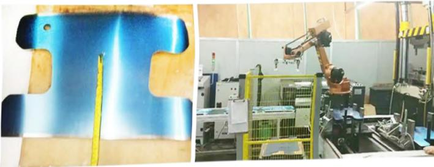

## 应用案例

## GSKRMD20机器人在某家电公司实现水壶装饰板自动生产线上下料应用

## 客户要求

机器人替代人工，完成工件刷油、机器人对油压机上下料，再对激光切割机上下料的生产工序；产品型号多，单次生产批量不多，机器人夹具通用性强，需要实现不同外形产品抓取上下料。激光切割机加工时间20秒，产线生产产能：180件/小时；

## 应用效果

采取兼容柔性化机械手设计，用较少的制造成本解决了多型号、小批量生产在同一产线生产的难题；家电行业普遍生产特性就是品种类多、设备兼容性强、生产工序频繁单一、劳动力密集、生产交期短，采用机器人替代人工自动化生产，降低生产运营成本、保证生产周期；

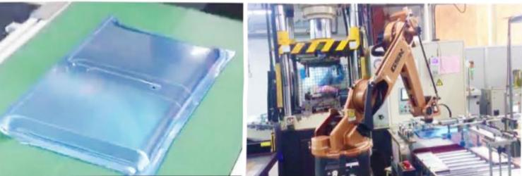

## GSKRMD50机器人应用于某公司多种产品的分向码垛

## 客户要求

采用工业机器人配套相应设备装置，代替人工完成多种产品的分向堆垛的生产工序

## 用效果

机器人替代人工，可24小时随时作业，稳定高效完成工作任务威少人工数量，降低劳动强度

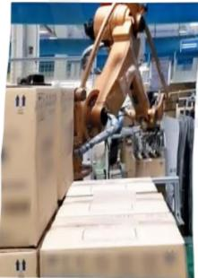

## GSKRMD50机器人在某公司整箱蛋卷自动码垛应用

## 客户要求

·机器人替代人工，完成纸箱自动码垛的生产工序；·码垛5层，垛型高度1825mm，结合卡板总高度为1975mm。纸箱7-8秒一个，产线生产产能：320秒/垛

## 应用效果

·通过机器人进行码垛，垛型美观、稳定，自动化的封箱、码垛生产线，提升企业形象；大大的减少了人工的劳动强度，减少了人工成本；

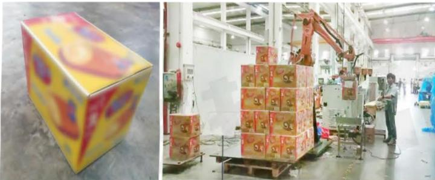

## GSKRMD200码垛机器人在某知名机床厂上下料

## 客户要求

替代原先整线由人工操作的方式，自动化全程监控；机器人实现上下料、灌胶、烘干、冷却多工位的自动化运行；每次装夹产品时，对产品位置的偏差进行识别

## 应用效果

利用附加轴长导轨实现机器人多工位兼顾；高精度视觉系统对位置差异进行自动补偿纠正；·生产线自动化程度高，工艺流程连续稳定运行。

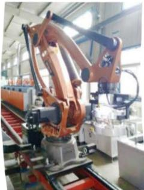

## GSKRMD160码垛机器人码垛洗衣机的应用

## 客户要求

·所码垛工件为500*500*720mm、重40-60kg左右的洗衣机成品；·码垛线节拍满足上游生产线节拍，机器人码垛节拍为15s；·过程确保稳定安全可靠。

## 应用效果

·1台RMD160搬运机器人及手爪，抓取洗衣机，将洗衣机从输送线上搬出，在托盘上完成码垛作业；·机器人手爪上装有压力传感器防止压坏洗衣机，洗衣机在输送线末端定位；机器人码垛单元兼容5种机型的码垛；RMD机器人将洗衣左右码垛，即两垛，左右各一垛，每垛8台60KG洗衣机/机器人每垛码6台60KG洗衣机，垛型分为上下两层，每层4台；按照生产纲领每月26天，每天2班16小时计，按照15s的码垛节拍，机器人码垛大单元月处理洗衣机台数为99840台。完全满足洗衣机成品线产能。

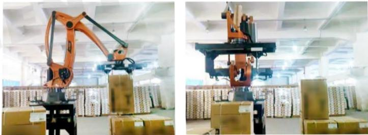

## GSKRMD200机器人应用于某公司完成米袋码垛

客户要求

·对接人工装袋、封包产线，代替人工进行自动化码垛

兼容5-50kg，共五种规格米袋

## 应用效果

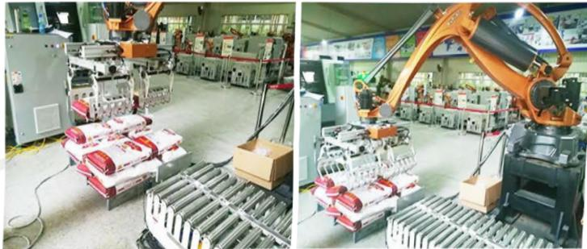

整个机器人系统运行稳定，节省了设备投入，保证了很好的生产连续性。

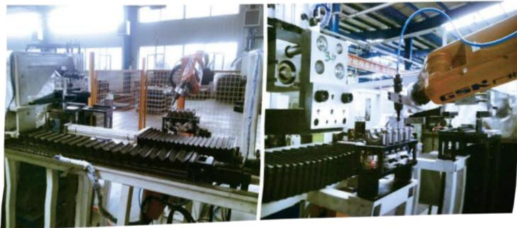

·对接人工产线，实现米袋推倒、导正、高度调节、振平、抓取码垛的自动化工艺流程·采取人工调节换产的方式，用手轮、摇杆等方式有效减少换产时间，提高工作效率，兼容五种规格米袋

## 打磨应用

## GSKRB08机器人在汽车行业中的零配件去毛刺应用

## 客户要求

·与现场加工设备对接，实现工件的上料、去毛刺及下料的自动化作业。应用效果

## 应用案例

## GSKRB20机器人在汽车行业中的缸体打磨去毛刺应用

## 客户要求

与甲方现有设备对接，实现工件的自动打磨去毛刺；工件上下料及打磨去毛刺总时间85s以下。

## 立用效果

节拍配合紧密，机器人生产运行流畅，节拍70s。

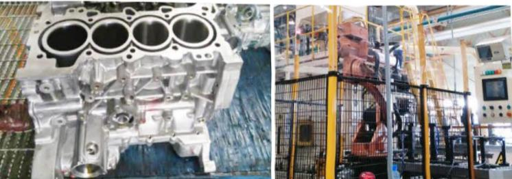

## GSKRB50机器人沙滤机打磨的应用

## 客户要求

机器人替代人抓取沙滤机进行自动化打磨抛光作业；工件表面麻轮抛光，节拍<60S/工件；表面光洁，无划痕、水纹等瑕疵；

## 立用效果

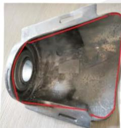

机器人替代人工，可24小时持续作业，稳定完成工作任务；

打磨行业是一个有一定危险性的行业，尤其是抛光打磨类粉尘，如有砂纸砂石的磨损，金属的粉尘等等，这些粉尘对工人的身心健康有一定的影响，使用机器人可避免各种事故的发生

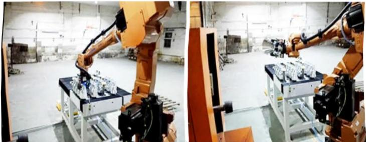

## 职业技能平台

## 类赛）

元、数控机床、智能料仓、视觉检测装置及控制系统、智能产线控制系统等组成的。该平台能够对料仓内的随机摆置的毛坏通过颜色、数字、形状、特征等进行智能识别，把识别的位置、类型等数据发送给工业机器人。工业机器人抓取毛坏，智能产线控制系统自动调用数控机床中的程序，对毛坏进行加工，加工完成后机器人把成品放回成品仓指定位置。并能按照拟定程序实现不间断循环功能，完成不同工件不同数量的智能制造。

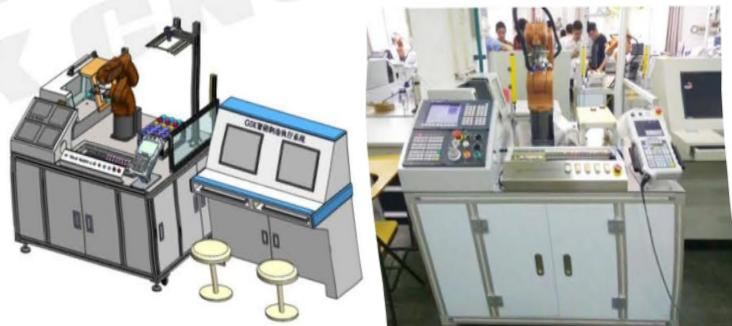

## GSK智能制造生产实训基地 -全国首届智能制造技术应用技能大赛指定技术平台（一类赛）

该平台以智能制造技术推广应用实际与发展需求为设计依据，按照“设备自动化+生产精益化+管理信息化+人工高效化的切削加工智能制造单元构建理念，将数控加工设备、工业机器人、产品检测设备、数据信息采集设备等典型加工制造设备，集成为智能制造单元“硬件“系统，结合智能化控制技术、高效加工技米术技能。术、工业物联网技术、RFID数字信息技术等“软件"的综合运用，构成大赛技术平台。通过大赛着重展示数字化设备互联互通、人机协同和零件柔性化设计、可追溯加工过程以及MES等智能决策管理系统应用的技

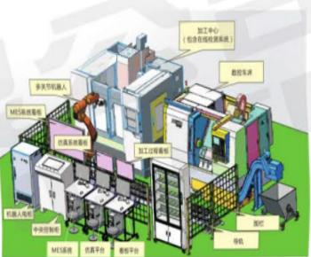

## 配置  

<html><body><table border="1"><tbody><tr><td>空设备 序号</td><td>名称</td><td>数量</td><td>单位</td></tr><tr><td></td><td>数控车床（配广数GSK988TA-H数控系统）</td><td>1</td><td>台</td></tr><tr><td>2</td><td>加工中心（三轴）（配广数GSK25i数控系统）</td><td>1</td><td>台</td></tr><tr><td>3</td><td>工业机器人及夹具</td><td>1</td><td>台</td></tr><tr><td></td><td>机器人导轨</td><td>1</td><td>套</td></tr><tr><td>5</td><td>立式仓库</td><td>一</td><td>套</td></tr><tr><td></td><td>可视化系统及显示终端</td><td>3</td><td>台</td></tr><tr><td>7</td><td>加工中心在线测量装置及软件</td><td>1</td><td>套</td></tr><tr><td>8</td><td>中央电气控制系统（含无线路由器）</td><td>1</td><td>套</td></tr><tr><td>9</td><td>MES软件系统</td><td>1</td><td>套</td></tr><tr><td>10</td><td>机械设计及仿真软件</td><td>1</td><td>套</td></tr><tr><td>11</td><td>电脑</td><td>2</td><td>台</td></tr><tr><td>12</td><td>安全防护系统</td><td>1</td><td>套</td></tr><tr><td>13</td><td>在线检测</td><td>2</td><td>套</td></tr><tr><td>14</td><td>RFID读写棒</td><td>1</td><td>套</td></tr><tr><td>15</td><td>RID芯片</td><td>若干</td><td>个</td></tr></tbody></table></body></html>

## 涂胶应用

## 包装应用

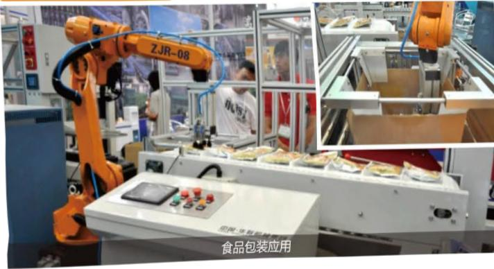

## 部分合作伙伴

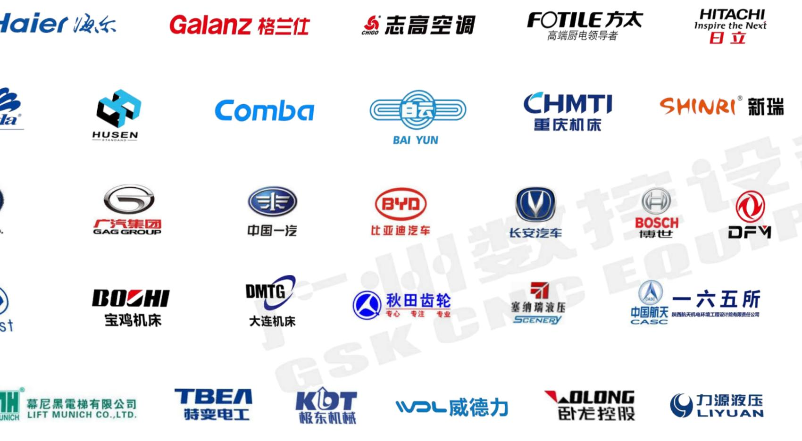

## 精益求精让用户满意

## GSK全国办事处

广东·广州办事处电话：13808892746地址：广州市罗冲围螺涌北路一街七号广东·江门办事处电话：13822335346地址：江门市蓬江区聚德街36幢2-204室汕头市澄海区凤翔街道凤翔路124号电话：13560149362广东省东莞市常平镇大京九塑胶城广东·汕头广东·东莞办事处电话：13822282126地址：东莞市长安夏锦村锦江花园豪景庭15楼A号房电话：15986414204广东·东莞办事处

地地址：柳州市飞娥路利民区22栋1单元7号联系电话：13977280656广西·柳州办事处

EM 

上海办事处

电话：13808824702

地址：上海市松江区荣乐中路120弄18号201室

江苏·无锡办事处

电话：13961838115

地址：江苏省无锡市北塘区锡沪西路康桥丽景小区50号楼101室

江苏·无锡办事处

电话：15962525661

地址：江苏省无锡市新昊区城区纺城大道289号南方不锈钢市场25栋108号

江苏·徐州办事处

电话：13805213538

地址：江苏省徐州市云龙区和平大道尚仕名邸B9号楼1-1504

江苏·常州办事处

电话：15851938363

地址：常州市天宁区翠竹新村北区157幢丙单元102室

江苏·南京办事处

电话：13645157082

地址：江苏省南京市栖霞区网板路14号金纺园04幢二单元403室

江苏·泰州办事处

电话：15895728321

地址：江苏省泰州市海陵区盛和花园54-304室

江苏·南通办事处

电话：13646260011

地址：江苏省南通市崇川区任港街道世纪园12栋301室

## 我们的服务

江苏·盐城办事处

电话：13851180443

地址：盐城市亭湖区文港路五星小区康居苑10号楼404号

江苏·苏州办事处

电话：15850005239

地址：苏州市吴中区碧波花园22栋304室

浙江·玉环办事处电话：13600576658地址：浙江省台州市玉环玉城街道蓝天花苑17幢2单元204浙江·温岭办事处电话：13665785170地址：浙江省温岭市太平街道东辉小区12栋一单元401浙江·路桥办事处电话：13750620308地址：台州市路桥区路北银安居银安小区6栋101房浙江·温州办事处

电话：13615779918

地址：温州市龙湾区永兴街道下街670弄3号

浙江·永康办事处

电话：13566755677

地址：浙江省永康市古丽镇牟店石西路376号

浙江·永康办事处

电话：15219903790

地址：金华市永康市金色港湾5幢1单元1302

浙江·西店办事处

电话：13884452605

地址：浙江省宁波县西店镇西店派出所旁，大鹏电子后面

浙江·宁波办事处

电话：13732118020

地址：宁波市海曙区气象路与通达路交叉路口丽雅苑17幢27号101室

浙江·余姚办事处

电话：13616568939

地址：浙江省余姚市阳明公寓2幢102室

浙江·杭州办事处

电话：18858273927

地址：杭州市萧山区回澜北苑27幢2单元402室

浙江·店口办事处

电话：13758518391

地址：诸暨市店口镇湄池江东路临江花园9幢5单元401室

浙江·富阳办事处

电话：15805712468

地址：浙江省杭州市富阳区富春街道文教路62号团结楼104室

浙江·嘉兴办事处

电话：13957324866

地址：浙江省嘉兴市禾兴北路阳光小区17栋307室

浙江·新昌办事处

电话：13566560481

地址：浙江省绍兴市新昌县新昌大道西路215号131室

福建·福州办事处

电话：18559950945

地址：福州市仓山区东升街道则徐大道270号金辉伯爵山10#楼206单元

福建·泉州办事处

电话：13489480199

地址：泉州市前坂新村西区17栋201室

江西·上饶办事处

电话：13687038379地址：上饶市带湖路51号

安徽·合肥办事处

电话：15155115728

地址：安微省合肥市瑶海区当涂路金城港湾2号1006室

安徽·芜湖办事处

电话：18855319358

地址：安徽省芜湖市镜湖区荣盛华府22栋一单元601室

## 华北

山东·青岛办事处

电话：13808992916

地址：青岛市市北区局仁路2号二单元201户

山东·烟台办事处

电话：13808843497

地址：山东省烟台市芝果区前进路西供销家园8-6

山东·潍坊办事处

电话：13869602619

地址：山东省潍坊市潍城区玉清街5710号/恒信御峰南区21-4-302

山东·滕州办事处

电话：18266012329

地址：滕州市荆河街道熙城国际金园1号楼一单元1404

山东·济南办事处

电话：13853119376

地址：山东省济南市天桥区无影山路48-15号美林大厦西塔7楼708

山东·华北技术中心

电话：13318722875

地址：山东省济南市天桥区无影山路48-15号美林大厦西塔7楼708

河南·郑州办事处

电话：13808874681

地址：郑州市金水区杜岭街道彭公祠街和谐8号家属院内202房

河南·洛阳办事处

电话：13808843850

地址：洛阳市西工区金谷园路89号帝景上院4幢3-801

河北·石家庄办事处

电话：13784331918

地址：河北省石家庄市桥西区新石中路39号嘉实栖园2-2-301

河北·任丘办事处

电话：15076767218

地址：河北省任丘市金台园小区27号楼一单元903室

河北·沧州办事处

电话：18333056012

地址：河北省沧州市运河区西环中街街道御河新城东区6号楼-1-2202

河北·邢台办事处

电话：13808844317

地址：河北省邢台市隆尧县新华路中段北侧锦泰城3号楼2-103

## 天津办事处